# CineBook — Software Requirements & Design Specification (SRS v2)

> A comprehensive, diagram-rich specification of the **entire CineBook platform**: every functional flow,
> the database schema, the full REST API, the Stripe payment & refund integration, the complete technology
> stack, the project structure, and the development challenges faced. Intended as the single canonical
> reference for the system. Where the document and the code disagree, the code is the source of truth.

| | |
|---|---|
| **Version** | 2.0 |
| **Date** | 2026-06-16 |
| **Backend** | Spring Boot 3.3.5 · Java 21 · MySQL 8 (`:8181`) |
| **Frontend** | Angular 17 standalone + Signals · Tailwind (`:4200`) |
| **Payments** | Stripe Hosted Checkout (TEST mode) |
| **Coverage** | 36 API endpoints · 8 entities · 26 documented challenges · 20 Mermaid diagrams |

> 📎 Companion docs: [stripe-integration.md](stripe-integration.md) (deep-dive on payments) · [STRIPE_SETUP.md](STRIPE_SETUP.md) (key setup) · [srs1.md](srs1.md) (v1 SRS).

## Table of Contents

- [1. System Overview & Scope](#1-system-overview--scope)
- [2. Technology Stack](#2-technology-stack)
- [3. Project Structure](#3-project-structure)
- [4. System Architecture](#4-system-architecture)
- [5. Database Schema](#5-database-schema)
- [6. Functional Specifications - User & Auth Flows](#6-functional-specifications---user--auth-flows)
- [7. Functional Specifications - Admin Flows](#7-functional-specifications---admin-flows)
- [8. Stripe Payment & Refund Integration](#8-stripe-payment--refund-integration)
- [9. Complete API Reference](#9-complete-api-reference)
- [10. Security & Cross-Cutting Concerns](#10-security--cross-cutting-concerns)
- [11. Development Challenges & Resolutions](#11-development-challenges--resolutions)

---
## 1. System Overview & Scope

CineBook is a full-stack, multi-tenant movie-ticket booking platform. End users browse a movie catalogue, discover screenings at nearby theaters, pick seats, and pay securely through Stripe Hosted Checkout; theater administrators manage their own venue's movies, screenings, and bookings and view a live analytics console. The system is built as a Spring Boot 3.3.5 / Java 21 REST backend (port 8181) backed by MySQL, with an Angular 17 single-page application (port 4200) as the client. Payments, refunds, and reconciliation are handled end-to-end through Stripe, with seat inventory protected against double-booking and abandoned-payment leakage.

### 1.1 Actors

| Actor | Description | How they are identified |
| --- | --- | --- |
| Guest | An unauthenticated visitor. Can only reach the `login` and `register` pages (enforced by `guestGuard`). Every API call except `/api/auth/**` and the Stripe webhook requires authentication, so a Guest cannot browse the catalogue or book until they sign in. | No token; anonymous requests are rejected with HTTP 401 by the backend `AuthenticationEntryPoint`. |
| User (role `USER`) | A registered customer. Browses movies and theaters, selects shows and seats, pays via Stripe, views and partially/fully cancels their own bookings (with tiered refunds), rates movies they have seen, and joins the "I'm interested" waitlist for unscheduled titles. | Signed JWT with `role = USER`; `authGuard` on user routes. |
| Admin (role `ADMIN`) | A theater operator, bound to exactly one theater. Manages that theater's movie catalogue and screenings, views the theater's full bookings ledger and "Most Booked" leaderboard, and uses the analytics dashboard. All admin reads/writes are strictly scoped to the admin's own `theaterId` (carried in the JWT), with one deliberate exception: the cross-catalogue Audience-Interest panel. | Signed JWT with `role = ADMIN` and a `theaterId` claim; `authGuard + adminGuard` on admin routes. |

### 1.2 High-Level Capabilities

| Capability area | What it does | Primary services |
| --- | --- | --- |
| Authentication & accounts | User and theater-admin registration, login, BCrypt password hashing, stateless JWT issuance (24h, HS256) with `userId`/`role`/`theaterId` claims. | `AuthService`, `JwtService` |
| Movie catalogue | Browse movies, view detail, ratings and trailers; admin CRUD with soft-delete to preserve booking history. | `MovieService`, `ReviewService` |
| Theaters & screenings | Public theater directory and per-theater show listings; admin scheduling of shows with capacity management, operational buffer, and Open/Closed status derived from show time. | `ShowService` |
| Booking & seat selection | Per-seat reservation (one `BookingSeat` row per seat), concurrency-safe seat holds, full and partial seat cancellation, and seat-availability lookups. | `BookingService` |
| Payments & refunds | Stripe Hosted Checkout (reserve-then-pay), session finalization from both the return page and webhook, tiered time-based refunds, abandoned-hold cleanup, and edge-case auto-refunds. | `StripePaymentService`, `StripeGateway` |
| Reviews & ratings | Verified reviews (must own a paid booking), per-movie review lists, and aggregate movie ratings. | `ReviewService` |
| Demand discovery | "I'm interested" waitlist toggle for titles with no upcoming shows; surfaced cross-catalogue to admins. | `MovieInterestService` |
| Analytics | Theater-scoped admin dashboard: revenue/footfall KPIs, bookings-over-time, occupancy, top performers, ratings, and cross-catalogue audience interest, with client-side aggregation and 30s auto-refresh. | `AnalyticsService` |

### 1.3 Core Domain Entities

| Entity | Role in the system |
| --- | --- |
| `User` | Account holder; carries role and (for admins) the owning theater. |
| `Movie` | Catalogue title; soft-deletable to avoid orphaning history. |
| `Theater` | Venue; the unit of multi-tenant scoping for admins. |
| `Show` | A scheduled screening of a movie at a theater, with `totalSeats`/`availableSeats` and a soft-delete flag. |
| `Booking` | A reservation record holding status, Stripe references (`stripeSessionId`, `stripePaymentIntentId`), refund total, and an immutable original seat snapshot. |
| `BookingSeat` | One row per seat (label, captured price, `BOOKED`/`CANCELLED` status, `cancelledAt`) — the authoritative current seat state enabling partial cancellation. |
| `Review` | A user's rating/review of a movie, tied to a paid booking. |
| `MovieInterest` | A user's "interested" signal for a movie, used for waitlist and demand analytics. |

### 1.4 Assumptions & Constraints

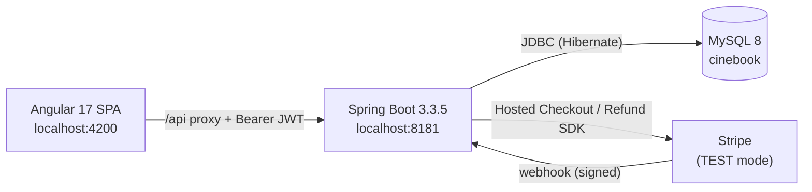

| # | Assumption / Constraint | Detail |
| --- | --- | --- |
| A1 | Multi-tenant by theater | Each admin owns exactly one theater; the owning `theaterId` is encoded in the signed JWT and re-verified server-side on every admin read/mutate (403 on mismatch). It is never trusted from the request body. |
| A2 | Stateless authentication | No HTTP session/JSESSIONID; security is stateless JWT (HS256). The browser persists the session (incl. token) in `localStorage` under `cinebook.user`. |
| A3 | Reserve-then-pay seat model | Seats are held (`PENDING_PAYMENT`) before payment to guarantee availability; holds are released on explicit cancel, Stripe `session.expired`, or a 30-minute TTL reaper. `PENDING_PAYMENT` bookings are hidden from all user/admin ledgers and revenue. |
| A4 | No card data on CineBook | Stripe Hosted Checkout is used; CineBook never sees or stores card numbers and requires no Stripe.js/publishable key on the frontend. All Stripe secrets live on the backend; the webhook is the only unauthenticated endpoint, trusted purely via Stripe's cryptographic signature. |
| A5 | Single UTC clock | Refund tiers pivot on `Duration.between(now, showTime)`; the system stores and computes in UTC everywhere (datasource `serverTimezone=UTC`) and localizes only at the display edge. The server's UTC computation is authoritative; the SPA's refund estimate is advisory. |
| A6 | Currency is INR | All charges/refunds are in Indian rupees, sent to Stripe in minor units (paise) via a single `toMinorUnits()` helper. |
| A7 | Auto-schema (dev) | Hibernate `ddl-auto=update` auto-creates/migrates the schema on boot (no migration scripts) — acceptable for dev, not recommended for production. |
| A8 | CORS / origin model | In dev, the Angular proxy makes the SPA and API share an origin (`/api -> :8181`); CORS is wired into the Spring Security chain and currently allows only `http://localhost:4200`. Production deployment requires parameterizing this origin. |
| A9 | Secrets are dev placeholders | The JWT secret, Stripe test key, and DB credentials are committed dev/test placeholders that MUST be overridden via environment variables / a secrets manager and rotated before production. |
| A10 | Stripe-optional startup | If Stripe is unconfigured, the app still boots and all non-payment features (auth, browsing, booking schema) work; only payment endpoints fail fast with a clear message. |
| A11 | Soft deletion | Movies and shows are soft-deleted (boolean `deleted` flag) so historical bookings, reviews, and analytics keep resolving; reads filter `deleted = false`. |

## 2. Technology Stack

This is an exhaustive enumeration of every technology in the CineBook stack with its specific role in this project, grouped into Backend, Frontend, Data & Payments, and Build & Tooling.

### 2.1 Backend

| Technology | Version | Role in CineBook |
| --- | --- | --- |
| Java | 21 (LTS) | Backend language; set via `<java.version>21</java.version>`, toolchain is the Spring Boot parent's default JDK 21+. |
| Spring Boot | 3.3.5 | Application framework and auto-configuration; inherited from `spring-boot-starter-parent:3.3.5`. Build artifact `com.cinebook:cinebook-backend:0.0.1-SNAPSHOT`. |
| Spring Boot Starter Web (Spring MVC) | managed by 3.3.5 | REST `@RestController` layer, Jackson JSON, and the embedded servlet container; HTTP listener on port 8181. |
| Embedded Tomcat | managed by 3.3.5 | Servlet container bundled by `starter-web`, serving the API on port 8181. |
| Spring Data JPA | managed by 3.3.5 | Repository layer — `JpaRepository` finders (e.g. `BookingRepository.findByStripeSessionId`, `findByStatusAndBookingDateBefore`), derived queries, and `@Query` JPQL aggregations (e.g. `MovieInterestRepository.countAllByMovie`). |
| Hibernate ORM | managed by 3.3.5 | JPA implementation; entity-to-table mapping, `ddl-auto=update` auto-schema, `org.hibernate.dialect.MySQLDialect`, OSIV disabled (`open-in-view=false`). |
| Spring Boot Starter Validation (Jakarta Bean Validation / Hibernate Validator) | managed by 3.3.5 | `@Valid` request-DTO validation; `MethodArgumentNotValidException` mapped globally to HTTP 400 with `field: message` details. |
| Spring Security | managed by 3.3.5 | Stateless JWT filter chain (`SecurityConfig`), `BCryptPasswordEncoder`, `@EnableMethodSecurity`/`@PreAuthorize` role checks, CORS integration, and a custom 401 `AuthenticationEntryPoint` (no login redirect). |
| JJWT — `jjwt-api` | 0.12.6 | Compile-time API used by `JwtService` to build/parse JWTs (`Jwts.builder`/`parser`). |
| JJWT — `jjwt-impl` | 0.12.6 | Runtime implementation of the JJWT API (scope `runtime`). |
| JJWT — `jjwt-jackson` | 0.12.6 | Jackson-based JSON (de)serializer for JWT claims (scope `runtime`). |
| Spring `@Transactional` | (Spring core) | All-or-nothing boundaries for booking, cancellation, and payment so MySQL and Stripe never drift (e.g. a failed Stripe refund rolls back seat cancellation). |
| Spring `@Scheduled` / `@EnableScheduling` | (Spring core) | Activated on `CineBookApplication`; drives `StripePaymentService.reapAbandonedHolds()` every 5 minutes (`fixedDelay = 300000`) to release abandoned `PENDING_PAYMENT` holds older than the 30-minute TTL. |
| Spring Boot DevTools | managed by 3.3.5 | Optional dev-time hot reload/auto-restart (scope `runtime`, `optional=true`). Documented caveat: do a full restart after adding/upgrading the Stripe jar to avoid `NoClassDefFoundError`. |
| SLF4J / Logback | managed by 3.3.5 | Backend logging (e.g. reaped holds and benign skipped webhook finalizes in `StripePaymentService`); Hibernate SQL logger at `info`. |

### 2.2 Frontend

| Technology | Version | Role in CineBook |
| --- | --- | --- |
| Angular | ^17.3.0 | Standalone-component SPA framework (no NgModules); bootstrapped via `app.config.ts` with `provideRouter`; signals/computed for reactive state; new `@if`/`@for` control flow with `as` bindings for null-safe templates. |
| TypeScript | ~5.4.2 | Frontend language; strict typed domain models in `core/models` that mirror backend DTOs for end-to-end type safety. |
| RxJS | ~7.8.0 | HTTP Observables; `forkJoin` to fan out parallel admin-dashboard feeds; `tap` to seed state signals; `catchError` in the error interceptor. |
| `@angular/common/http` (HttpClient) | ^17.3.0 | All API I/O; registered via `provideHttpClient(withInterceptors([authInterceptor, errorInterceptor]))`. `authInterceptor` attaches `Authorization: Bearer {token}`; `errorInterceptor` logs out and redirects to `/login` on 401. |
| `@angular/router` | ^17.3.0 | Functional router with fully lazy-loaded standalone components (`loadComponent`) and `CanActivateFn` guards: `authGuard`, `adminGuard`, `guestGuard`. |
| `@angular/forms` | ^17.3.0 | Template-driven forms (`FormsModule`/`ngModel`) on login, register, and admin manage pages. |
| `@angular/cdk` | ^17.3.10 | Component Dev Kit primitives (overlay/a11y) supporting interactive UI. |
| `@angular/animations` | ^17.3.0 | Animation engine dependency. |
| `@lucide/angular` | ^1.17.0 | Icon library used as `<svg lucideX>` attribute components (project convention; replaces a custom inline icon component). |
| Chart.js | ^4.5.1 | Charting engine for the admin analytics dashboard (ratings / audience interest / bookings-over-time). |
| ng2-charts | ^6.0.1 | Angular wrapper for Chart.js; registered globally via `provideCharts(withDefaultRegisterables())` in `app.config.ts`. |
| Tailwind CSS | ^3.4.1 | Utility-first styling with a custom cinema theme (`ink` surface scale, `tomato` accent, Inter font) and a reusable `@layer` component library (`btn-primary`, `card`, `input`, `pill`, `chip`, `filter-trigger`/`filter-menu`, `status-badge`) in `src/styles.css` / `tailwind.config.js`. No Tailwind plugins. |
| zone.js | ~0.14.3 | Angular change-detection polyfill (the only polyfill configured in `angular.json`). |
| tslib | (Angular dep) | TypeScript runtime helpers. |
| `localStorage` | (browser) | Persists the auth session (`cinebook.user`, incl. JWT) and chosen location (`cinebook.location`) across reloads. |

### 2.3 Data & Payments

| Technology | Version | Role in CineBook |
| --- | --- | --- |
| MySQL | 8 | Primary relational store; local schema `cinebook` (JDBC URL `jdbc:mysql://localhost:3306/cinebook` with `createDatabaseIfNotExist=true`, `useSSL=false`, `serverTimezone=UTC`, `allowPublicKeyRetrieval=true`). |
| MariaDB | 11.4 | Cloud-compatible engine on Alwaysdata (schema `cinebook_data`) for the deployed backend. |
| MySQL Connector/J | managed by 3.3.5 | JDBC driver (`com.mysql.cj.jdbc.Driver`, scope `runtime`) connecting Hibernate to MySQL/MariaDB. |
| Alwaysdata (Free Tier) | — | Managed cloud MySQL/MariaDB host (`mysql-cinebook.alwaysdata.net`, 1GB SSD / 256MB RAM, no expiry); phpMyAdmin for visual data management. SSL unchecked and Authorized IP left wildcard so both localhost and the cloud host can connect. The cloud datasource block is kept commented in `application.properties` for a one-line switch. |
| Stripe Java SDK (`com.stripe:stripe-java`) | 26.0.0 | Stripe SDK used by `StripeGateway`: Checkout `Session.create`/`retrieve`, `Refund.create`, and `Webhook.constructEvent` signature verification. |
| Stripe Checkout (Hosted) | TEST mode | Redirect-based payment so CineBook never handles card data; success/cancel URLs default to `http://localhost:4200/payment/{success,cancel}`. The frontend `PaymentService` calls `/api/payments/checkout`, `/confirm`, and `/cancel-hold` only — no Stripe.js or publishable key. |
| Stripe Webhooks | — | Server-to-server `checkout.session.completed`/`expired` callbacks to `/api/payments/webhook` (the only unauthenticated endpoint), trusted via the `whsec_` signing secret (`STRIPE_WEBHOOK_SECRET`). Drives idempotent finalize/release as a backstop to the success-page confirmation. |
| Stripe CLI | — | Dev tool: `stripe listen --forward-to localhost:8181/api/payments/webhook` forwards live events to localhost (Stripe cannot reach localhost otherwise) and prints the `whsec_` to use locally. |

### 2.4 Build & Tooling

| Technology | Version | Role in CineBook |
| --- | --- | --- |
| Maven + Maven Wrapper (`mvnw`/`mvnw.cmd`) | — | Backend build and dependency management; the wrapper means no system Maven is required. |
| Spring Boot Maven Plugin | from parent 3.3.5 | Produces the executable Spring Boot fat JAR (repackage goal); the only declared build plugin. |
| Spring Boot Starter Test (JUnit 5, Spring Test, Mockito, AssertJ) | managed by 3.3.5 | Backend test stack (scope `test`). |
| Angular CLI / `@angular-devkit/build-angular` | 17.3 (`application` builder) | Frontend build and dev server; output `dist/cinebook`; global style `src/styles.css`; prod budgets — initial 1mb warn / 2mb error, `anyComponentStyle` raised to 6kb warn / 8kb error for the themed components. |
| Angular dev-server proxy (`proxy.conf.json`) | — | Proxies `/api -> http://localhost:8181` (`changeOrigin`) in dev so the SPA stays origin-agnostic (`environment.apiUrl = '/api'`) and avoids CORS; wired via `npm start = ng serve --proxy-config proxy.conf.json`. |
| PostCSS + Autoprefixer | postcss ^8.4.35 / autoprefixer ^10.4.17 | CSS pipeline powering Tailwind processing and vendor prefixing (`postcss.config.js`). |
| Node.js + npm | 18 / 20 LTS | Frontend toolchain runtime and package management (`npm install --legacy-peer-deps`). |
| Git + GitHub (`gh` / Pull Requests) | — | Version control and multi-contributor collaboration (merged PRs #2–#10). |
| Mermaid.js | — | Architecture / sequence / state diagrams authored in the SRS and integration markdown docs. |
| Render (planned) | — | Target free Web Service host for the Spring Boot backend (deployment reference). |
| Vercel / Netlify (planned) | — | Target host for the compiled Angular SPA (deployment reference). |

---

## 3. Project Structure

CineBook is a two-part application living in a single repository: a **Spring Boot + Maven** REST API under `backend/` and an **Angular standalone-components** single-page app (SPA) under `frontend/`. The repository root also holds a set of Markdown design/spec documents. The map below shows how the major folders relate.

### 3.1 Top-level module and folder map

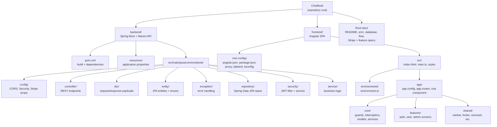

### 3.2 Repository root layout

```text
CineBook/  (repository root)
├── backend/                  # Spring Boot + Maven API (see 3.3)
├── frontend/                 # Angular standalone-components SPA (see 3.4)
├── README.md                 # Project overview / setup instructions
├── srs1.md                   # Software requirements specification
├── stripe-integration.md     # Stripe payment integration design/notes
├── STRIPE_SETUP.md           # Step-by-step Stripe configuration guide
├── database.md               # Data model / schema documentation
├── flow.md                   # Application flow / sequence documentation
├── manage-bookings.md        # Admin manage-bookings feature spec/notes
├── manage-shows.md           # Admin manage-shows feature spec/notes
├── guest-route-guard.md      # Guest route guard design notes
└── day1.md                   # Day-1 / initial planning notes
```

### 3.3 Backend tree (`com.cinebook` packages + resources)

Everything below lives under `backend/`. The Java code is organised into clean layers: **controller** (HTTP) -> **service** (business logic) -> **repository** (database), with **entity**, **dto**, **security**, **config**, and **exception** as supporting packages.

```text
backend/
├── pom.xml                                 # Maven build: Spring Boot parent + deps
│                                           #   (web, data-jpa, security, validation,
│                                           #    jjwt, stripe-java, MySQL driver)
└── src/main/
    ├── java/com/cinebook/
    │   ├── CineBookApplication.java         # @SpringBootApplication entrypoint
    │   │
    │   ├── config/                          # Cross-cutting configuration
    │   │   ├── CorsConfig.java              # CORS allow-list for the Angular dev origin
    │   │   ├── SecurityConfig.java          # Security filter chain: stateless JWT,
    │   │   │                                #   role rules, password encoder
    │   │   └── StripeProperties.java        # @ConfigurationProperties for Stripe keys/URLs
    │   │
    │   ├── controller/                      # REST endpoints (the HTTP layer)
    │   │   ├── AdminBookingController.java  # Admin: list/cancel any booking
    │   │   ├── AnalyticsController.java     # Admin dashboard metrics endpoints
    │   │   ├── AuthController.java          # /auth register + login (user & admin)
    │   │   ├── BookingController.java       # User booking create/list/cancel-seats
    │   │   ├── MovieController.java         # Movie CRUD (admin) + public listing
    │   │   ├── MovieInterestController.java # Toggle/query "interested" on coming-soon movies
    │   │   ├── PaymentController.java       # Stripe checkout session create + webhook/confirm
    │   │   ├── ReviewController.java        # Movie review create/list
    │   │   ├── ShowController.java          # Show CRUD (admin) + public show/seat queries
    │   │   └── TheaterController.java       # Theater listing/detail
    │   │
    │   ├── dto/                             # Request/response payload records & POJOs
    │   │   ├── AdminBookingResponse.java
    │   │   ├── AuthResponse.java            # JWT token + user info returned on login
    │   │   ├── BookingRequest.java
    │   │   ├── CancelSeatsRequest.java
    │   │   ├── CheckoutResponse.java        # Stripe checkout session URL/id
    │   │   ├── LoginRequest.java
    │   │   ├── MostBookedMovieResponse.java
    │   │   ├── MovieInterestResponse.java
    │   │   ├── MovieInterestStatusResponse.java
    │   │   ├── MovieRatingResponse.java
    │   │   ├── MovieRequest.java
    │   │   ├── PublicShowResponse.java
    │   │   ├── RefundQuoteResponse.java
    │   │   ├── RegisterAdminRequest.java
    │   │   ├── RegisterRequest.java
    │   │   ├── ReviewRequest.java
    │   │   ├── ReviewResponse.java
    │   │   ├── SeatAvailabilityResponse.java
    │   │   ├── SessionRequest.java
    │   │   ├── ShowRequest.java
    │   │   ├── TheaterResponse.java
    │   │   └── UserBookingResponse.java
    │   │
    │   ├── entity/                          # JPA @Entity classes + enums
    │   │   ├── Booking.java                 # Booking aggregate root
    │   │   ├── BookingSeat.java             # Per-seat row tied to a booking
    │   │   ├── BookingStatus.java           # enum (PENDING/CONFIRMED/CANCELLED)
    │   │   ├── Movie.java
    │   │   ├── MovieInterest.java           # User-to-movie interest record
    │   │   ├── Review.java
    │   │   ├── Role.java                    # enum USER/ADMIN
    │   │   ├── SeatStatus.java              # enum seat state
    │   │   ├── Show.java                    # Showtime linking movie + theater
    │   │   ├── Theater.java
    │   │   └── User.java
    │   │
    │   ├── exception/                       # Centralised error handling
    │   │   ├── ApiException.java            # Custom runtime exception w/ HTTP status
    │   │   └── GlobalExceptionHandler.java  # @RestControllerAdvice -> uniform error JSON
    │   │
    │   ├── repository/                      # Spring Data JPA repos + projection interfaces
    │   │   ├── BookingRepository.java
    │   │   ├── BookingSeatRepository.java
    │   │   ├── MovieInterestAggregate.java  # projection for interest counts
    │   │   ├── MovieInterestRepository.java
    │   │   ├── MovieRatingAggregate.java    # projection for avg rating/count
    │   │   ├── MovieRepository.java
    │   │   ├── MovieSeatAggregate.java      # projection for seat/booking stats
    │   │   ├── ReviewRepository.java
    │   │   ├── ShowRepository.java
    │   │   ├── TheaterRepository.java
    │   │   └── UserRepository.java
    │   │
    │   ├── security/                        # Authentication plumbing
    │   │   ├── AuthPrincipal.java           # authenticated principal (id/email/role)
    │   │   ├── JwtAuthFilter.java           # OncePerRequest filter validating Bearer token
    │   │   └── JwtService.java              # JWT generation/parsing/validation
    │   │
    │   └── service/                         # Business logic layer
    │       ├── AnalyticsService.java
    │       ├── AuthService.java
    │       ├── BookingService.java          # seat reservation/cancellation + refund logic
    │       ├── MovieInterestService.java
    │       ├── MovieService.java
    │       ├── ReviewService.java
    │       ├── ShowService.java
    │       ├── StripeGateway.java           # thin wrapper over Stripe SDK calls
    │       └── StripePaymentService.java    # checkout session + webhook orchestration
    │
    └── resources/
        └── application.properties           # datasource, JPA, JWT secret,
                                             #   Stripe props, server config

# Note: no backend/src/test sources are present, and resources holds a single
# application.properties (no profile-specific or YAML variants).
```

### 3.4 Frontend tree (`src/app` core / features / shared + root configs)

Everything below lives under `frontend/`. The app uses Angular standalone components with a **flat file-naming convention** (`[name].ts` / `.html` / `.css`, no `.component` suffix). Code is grouped into `core/` (app-wide singletons and cross-cutting logic), `features/` (the actual screens), and `shared/` (reusable UI pieces).

```text
frontend/
├── angular.json                            # Angular CLI workspace/build config
├── package.json                            # npm scripts + deps (Angular,
│                                           #   @lucide/angular, tailwind, stripe-js)
├── package-lock.json
├── proxy.conf.json                         # dev proxy: /api -> Spring Boot backend
├── postcss.config.js                       # PostCSS pipeline (tailwind + autoprefixer)
├── tailwind.config.js                      # Tailwind theme/content config
├── tsconfig.json                           # base TS config
├── tsconfig.app.json                       # app-specific TS config
├── dist/                                   # build output (generated)
├── node_modules/                           # deps (generated)
└── src/
    ├── index.html                          # SPA host page
    ├── main.ts                             # bootstrapApplication(App, appConfig)
    ├── styles.css                          # global styles / Tailwind layers
    ├── assets/                             # static assets
    ├── environments/
    │   └── environment.ts                  # apiUrl + Stripe publishable key
    │                                       #   (only file here; no environment.prod.ts)
    └── app/
        ├── app.config.ts                   # standalone providers: router,
        │                                   #   http + interceptors
        ├── app.routes.ts                   # top-level route table (guards, lazy features)
        ├── app.ts                          # root standalone component
        ├── app.html
        ├── app.css
        │
        ├── core/                           # App-wide singletons & cross-cutting logic
        │   ├── guards/
        │   │   ├── admin.guard.ts          # restricts admin routes to ADMIN role
        │   │   ├── auth.guard.ts           # requires authenticated user
        │   │   └── guest.guard.ts          # blocks logged-in users from auth pages
        │   ├── interceptors/
        │   │   ├── auth.interceptor.ts     # attaches JWT Bearer header
        │   │   └── error.interceptor.ts    # global HTTP error handling
        │   ├── models/
        │   │   ├── catalog.model.ts        # Movie/Show/Theater/Booking interfaces
        │   │   └── user.model.ts           # User/auth interfaces
        │   └── services/                   # Typed API clients + state
        │       ├── analytics.service.ts
        │       ├── auth.service.ts         # login/register, token storage, auth state
        │       ├── booking.service.ts
        │       ├── location.service.ts
        │       ├── movie.service.ts
        │       ├── movie-interest.service.ts
        │       ├── payment.service.ts      # Stripe checkout calls
        │       ├── review.service.ts
        │       ├── show.service.ts
        │       ├── theater.service.ts
        │       └── user-booking.service.ts
        │
        ├── features/                       # The actual screens, grouped by audience
        │   ├── auth/
        │   │   ├── login/                  # login.ts/.html/.css
        │   │   └── register/               # register.ts/.html/.css
        │   ├── user/
        │   │   ├── home/                    # landing w/ carousels
        │   │   ├── movies/                  # browse/filter movies
        │   │   ├── theaters/
        │   │   ├── theater-detail/
        │   │   ├── booking/                 # seat selection + checkout
        │   │   ├── my-bookings/
        │   │   ├── payment-success/
        │   │   └── payment-cancel/
        │   └── admin/
        │       ├── analytics/               # admin dashboard
        │       ├── manage-movies/
        │       ├── manage-shows/
        │       └── manage-bookings/
        │
        └── shared/                         # Reusable UI components
            ├── navbar/
            ├── sidebar/
            ├── footer/
            ├── carousel/                    # reusable movie carousel
            ├── coming-soon/
            ├── trailer-modal/
            └── tomato-icon/                 # rating icon

# Convention: each feature/shared component sits in its own folder with flat
# [name].ts / [name].html / [name].css files (no .component suffix).
```

### 3.5 Key files at a glance

| File | Layer / Area | Role |
| --- | --- | --- |
| `backend/pom.xml` | Backend build | Maven build descriptor; Spring Boot parent and all backend dependencies (web, data-jpa, security, validation, jjwt, stripe-java, MySQL driver). |
| `backend/src/main/resources/application.properties` | Backend config | Central runtime config: datasource/JPA, JWT secret, Stripe properties, server port and CORS-adjacent settings. |
| `backend/src/main/java/com/cinebook/CineBookApplication.java` | Backend entrypoint | Spring Boot application entrypoint (`@SpringBootApplication`). |
| `backend/src/main/java/com/cinebook/config/SecurityConfig.java` | Backend security | Defines the Spring Security filter chain: stateless JWT auth, role-based URL authorization, password encoder, filter wiring. |
| `backend/src/main/java/com/cinebook/security/JwtService.java` | Backend security | Issues, parses, and validates JWT tokens used for authentication. |
| `backend/src/main/java/com/cinebook/security/JwtAuthFilter.java` | Backend security | Per-request filter that extracts the Bearer token and populates the SecurityContext. |
| `backend/src/main/java/com/cinebook/service/AuthService.java` | Backend service | Registration and login business logic; hashes passwords, builds AuthResponse with JWT. |
| `backend/src/main/java/com/cinebook/service/BookingService.java` | Backend service | Core booking logic: seat reservation, cancellation, status transitions, refund-quote computation. |
| `backend/src/main/java/com/cinebook/service/StripePaymentService.java` | Backend service | Orchestrates Stripe checkout session creation and payment confirmation/webhook handling. |
| `backend/src/main/java/com/cinebook/service/StripeGateway.java` | Backend service | Thin abstraction over the Stripe SDK so payment logic is testable/mockable. |
| `backend/src/main/java/com/cinebook/controller/AuthController.java` | Backend controller | REST endpoints for user/admin registration and login. |
| `backend/src/main/java/com/cinebook/controller/BookingController.java` | Backend controller | REST endpoints for creating, listing, and cancelling user bookings/seats. |
| `backend/src/main/java/com/cinebook/controller/PaymentController.java` | Backend controller | REST endpoints for Stripe checkout session creation and payment confirmation. |
| `backend/src/main/java/com/cinebook/exception/GlobalExceptionHandler.java` | Backend exception | `@RestControllerAdvice` mapping exceptions (incl. ApiException) to consistent JSON error responses. |
| `backend/src/main/java/com/cinebook/entity/Show.java` | Backend entity | JPA entity linking a Movie to a Theater at a showtime; central to seat/booking flow. |
| `backend/src/main/java/com/cinebook/entity/Booking.java` | Backend entity | JPA aggregate root for a booking, owning BookingSeat rows and status. |
| `frontend/src/app/app.config.ts` | Frontend bootstrap | Standalone app providers: router, HttpClient with auth/error interceptors. |
| `frontend/src/app/app.routes.ts` | Frontend routing | Top-level Angular route table wiring features and applying auth/admin/guest guards. |
| `frontend/src/app/core/services/auth.service.ts` | Frontend service | Frontend auth: login/register calls, token persistence, reactive auth/role state. |
| `frontend/src/app/core/interceptors/auth.interceptor.ts` | Frontend interceptor | Attaches the JWT Bearer header to outgoing HTTP requests. |
| `frontend/src/app/core/guards/auth.guard.ts` | Frontend guard | Route guard requiring an authenticated user. |
| `frontend/src/app/core/guards/admin.guard.ts` | Frontend guard | Route guard restricting admin feature routes to ADMIN role. |
| `frontend/src/app/features/user/booking/booking.ts` | Frontend feature | Seat-selection and checkout flow component (initiates Stripe payment). |
| `frontend/src/app/features/admin/analytics/analytics.ts` | Frontend feature | Admin dashboard consuming analytics endpoints for booking/movie metrics. |
| `frontend/src/environments/environment.ts` | Frontend config | Frontend environment config: backend apiUrl and Stripe publishable key. |
| `frontend/proxy.conf.json` | Frontend config | Dev-server proxy routing `/api` calls to the Spring Boot backend to avoid CORS in development. |

---

## 4. System Architecture

CineBook is a classic **three-tier web application**: an Angular single-page application (SPA) in the browser, a Spring Boot REST API in the middle, and a MySQL relational database for storage. Stripe sits outside the system as a third-party payment provider. There is no server-side session — every authenticated request carries its own proof of identity (a JWT), so the API is **stateless**.

### 4.1 Runtime topology

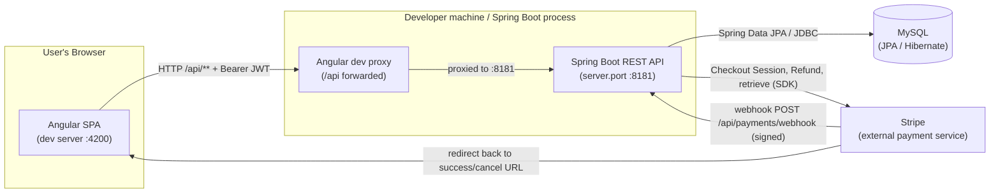

**Layers, briefly:**

| Layer | Where | Responsibility |
|---|---|---|
| Angular SPA | Browser, dev server on **:4200** | Renders the UI (movie browsing, seat picker, booking, admin dashboards); stores and attaches the JWT on every `/api/**` call. |
| Dev proxy | Angular dev tooling | Forwards browser calls to `/api/**` over to the API on **:8181**, so the front end can call the back end without cross-origin friction during development. CORS is also explicitly allowed for origin `http://localhost:4200`. |
| REST controllers | Spring Boot, **:8181** (`com.cinebook.controller`) | HTTP entry points; read the caller's identity from the JWT (`@AuthenticationPrincipal AuthPrincipal`) and delegate to services. |
| Services | `com.cinebook.service` | All business rules and transactions: booking/seat lifecycle, money math (18% GST, refund windows), Stripe orchestration, auth, catalog CRUD, analytics. |
| Repositories | `com.cinebook.repository` | Spring Data JPA interfaces over the tables; derived finders plus a few explicit JPQL queries (joins/aggregations). |
| MySQL | Database | Durable storage; schema auto-managed in dev via Hibernate `ddl-auto=update`. |
| Stripe | External SaaS | Hosted Checkout (collects card payment), refunds, and signed webhooks. The API never sees raw card data. |

### 4.2 Request lifecycle

A typical authenticated request flows through these stages inside the API:

1. **CORS / security gate** — `SecurityConfig` runs with CSRF disabled and session policy **STATELESS**. Public paths (`/api/auth/**` for login/register and `/api/payments/webhook` for Stripe's server-to-server call) are open; everything else requires authentication.
2. **JWT filter** — `JwtAuthFilter` (a `OncePerRequestFilter` registered before Spring's username/password filter) reads the `Authorization: Bearer <token>` header. `JwtService` verifies the HS256 signature and expiry, then builds an `AuthPrincipal` (userId, username, role, theaterId) with authority `ROLE_<role>` and places it in the `SecurityContextHolder`. If the token is missing or invalid, the context is left empty and the request ultimately gets a **401** from the custom entry point (it does not redirect to a login page).
3. **Controller** — the matched controller reads the `AuthPrincipal`, performs any `@PreAuthorize` method-level checks (e.g. ADMIN-only writes), and calls the relevant service.
4. **Service** — applies business logic inside a `@Transactional` boundary. For payment-sensitive flows (e.g. cancellation refunds), the Stripe call happens *inside* the transaction so a Stripe failure rolls back the database change — seats are never cancelled without the money being returned.
5. **Repository / MySQL** — the service uses Spring Data JPA repositories to read/write rows. Because entities use **plain `Long` FK columns** (no `@ManyToOne`/`@OneToMany`), cross-entity joins are done with explicit JPQL where needed (e.g. joining `Booking` to `Show`).
6. **Response / errors** — the service returns DTOs that the controller serializes to JSON. Any `ApiException` is mapped to its HTTP status by `GlobalExceptionHandler` (`@RestControllerAdvice`); validation errors become 400, `AccessDeniedException` becomes 403, anything else 500. All errors share one envelope: `{ timestamp, status, error, message }`.

A separate, internal lifecycle runs without a user: `@EnableScheduling` activates `StripePaymentService.reapAbandonedHolds()`, which fires every 5 minutes to release seat holds for abandoned `PENDING_PAYMENT` bookings.

## 5. Database Schema

CineBook persists eight tables in MySQL. The schema deliberately uses **plain `Long` foreign-key columns** rather than JPA relationship mappings, so the relationships below are *logical* (inferred from `*_id` columns and enforced/joined in application code), not declared via database-level `@ManyToOne`/`@OneToMany` associations.

### 5.1 Entity-relationship diagram

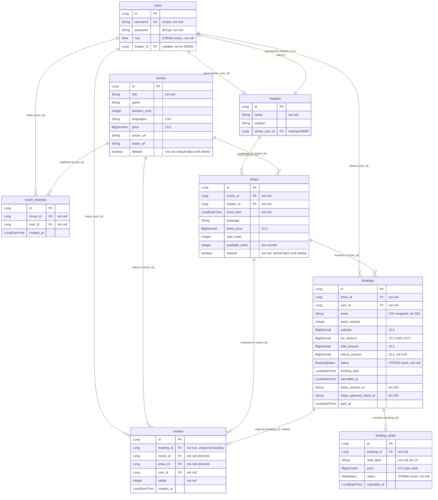

> Note the **circular link** between `users` and `theaters`: a theater records its owning admin in `owner_user_id`, while the admin user records its operated theater in `theater_id`. This pair is established together in `AuthService.registerAdmin`.

### 5.2 Column reference

#### `users`
| Column | Type | Constraints | Meaning |
|---|---|---|---|
| id | Long (BIGINT) | PK, identity | Surrogate key. |
| username | String(50) | not null, **unique** | Login handle; uniqueness guarded via `existsByUsername`. |
| password | String(100) | not null | BCrypt-encoded password hash. |
| role | Role enum, String(20) | not null, `@Enumerated(STRING)` | `USER` or `ADMIN`. |
| theater_id | Long | FK → `theaters.id`, nullable | The theater an ADMIN operates; `null` for regular users. |

#### `theaters`
| Column | Type | Constraints | Meaning |
|---|---|---|---|
| id | Long | PK, identity | Surrogate key. |
| name | String(150) | not null | Theater display name. |
| location | String(150) | — | City/area; queried via `findByLocationIgnoreCase`. |
| owner_user_id | Long | FK → `users.id` | The ADMIN user that owns this theater. |

#### `movies`
| Column | Type | Constraints | Meaning |
|---|---|---|---|
| id | Long | PK, identity | Surrogate key. |
| title | String(150) | not null | Movie title. |
| genre | String(50) | — | Genre label. |
| duration_mins | Integer | — | Runtime in minutes. |
| languages | String(250) | — | CSV of supported languages, e.g. `Telugu,Hindi,English`. |
| price | BigDecimal | precision 10, scale 2 | Base/reference ticket price for the movie. |
| poster_url | String(500) | — | Poster image URL. |
| trailer_url | String(500) | — | Trailer video URL. |
| deleted | boolean | not null, default false | **Soft-delete** flag; read paths use `findByDeletedFalse`. |

#### `shows`
| Column | Type | Constraints | Meaning |
|---|---|---|---|
| id | Long | PK, identity | Surrogate key. |
| movie_id | Long | FK → `movies.id`, not null | Which movie this screening shows. |
| theater_id | Long | FK → `theaters.id`, not null | Which theater hosts it. |
| show_time | LocalDateTime | not null | Start time; drives upcoming/“has played” gating and the refund window. |
| language | String(40) | — | Language of this specific screening. |
| ticket_price | BigDecimal | precision 10, scale 2 | Per-seat price used to compute the booking subtotal. |
| total_seats | Integer | — | House capacity for this show. |
| available_seats | Integer | — | Live remaining-seat counter; decremented on hold, restored on release/cancel (clamped to `total_seats`). |
| deleted | boolean | not null, default false | **Soft-delete** flag; read paths exclude deleted shows. |

#### `bookings`
| Column | Type | Constraints | Meaning |
|---|---|---|---|
| id | Long | PK, identity | Surrogate key. |
| show_id | Long | FK → `shows.id`, not null | The screening booked. |
| user_id | Long | FK → `users.id`, not null | The booking owner. |
| seats | String(500) | — | Immutable CSV snapshot of originally booked seat labels (e.g. `A1,A2,B5`). Authoritative per-seat state lives in `booking_seats`. |
| seats_booked | Integer | — | Count of seats originally booked. |
| subtotal | BigDecimal | precision 10, scale 2 | Ticket price × seat count. |
| tax_amount | BigDecimal | precision 10, scale 2 | 18% GST on subtotal. |
| total_amount | BigDecimal | precision 10, scale 2 | subtotal + tax. |
| refund_amount | BigDecimal | precision 10, scale 2 | Accumulated refund issued so far; initialized to `0.00`. |
| status | BookingStatus enum, String(20) | not null, `@Enumerated(STRING)` | Lifecycle state (see enums below). |
| booking_date | LocalDateTime | — | Set to `now()` at hold creation; also the reaper cutoff field. |
| cancelled_at | LocalDateTime | — | Set when the booking becomes fully `CANCELLED`. |
| stripe_session_id | String(255) | — | Stripe Checkout Session id; set at hold, used to finalize/release (`findByStripeSessionId`). |
| stripe_payment_intent_id | String(255) | — | PaymentIntent id of the successful charge; used to issue refunds. |
| paid_at | LocalDateTime | — | Set when payment succeeds and booking is finalized to `CONFIRMED`. |

#### `booking_seats`
| Column | Type | Constraints | Meaning |
|---|---|---|---|
| id | Long | PK, identity | Surrogate key. |
| booking_id | Long | FK → `bookings.id`, not null | Parent booking. |
| seat_label | String(10) | not null | Seat label within the show, e.g. `A1`. |
| price | BigDecimal | precision 10, scale 2 | Per-seat price retained for seat-by-seat partial refunds. |
| status | SeatStatus enum, String(20) | not null, `@Enumerated(STRING)` | `BOOKED` or `CANCELLED`. |
| cancelled_at | LocalDateTime | — | Set when this individual seat is cancelled. |

#### `reviews`
| Column | Type | Constraints | Meaning |
|---|---|---|---|
| id | Long | PK, identity | Surrogate key. |
| booking_id | Long | FK → `bookings.id`, not null, **one per booking** | Booking being reviewed; uniqueness via `existsByBookingId`. |
| movie_id | Long | FK → `movies.id`, not null | Derived from the booking's show (not client input). |
| show_id | Long | FK → `shows.id`, not null | Derived from the booking. |
| user_id | Long | FK → `users.id`, not null | The reviewer. |
| rating | Integer | not null | Star rating value. |
| created_at | LocalDateTime | — | Set to `now()` at creation. |

#### `movie_interests`
| Column | Type | Constraints | Meaning |
|---|---|---|---|
| id | Long | PK, identity | Surrogate key. |
| movie_id | Long | FK → `movies.id`, not null | The movie of interest. |
| user_id | Long | FK → `users.id`, not null | The interested user. |
| created_at | LocalDateTime | — | Set to `now()` when interest is marked. |
| *(logical)* (movie_id, user_id) | — | Unique-in-code | Idempotent “I'm interested” flag; guarded by `findByMovieIdAndUserId`. |

### 5.3 Enums and the soft-delete pattern

**`BookingStatus`** (`bookings.status`, String(20)):

| Value | Meaning |
|---|---|
| `PENDING_PAYMENT` | Seats held during Stripe Checkout, not yet paid. Hidden from user/admin listings; promoted to `CONFIRMED` by `finalizePending`, or freed by `releasePending`/the reaper. |
| `CONFIRMED` | Payment succeeded and booking finalized (`paid_at` stamped). |
| `PARTIALLY_CANCELLED` | Some seats cancelled but at least one `BOOKED` seat remains. |
| `CANCELLED` | All seats cancelled (`cancelled_at` stamped). Excluded from "Most Booked" aggregates; reviews are blocked on these. |

**`SeatStatus`** (`booking_seats.status`, String(20)):

| Value | Meaning |
|---|---|
| `BOOKED` | Active held/confirmed seat. Drives the seat picker (`findByShowIdAndStatus`), conflict checks, and availability restoration. |
| `CANCELLED` | Seat individually cancelled (`cancelled_at` set). The count of remaining `BOOKED` seats decides whether the parent booking becomes `PARTIALLY_CANCELLED` or `CANCELLED`. |

**`Role`** (`users.role`, String(20)):

| Value | Meaning |
|---|---|
| `USER` | Moviegoer; registered via `register()`. |
| `ADMIN` | Theater owner; registered via `registerAdmin()`, gets an owned `Theater` and a non-null `theater_id`. Admin-scoped services gate on this via `requireTheater()`. |

**Soft-delete pattern.** `movies` and `shows` are never physically deleted. Instead a boolean `deleted` flag (not null, default `false`) is set to `true`, and read paths filter it out (`findByDeletedFalse`, `findByMovieIdAndDeletedFalse`, `findByTheaterIdAndDeletedFalse`, and the `!isDeleted()` checks in `getMovie`/`getShow`). This guarantees that dependent `shows`, `bookings`, and `reviews` are **never orphaned** when an admin removes a movie or screening — historical bookings and their FK references stay valid because the parent row still exists.

---

## 6. Functional Specifications - User & Auth Flows

This section walks through every user-facing capability of CineBook end to end: what the user does on screen, which Angular route/component is involved, and which backend API endpoints are called. Each flow opens with a diagram, followed by a plain-language description and a table of the endpoints touched. All authenticated requests carry the JWT bearer token (injected by the auth interceptor); the token is what scopes a request to the calling user (`userId`) and, for admins, to their theater (`theaterId`).

### 6.1 Register & Login (JWT issue, guest guard)

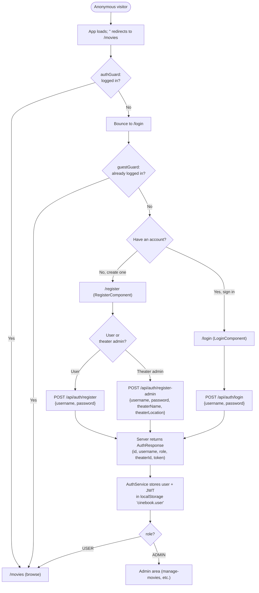

The landing path `''` redirects straight to `/movies`, which is protected by `authGuard`; an anonymous visitor is therefore bounced to `/login`. Both `/login` and `/register` are wrapped in `guestGuard`, so an already-authenticated user who tries to reach them is sent back into the app instead. The Register page (`RegisterComponent`) offers two modes: a plain **USER** sign-up, and a **theater-owner ADMIN** sign-up that additionally creates a Theater and ties the new admin to it. Login (`LoginComponent`) authenticates an existing account. In all three cases the server replies with an `AuthResponse` containing a signed **JWT** plus the account's `id`, `username`, `role`, and `theaterId` (null for regular users). `AuthService` persists this to `localStorage` under `cinebook.user` and exposes `isLoggedIn` / `isAdmin` / `token` signals, so the SPA is immediately logged in without a second round-trip. Logout is local-only (clears storage, no HTTP call).

| Action | Frontend route / component | Endpoint | Notes |
| --- | --- | --- | --- |
| User registration | `/register` · `RegisterComponent` | `POST /api/auth/register` | 201; returns `AuthResponse` with role `USER`, `theaterId` null, JWT |
| Theater-admin registration | `/register` · `RegisterComponent` | `POST /api/auth/register-admin` | 201; also creates the Theater; role `ADMIN`, `theaterId` set |
| Sign in | `/login` · `LoginComponent` | `POST /api/auth/login` | 200; password checked against BCrypt hash, issues JWT |
| Sign out | (any, via navbar) | none | Local only — `AuthService` clears `cinebook.user` |

### 6.2 Browse Movies & view details / trailer

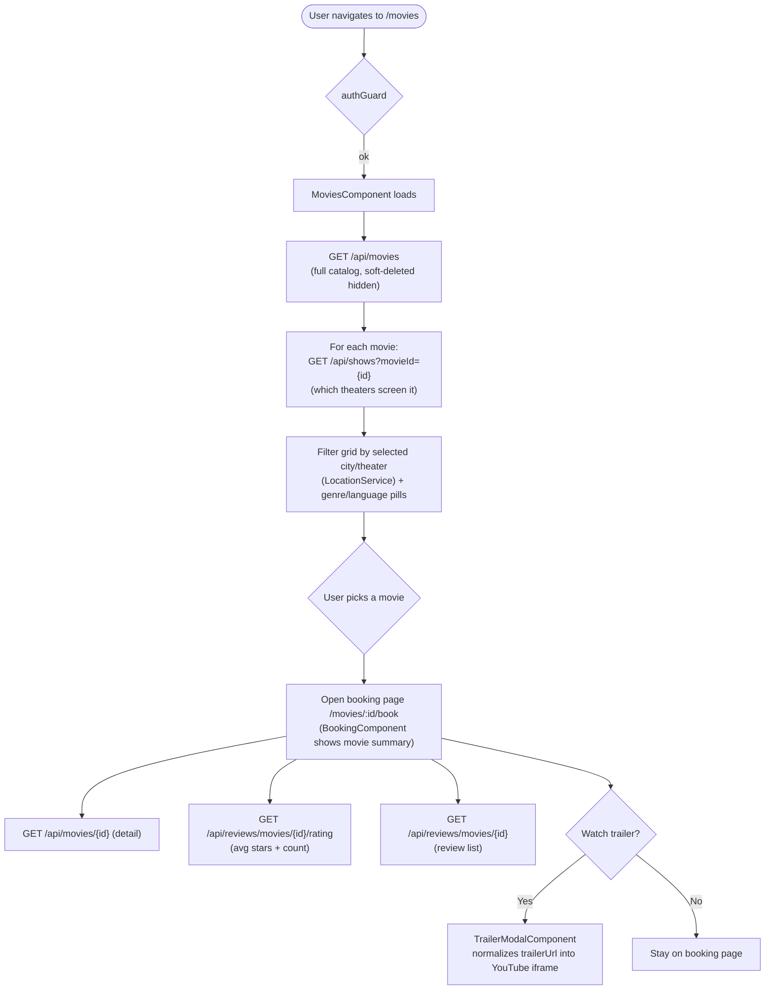

`MoviesComponent` renders the browse grid. It first pulls the whole catalog with `GET /api/movies` (the service already filters out soft-deleted rows), then fans out a `GET /api/shows?movieId={id}` per movie to learn which theaters currently screen each film — that mapping powers the location/theater filter alongside the genre and language pills (driven by `LocationService` + the navbar city picker). Selecting a movie routes to the booking page `/movies/:id/book`, where the movie summary, poster, average rating, and reviews are shown. The aggregate rating comes from `GET /api/reviews/movies/{id}/rating` and the individual reviews from `GET /api/reviews/movies/{id}`. A "Watch trailer" CTA opens the reusable `TrailerModalComponent`, which normalizes the movie's `trailerUrl` (watch / youtu.be / embed forms) into a YouTube iframe.

| Action | Frontend route / component | Endpoint | Notes |
| --- | --- | --- | --- |
| List catalog | `/movies` · `MoviesComponent` | `GET /api/movies` | Raw `Movie[]`; soft-deleted excluded |
| Map theaters per movie | `/movies` · `MoviesComponent` | `GET /api/shows?movieId={id}` | `PublicShowResponse[]`, upcoming only, theater-enriched |
| Movie detail | `/movies/:id/book` · `BookingComponent` | `GET /api/movies/{id}` | 404 if missing |
| Aggregate rating | `/movies/:id/book` · `BookingComponent` | `GET /api/reviews/movies/{id}/rating` | `MovieRatingResponse` (avg + count) |
| Review list | `/movies/:id/book` · `BookingComponent` | `GET /api/reviews/movies/{id}` | `ReviewResponse[]` (includes reviewer username) |
| Watch trailer | `TrailerModalComponent` (shared) | none | Renders `trailerUrl` in an iframe; no HTTP |

### 6.3 Browse Theaters & their shows

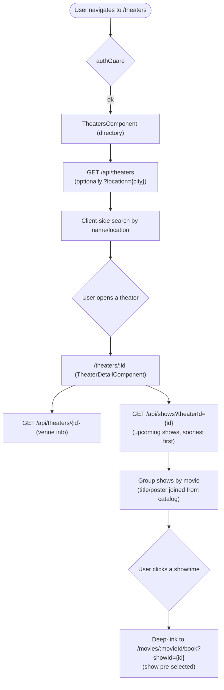

`TheatersComponent` lists the public theater directory from `GET /api/theaters`, which optionally accepts a `?location={city}` filter (exact, case-insensitive); a client-side search box further narrows by name or location. Opening a venue routes to `/theaters/:id` (`TheaterDetailComponent`), which fetches the theater via `GET /api/theaters/{id}` and its upcoming screenings via `GET /api/shows?theaterId={id}` (soonest first). The detail page groups those shows by movie — joining title and poster from the catalog — and each showtime deep-links into the booking page with `?showId=` pre-selected, so the user lands on the right show with the seat picker ready.

| Action | Frontend route / component | Endpoint | Notes |
| --- | --- | --- | --- |
| Theater directory | `/theaters` · `TheatersComponent` | `GET /api/theaters` (`?location=` optional) | `TheaterResponse[]` (id, name, location) |
| Theater detail | `/theaters/:id` · `TheaterDetailComponent` | `GET /api/theaters/{id}` | 404 ("Theater not found") if missing |
| Venue's upcoming shows | `/theaters/:id` · `TheaterDetailComponent` | `GET /api/shows?theaterId={id}` | `PublicShowResponse[]`, upcoming only, soonest first |
| Jump to booking | deep-link to `/movies/:id/book?showId=` | (none here) | Pre-selects the show on the booking page |

### 6.4 Booking + seat selection leading into payment

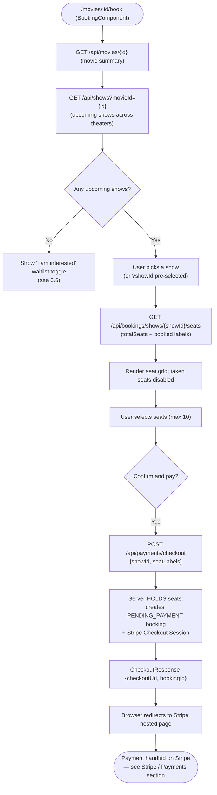

The booking page `/movies/:id/book` (`BookingComponent`) is the heart of the purchase flow. It loads the movie summary (`GET /api/movies/{id}`) and the movie's upcoming shows (`GET /api/shows?movieId={id}`). If the movie has **no upcoming shows**, the page swaps the show picker for the "I am interested" waitlist toggle (section 6.6). Otherwise the user picks a show — honoring `?showId` pre-selection from a theater deep-link — and the page fetches a seat snapshot via `GET /api/bookings/shows/{showId}/seats`, which returns `totalSeats` plus the labels already `BOOKED` so the grid can disable taken seats. The user selects up to **10 seats** (a per-booking cap enforced server-side). On confirm, `PaymentService.startCheckout` calls `POST /api/payments/checkout` with `{showId, seatLabels}`. This is the **seat-hold** step: the server reserves those seats by creating a `PENDING_PAYMENT` booking and opens a Stripe Checkout Session, returning `{checkoutUrl, bookingId}`. The SPA then redirects the browser to `checkoutUrl`. Everything past the redirect — payment capture, confirmation on return (`/payment/success`), and hold release on back-out (`/payment/cancel`) — is covered in the Stripe / Payments section.

| Step | Frontend route / component | Endpoint | Notes |
| --- | --- | --- | --- |
| Movie summary | `/movies/:id/book` · `BookingComponent` | `GET /api/movies/{id}` | — |
| Upcoming shows for movie | `/movies/:id/book` · `BookingComponent` | `GET /api/shows?movieId={id}` | If empty → waitlist toggle (6.6) |
| Seat snapshot | `/movies/:id/book` · `BookingComponent` | `GET /api/bookings/shows/{showId}/seats` | `SeatAvailabilityResponse` (total + booked labels); any auth user may query any show |
| Hold seats + start payment | `/movies/:id/book` · `BookingComponent` (`PaymentService`) | `POST /api/payments/checkout` | Creates `PENDING_PAYMENT` hold + Stripe session; returns `checkoutUrl`, `bookingId`. Max 10 seats. Not idempotent (repeat = new hold) |

### 6.5 My Bookings + interactive seat cancellation & refund preview

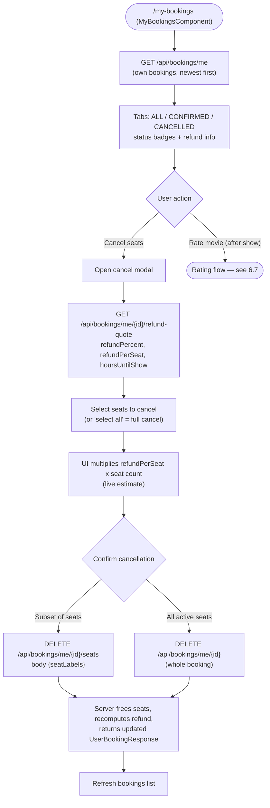

`/my-bookings` (`MyBookingsComponent`) lists the caller's own bookings via `GET /api/bookings/me` (newest first), with ALL / CONFIRMED / CANCELLED tabs, status badges, and refund details. The interactive cancel modal first fetches a **refund preview** with `GET /api/bookings/me/{id}/refund-quote`, which returns the policy tier (`refundPercent` of 0/50/80/100 depending on hours until showtime — at least 24h = 100%, 12-24h = 80%, 2-12h = 50%, under 2h = 0%), the `refundPerSeat` amount, and `hoursUntilShow`. As the user toggles seats in the grid, the UI multiplies `refundPerSeat` by the number of selected seats to show a live estimate. On confirm, the component (`UserBookingService.cancelSeats`) sends `DELETE /api/bookings/me/{id}/seats` with a `{seatLabels}` body for a **partial** cancel; a "select all" shortcut cancels the whole booking via `DELETE /api/bookings/me/{id}`. In both cases the server frees the seats back to the show and recomputes the refund authoritatively (the quote is only a preview), returning the updated `UserBookingResponse`. After a show has played, a Rate action appears (gated by the `hasReview` flag) — that's the review flow in 6.7.

| Action | Frontend route / component | Endpoint | Notes |
| --- | --- | --- | --- |
| List my bookings | `/my-bookings` · `MyBookingsComponent` | `GET /api/bookings/me` | `UserBookingResponse[]`, scoped to JWT userId; `hasReview` drives Rate button |
| Single booking detail | `/my-bookings` · `MyBookingsComponent` | `GET /api/bookings/me/{id}` | Ownership re-checked server-side |
| Refund preview (live estimate) | cancel modal | `GET /api/bookings/me/{id}/refund-quote` | `RefundQuoteResponse`; tiers 100/80/50/0% by `hoursUntilShow` |
| Cancel a subset of seats | cancel modal (`UserBookingService.cancelSeats`) | `DELETE /api/bookings/me/{id}/seats` (body `{seatLabels}`) | Partial cancel; remaining seats stay BOOKED; refund recomputed for subset |
| Cancel the whole booking | cancel modal ("select all") | `DELETE /api/bookings/me/{id}` | Cancels all active seats; sets status / cancelledAt / refundAmount |

### 6.6 "I am interested" movie waitlist

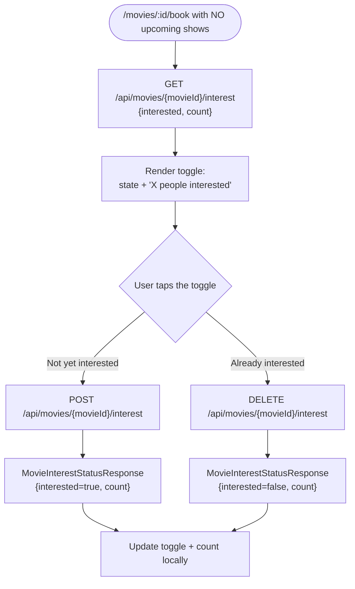

When a movie has no upcoming shows to book, `BookingComponent` shows the "I am interested" waitlist widget instead of the seat picker. On load it reads the caller's status and the running total with `GET /api/movies/{movieId}/interest`, rendering both the toggle state and an "X people interested" count. Tapping the toggle marks interest via `POST /api/movies/{movieId}/interest` (when not yet interested) or removes it via `DELETE /api/movies/{movieId}/interest` (when already on the waitlist). Both writes are idempotent and return the post-action `MovieInterestStatusResponse` `{interested, count}`, which the component applies locally so the widget updates immediately. (These counts also feed the admin "Audience Interest" analytics.)

| Action | Frontend route / component | Endpoint | Notes |
| --- | --- | --- | --- |
| Read interest status + total | `/movies/:id/book` · `BookingComponent` (`MovieInterestService`) | `GET /api/movies/{movieId}/interest` | `{movieId, interested, count}`; caller status via JWT |
| Mark interested (waitlist) | waitlist toggle | `POST /api/movies/{movieId}/interest` | Upserts a `MovieInterest` row; idempotent; no body |
| Remove interest (un-waitlist) | waitlist toggle | `DELETE /api/movies/{movieId}/interest` | Deletes the row; idempotent |

### 6.7 Rate / Review a watched movie

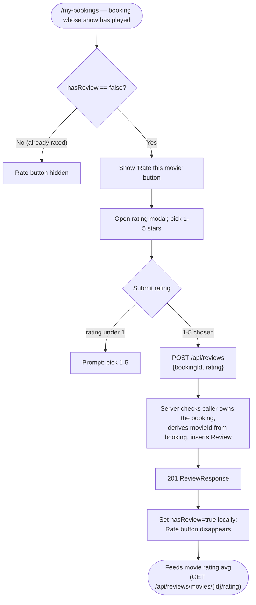

On `/my-bookings`, once a booking's show has played and the booking has not yet been reviewed (`hasReview == false`), a "Rate this movie" button appears. Opening it shows a 1-5 star modal; on submit, `ReviewService.submit` posts `POST /api/reviews` with `{bookingId, rating}`. The server enforces that the caller owns the linked booking and derives the `movieId` from that booking (so a user cannot rate a movie they did not book or mis-attribute the review), then inserts a `Review` row and returns `201` with a `ReviewResponse`. The component immediately flags the booking `hasReview: true` locally so the Rate button disappears without a refetch. These reviews aggregate into the movie's average rating shown on the detail page (section 6.2) and the admin "Top Rated" analytics.

| Action | Frontend route / component | Endpoint | Notes |
| --- | --- | --- | --- |
| Submit a rating | `/my-bookings` · `MyBookingsComponent` (`ReviewService`) | `POST /api/reviews` | `{bookingId, rating 1-5}`; 201; ownership enforced; movie derived from booking; once-per-booking (gated by `hasReview`) |
| (Read) reviews for a movie | `/movies/:id/book` · `BookingComponent` | `GET /api/reviews/movies/{movieId}` | Lists all reviews incl. reviewer username |
| (Read) aggregate rating | `/movies/:id/book` · `BookingComponent` | `GET /api/reviews/movies/{movieId}/rating` | Average stars + review count |

---

## 7. Functional Specifications - Admin Flows

All admin functionality is gated by the **`ADMIN` role** (Spring Security `@PreAuthorize("hasRole('ADMIN')")`) and is **theater-scoped**: the admin's own theater is read from the signed JWT (`principal.theaterId()`), never from the client. This means an admin can only ever see and modify data tied to the single theater they own. The link is established at sign-up: registering via `/api/auth/register-admin` creates both the admin `User` and their `Theater`, and stamps the new `theaterId` back onto the admin account. The movie *catalog*, by contrast, is **global** (shared across all theaters) — only shows, bookings, and most analytics are scoped per theater.

### 7.1 Manage Movies (CRUD + soft delete)

The admin maintains the global movie catalog. Deletes are **soft** (a `deleted` flag is flipped to true) so that historical shows and bookings tied to a movie are never orphaned — the movie simply disappears from browse and create screens.

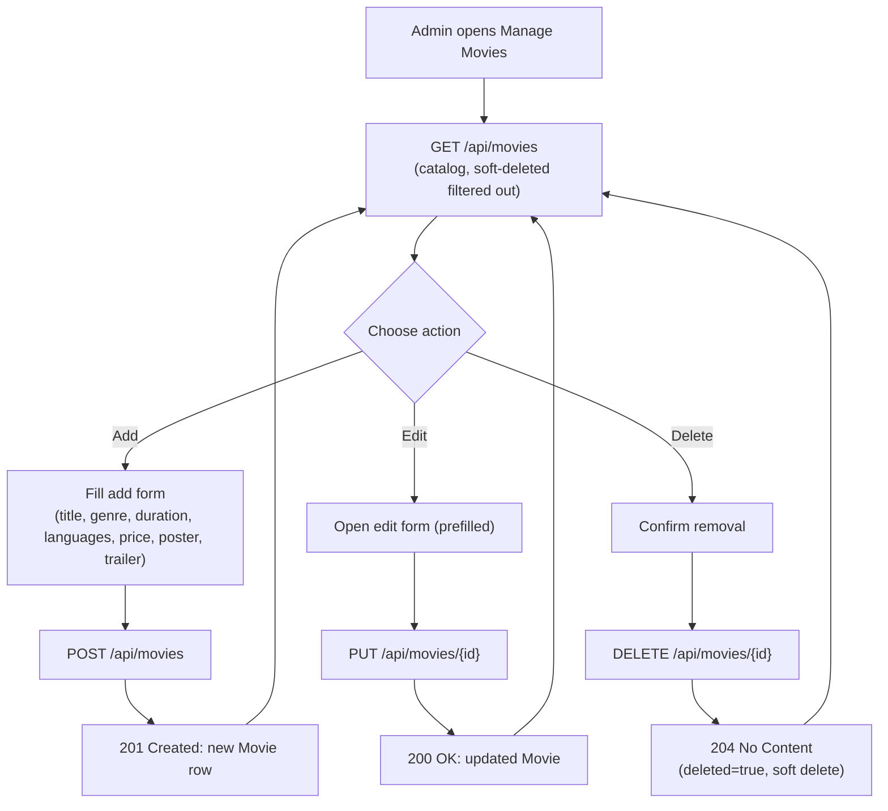

**Behaviour (plain language):** The Manage Movies screen lists every active movie, shows a counter and an auto-rotating carousel of the latest titles, and offers a filterable table. Adding a movie inserts a new row in the shared catalog; editing overwrites its details; deleting hides it (soft delete) rather than erasing it. Because the catalog is global, any change is visible to all theaters that schedule that movie. The add/edit form trims text fields server-side and offers preset language chips. (`ManageMoviesComponent`, backed by `MovieService`.)

**Endpoints:**

| Action | Method & Path | Auth | Request body | Response |
|---|---|---|---|---|
| List catalog | `GET /api/movies` | Authenticated user | none | `200` array of `Movie` (soft-deleted excluded) |
| View one | `GET /api/movies/{id}` | Authenticated user | none | `200` `Movie` (404 if missing) |
| Create | `POST /api/movies` | ADMIN | `MovieRequest { title, genre, durationMins, languages(CSV), posterUrl, trailerUrl, price }` | `201` created `Movie` |
| Update | `PUT /api/movies/{id}` | ADMIN | `MovieRequest` (same fields) | `200` updated `Movie` |
| Soft delete | `DELETE /api/movies/{id}` | ADMIN | none | `204 No Content` (sets `deleted=true`) |

### 7.2 Manage Shows (CRUD, theater-scoped)

A "show" is one screening of a catalog movie at the admin's theater at a given time. Every show belongs to the admin's own theater: on create the `theaterId` is taken from the JWT (never the request body), and update/delete verify the show belongs to the caller before acting. Deletes are soft (`deleted` flag).

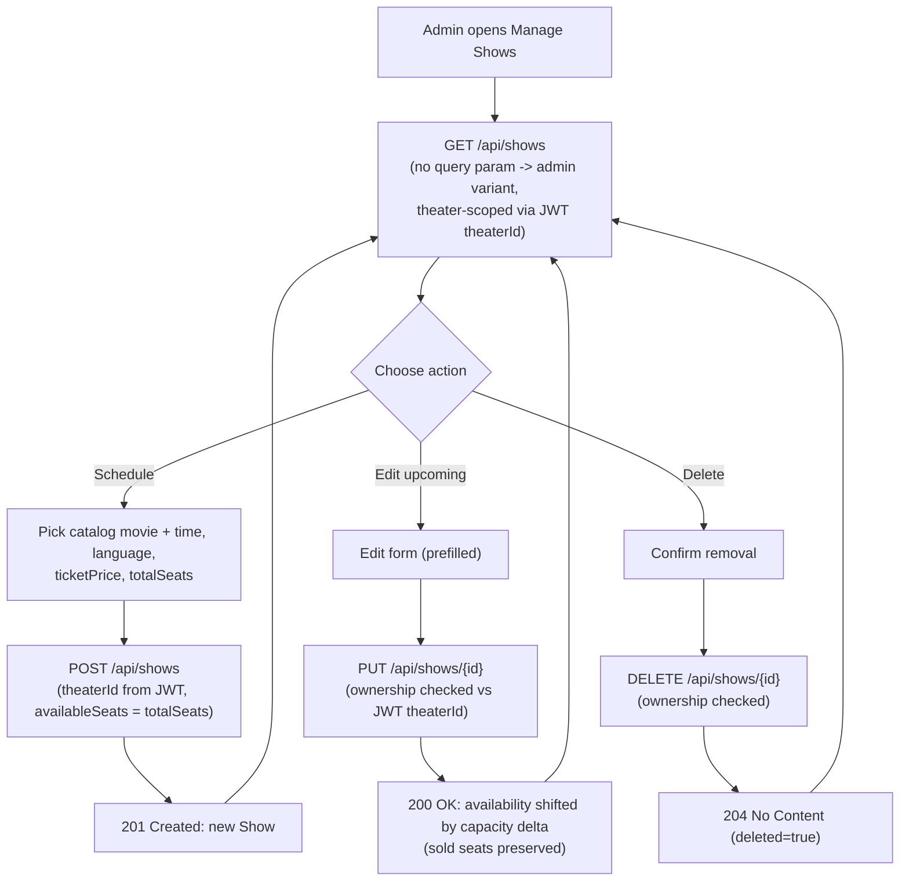

**Behaviour (plain language):** The scheduler lists only the calling admin's own shows, grouped by movie in a carousel, with a filterable ledger that separates upcoming shows (editable) from closed ones (delete-only). When a show is created the whole house is opened (`availableSeats = totalSeats`). When capacity is edited, already-sold seats are preserved: new availability = previous available adjusted by the change in total capacity, clamped to the new total — so the system never "loses" seats people already hold. Movie metadata (title, poster) is resolved from the cached catalog. (`ManageShowsComponent`, backed by `ShowService`.)

**Endpoints:**

| Action | Method & Path | Auth | Request body | Response |
|---|---|---|---|---|
| List own theater's shows | `GET /api/shows` (no query param) | ADMIN (JWT `theaterId`) | none | `200` array of `Show` (own theater, non-deleted) |
| Create | `POST /api/shows` | ADMIN | `ShowRequest { movieId, showTime, language, ticketPrice, totalSeats }` | `201` `Show` (`theaterId` from JWT, `availableSeats=totalSeats`) |
| Update | `PUT /api/shows/{id}` | ADMIN | `ShowRequest` | `200` `Show` (ownership-checked, availability re-derived) |
| Soft delete | `DELETE /api/shows/{id}` | ADMIN | none | `204 No Content` (ownership-checked) |

> Note: the same `GET /api/shows` path with a `movieId` or `theaterId` query parameter is the **user-facing** variant (returns upcoming `PublicShowResponse`); the admin variant is the one with **no** query param.

### 7.3 Manage Bookings (All Bookings ledger + Most-Booked)

The admin sees a complete reservation ledger for their own theater plus a "Most Booked" leaderboard. Both are read-only and theater-scoped via the JWT `theaterId`.

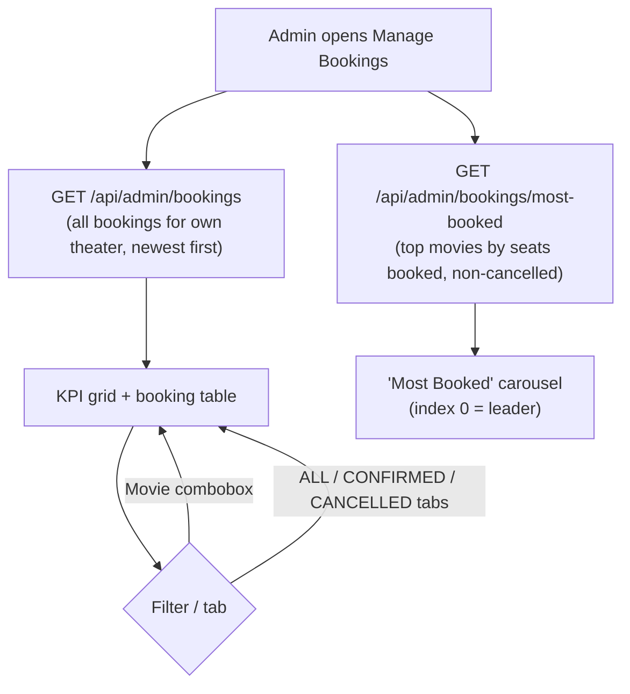

**Behaviour (plain language):** The "All Bookings" ledger lists every reservation made at the admin's theater (excluding still-pending payment holds), newest first, including the customer's username, the seats, the money breakdown (subtotal, tax, total, any refund), and status. A KPI grid summarises the figures, a movie-filter combobox and ALL/CONFIRMED/CANCELLED status tabs narrow the table, and a "Most Booked" carousel ranks movies by total seats sold across non-cancelled bookings (top 5, leader first). All of this is automatically limited to the admin's own theater — they cannot see other venues' bookings. (`ManageBookingsComponent`, backed by `BookingService`.)

**Endpoints:**

| Action | Method & Path | Auth | Response |
|---|---|---|---|
| All bookings ledger | `GET /api/admin/bookings` | ADMIN (theater-scoped) | `200` array of `AdminBookingResponse { id, userId, username, movieId, movieTitle, moviePosterUrl, showId, showTime, theaterName, theaterLocation, seatsBooked, seatNumbers, subtotal, taxAmount, totalAmount, refundAmount, status, bookingDate, cancelledAt }` |
| Most booked | `GET /api/admin/bookings/most-booked` | ADMIN (theater-scoped) | `200` array of `MostBookedMovieResponse { movieId, title, posterUrl, totalSeatsBooked, totalBookings }` ordered by `totalSeatsBooked` desc (limit 5) |

### 7.4 Analytics Dashboard (KPIs, top-performing shows, top-rated movies, audience interest)

The analytics dashboard renders revenue/seats/occupancy KPIs, charts of bookings over time and occupancy/top-performance, top-rated movies, and audience-interest cards. Most figures are **theater-scoped** — derived from the movies the admin's theater actually screens (via that theater's shows). **Audience interest is the deliberate exception: it spans the whole catalogue**, so the admin can see demand for titles they have not yet scheduled.

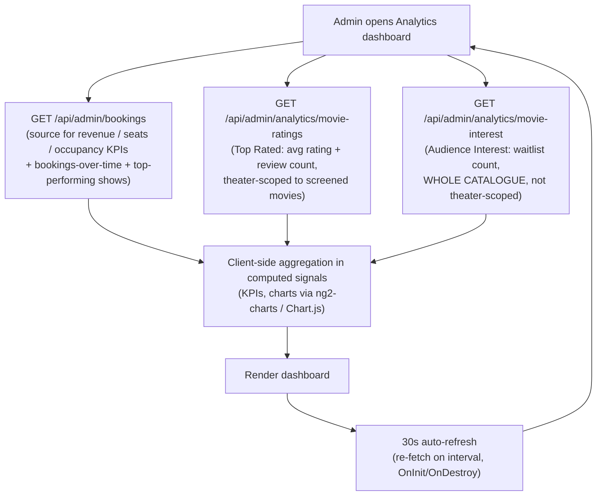

**Behaviour (plain language):** The dashboard pulls the theater's bookings and analytics aggregates and crunches them client-side (in Angular computed signals) into KPIs — revenue, seats sold, occupancy — plus a bookings-over-time chart and occupancy / top-performing-show views, all filterable by time range, grouping, and movie. "Top Rated" shows the average star rating and review count for movies the admin's theater screens. "Audience Interest" footer cards show how many users have waitlisted each movie across the **entire** catalogue (so demand for unscheduled titles surfaces — useful for deciding what to program next). The whole dashboard auto-refreshes every 30 seconds. (`AnalyticsComponent`, backed by `AnalyticsService` and `BookingService`.)

**Endpoints:**

| Purpose | Method & Path | Auth | Scope | Response |
|---|---|---|---|---|
| Revenue / seats / occupancy KPIs, bookings-over-time, top-performing shows | `GET /api/admin/bookings` | ADMIN | Theater-scoped | `200` array of `AdminBookingResponse` (aggregated client-side) |
| Top-rated movies | `GET /api/admin/analytics/movie-ratings` | ADMIN | Theater-scoped (movies the theater screens) | `200` array of `MovieRatingResponse { movieId, title, posterUrl, averageRating, reviewCount }` sorted by rating desc |
| Audience interest | `GET /api/admin/analytics/movie-interest` | ADMIN | **Whole catalogue** (intentional exception) | `200` array of `MovieInterestResponse { movieId, title, posterUrl, waitlistCount }` sorted by count desc |

> The `AnalyticsService.requireTheater` guard rejects (403/forbidden) any caller without a `theaterId`, so a non-admin token can never reach these aggregates.

## 8. Stripe Payment & Refund Integration

CineBook never takes card details itself. Instead it uses Stripe's **hosted Checkout** with a **reserve-then-pay** model: the server first *holds* the chosen seats as a `PENDING_PAYMENT` booking, then sends the customer to a Stripe-hosted payment page. Only after Stripe confirms the money has actually been collected does the booking become `CONFIRMED`. If the customer abandons the payment, the held seats are released automatically. Money is always handled in **paise** (the smallest currency unit — `toMinorUnits()` multiplies the rupee amount by 100, `HALF_UP`), prices include a flat **18% GST**, and the finalize step is **idempotent** so a booking is never confirmed twice even if both the browser and Stripe's webhook report success.

Configuration lives under `app.stripe.*` (bound by `StripeProperties`): `secretKey`, `webhookSecret`, `successUrl`, `cancelUrl`, `currency` (default `inr`), and `holdTtlMinutes` (default 30). `StripeGateway` is a thin SDK wrapper that maps every Stripe error to an `ApiException` and refuses to run if `STRIPE_SECRET_KEY` is unset. `StripePaymentService` orchestrates the flow on top of `BookingService`'s seat-hold primitives.

### 8.1 Booking-to-Payment Happy Path

When the user picks seats and pays, the seats are held, Stripe collects the money, and the booking is confirmed. A server-to-server webhook acts as a backstop in case the browser never makes it back from Stripe.

```mermaid
sequenceDiagram
  participant U as "User (SPA)"
  participant PC as "PaymentController"
  participant SPS as "StripePaymentService"
  participant BS as "BookingService"
  participant SG as "StripeGateway"
  participant ST as "Stripe (hosted)"

  U->>PC: "POST /api/payments/checkout {showId, seatLabels}"
  PC->>SPS: "startCheckout(userId, request)"
  SPS->>BS: "holdSeats(...) -> PENDING_PAYMENT booking"
  Note over BS: "subtotal = price x count; tax = 18%;<br/>total = subtotal + tax; availableSeats--"
  SPS->>BS: "toMinorUnits(total) -> amount in paise"
  SPS->>SG: "createCheckoutSession(amountMinor, name, bookingId)"
  SG->>ST: "Session.create (PAYMENT mode)"
  ST-->>SG: "Session {url, id}"
  SG-->>SPS: "Session"
  SPS->>BS: "persist booking.stripeSessionId"
  SPS-->>PC: "CheckoutResponse {checkoutUrl, bookingId}"
  PC-->>U: "200 OK {checkoutUrl, bookingId}"
  U->>ST: "redirect to checkoutUrl, pay card"
  ST-->>U: "redirect to successUrl?session_id=..."
  U->>PC: "POST /api/payments/confirm {sessionId}"
  PC->>SPS: "finalizeBySession(userId, sessionId)"
  SPS->>SG: "retrieveSession(sessionId)"
  SG->>ST: "Session.retrieve"
  ST-->>SG: "Session {paymentStatus='paid', paymentIntent}"
  SPS->>BS: "finalizePending(bookingId, paymentIntentId)"
  Note over BS: "PENDING_PAYMENT -> CONFIRMED (idempotent),<br/>stamps stripePaymentIntentId + paidAt"
  SPS-->>PC: "UserBookingResponse {status: CONFIRMED}"
  PC-->>U: "200 OK confirmed booking"

  Note over ST,SPS: "Webhook backstop (parallel, if browser never returns)"
  ST->>PC: "POST /api/payments/webhook (Stripe-Signature)"
  PC->>SPS: "handleWebhook(payload, sig)"
  SPS->>SG: "parseEvent -> checkout.session.completed"
  SPS->>SPS: "finalizeBySession(null, sessionId)"
  Note over SPS: "Same idempotent finalize; userId=null;<br/>benign errors swallowed so Stripe gets 200"
  PC-->>ST: "200 ok"
```

**Plain language:** Reserving the seats and asking Stripe for a payment page happens in one transaction — if Stripe refuses, the whole hold is rolled back, so seats are never stuck. When the user comes back from Stripe, the server re-checks the session directly with Stripe and only confirms if the payment status is truly `"paid"`. Because Stripe also notifies the server independently via a signed webhook, the booking still gets confirmed even if the user closes their browser before returning. Both paths call the same `finalizeBySession`, which is idempotent, so the booking is confirmed exactly once.

### 8.2 Refund / Cancel Flow (tiered refund, real Stripe refund, rollback on failure)

When a user cancels (whole booking or a subset of seats), the system computes a time-tiered refund, issues a **real Stripe refund**, and only marks the seats cancelled if the refund succeeds. The money movement and the seat cancellation live in the same transaction, so a Stripe failure rolls back the cancellation entirely — seats are never released without the money being returned.

```mermaid
sequenceDiagram
  participant U as "User (SPA)"
  participant BC as "BookingController"
  participant BS as "BookingService"
  participant SG as "StripeGateway"
  participant ST as "Stripe"

  Note over U,BC: "Optional preview"
  U->>BC: "GET /api/bookings/me/{id}/refund-quote"
  BC->>BS: "quoteRefund(userId, bookingId)"
  BS-->>BC: "RefundQuoteResponse {refundPercent, refundPerSeat, hoursUntilShow, message}"
  BC-->>U: "200 OK quote (live estimate)"

  U->>BC: "DELETE /api/bookings/me/{id}  (or .../seats {seatLabels})"
  BC->>BS: "cancelBooking / cancelSeats (ownership checked)"
  BS->>BS: "applyCancellation(booking, seats) [@Transactional]"
  Note over BS: "refundPercent = refundPercentFor(showTime, now)<br/>tiers: over/=24h=100, 12-24h=80, 2-12h=50, under 2h/past=0"
  Note over BS: "gross = sum(seat.price) + 18% tax<br/>refundWithTax = gross x percent / 100 (HALF_UP)"
  alt "refundWithTax over 0 AND stripePaymentIntentId present"
    BS->>SG: "refund(paymentIntentId, toMinorUnits(refundWithTax))"
    SG->>ST: "Refund.create (partial or full, in paise)"
    ST-->>SG: "Refund ok"
    SG-->>BS: "ok"
  end
  Note over BS: "seats -> CANCELLED (cancelledAt);<br/>accumulate booking.refundAmount;<br/>restore show.availableSeats (clamped to total);<br/>status = CANCELLED if 0 BOOKED left else PARTIALLY_CANCELLED"
  alt "Stripe refund throws"
    SG-->>BS: "ApiException"
    Note over BS: "@Transactional rolls back:<br/>seats stay BOOKED, no money lost or released"
    BS-->>BC: "error"
    BC-->>U: "error (cancellation aborted)"
  else "success"
    BS-->>BC: "UserBookingResponse {status, refundAmount, cancelledAt}"
    BC-->>U: "200 OK updated booking"
  end
```

**Plain language:** Before cancelling, the user can see a live refund estimate. The refund percentage depends on how close the show is: 100% if 24 hours or more away, 80% between 12 and 24 hours, 50% between 2 and 12 hours, and 0% under 2 hours (or if the show has already started). The refund is calculated on the seat price plus its 18% GST, scaled by that percentage, and an actual Stripe refund is issued in paise against the original payment. Crucially, the seat-release and the money-return are in one transaction: if Stripe fails to refund, nothing is cancelled and no seats are freed. If only some seats remain after a partial cancel, the booking becomes `PARTIALLY_CANCELLED`; if none remain, it becomes `CANCELLED`.

**Refund tiers:**

| Hours until show | Refund % |
|---|---|
| 24h or more | 100% |
| 12h up to 24h | 80% |
| 2h up to 12h | 50% |
| under 2h, past, or unknown | 0% |

### 8.3 Booking Status Lifecycle

```mermaid
stateDiagram-v2
  [*] --> PENDING_PAYMENT: "holdSeats (checkout)"
  PENDING_PAYMENT --> CONFIRMED: "finalizePending<br/>(Stripe paymentStatus = paid)"
  PENDING_PAYMENT --> [*]: "releasePending<br/>(cancel-hold / expired / reaper:<br/>seats + booking deleted)"
  CONFIRMED --> PARTIALLY_CANCELLED: "cancelSeats<br/>(some seats remain BOOKED)"
  CONFIRMED --> CANCELLED: "cancelBooking<br/>(all seats cancelled)"
  PARTIALLY_CANCELLED --> PARTIALLY_CANCELLED: "cancelSeats<br/>(more, but some remain)"
  PARTIALLY_CANCELLED --> CANCELLED: "cancel remaining seats<br/>(0 BOOKED left)"
  CANCELLED --> [*]
```

**Plain language:** A booking starts life as `PENDING_PAYMENT` the moment seats are held. If payment is verified it becomes `CONFIRMED`; if the hold is abandoned it is deleted outright (it never lingers as a "cancelled" record). From `CONFIRMED`, cancelling some seats moves it to `PARTIALLY_CANCELLED` (the rest stay valid), and cancelling everything moves it to `CANCELLED`.

### 8.4 Abandoned-Hold Cleanup

Held seats must not be locked up forever if a user wanders off mid-payment. Three mechanisms release them, layered for safety:

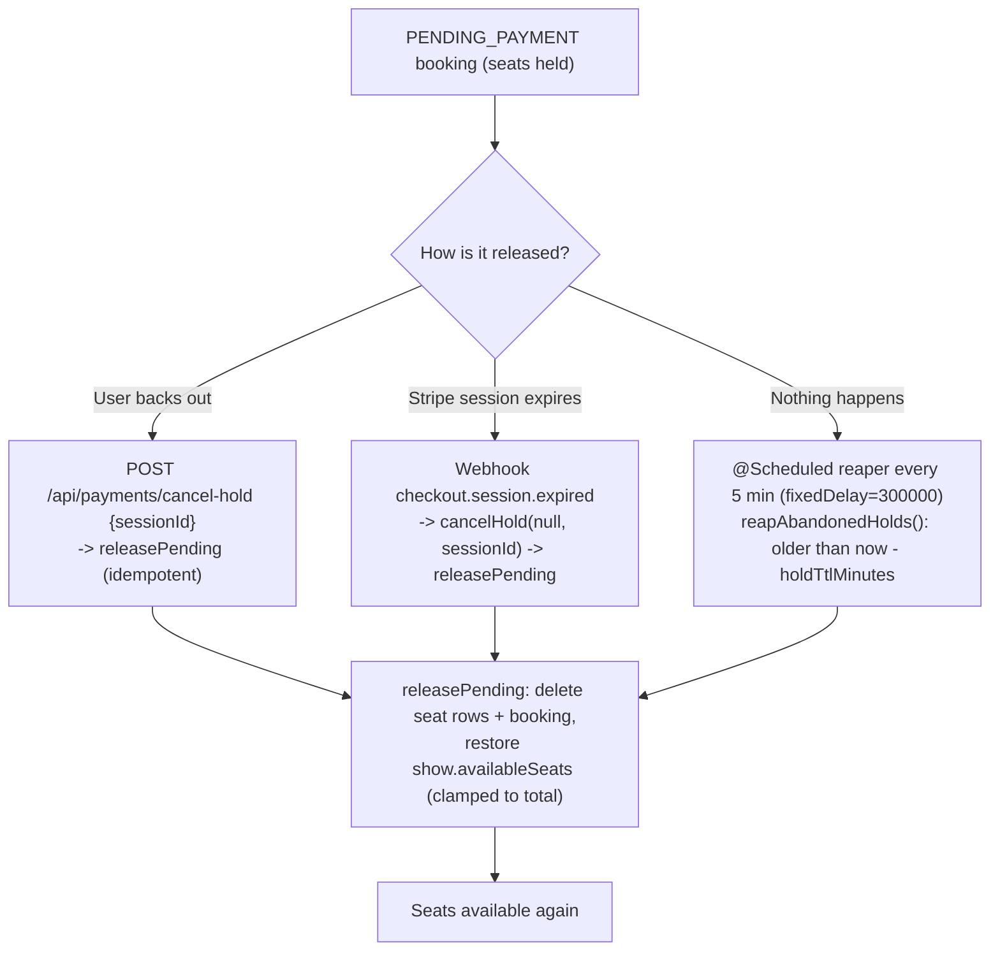

**Plain language:** There are three ways a stale hold gets cleaned up, and they overlap on purpose (belt-and-suspenders):

1. **Explicit cancel** — if the user clicks back out of payment, the SPA calls `cancel-hold`, which releases the seats immediately. Calling it twice is harmless (idempotent no-op).
2. **Stripe's expiry webhook** — when a Checkout session times out, Stripe sends a `checkout.session.expired` event; the server releases the hold out-of-band.
3. **The 5-minute reaper** — a scheduled job (`reapAbandonedHolds`, `@Scheduled(fixedDelay=300_000)`, enabled by `@EnableScheduling`) sweeps every 5 minutes and releases any `PENDING_PAYMENT` booking older than `holdTtlMinutes` (default 30). This is the safety net in case both the user and the webhook are silent.

In every case `releasePending` deletes the seat rows and the pending booking and restores the show's available-seat count (clamped to the show's total), so the freed seats reappear in other users' seat pickers. Releasing an already-released hold is a no-op, keeping all three paths safe to run together.

> Edge case handled by `finalizeBySession`: if a hold was already reaped but Stripe shows the session as `"paid"` (a late payment on a dead hold), the service issues an automatic refund of the orphan charge and reports `"reservation expired… charge refunded"` — so a user is never charged for seats they cannot get.

---

## 9. Complete API Reference

This section documents every HTTP endpoint exposed by the CineBook backend, grouped by functional area. All routes are JSON over HTTP. Authentication (unless marked **public**) is via a JWT bearer token sent in the `Authorization: Bearer <token>` header. The token is obtained from the Auth endpoints and encodes the caller's `userId`, `role` (USER or ADMIN), and `theaterId` (set only for admins). Admin operations are always scoped to the admin's own theater using the `theaterId` baked into the token — never a value supplied by the client.

### 9.0 Summary Table (all endpoints)

| # | Area | Method | Path | Auth | Purpose |
|---|------|--------|------|------|---------|
| 1 | Auth | POST | `/api/auth/register` | Public | Register a regular USER, return JWT |
| 2 | Auth | POST | `/api/auth/register-admin` | Public | Register an ADMIN + their Theater, return JWT |
| 3 | Auth | POST | `/api/auth/login` | Public | Log in, return JWT |
| 4 | Movies | GET | `/api/movies` | User/Admin | List the movie catalog |
| 5 | Movies | GET | `/api/movies/{id}` | User/Admin | Get one movie |
| 6 | Movies | POST | `/api/movies` | Admin | Create a movie |
| 7 | Movies | PUT | `/api/movies/{id}` | Admin | Update a movie |
| 8 | Movies | DELETE | `/api/movies/{id}` | Admin | Soft-delete a movie |
| 9 | Theaters | GET | `/api/theaters` | User/Admin | List theaters (optional location filter) |
| 10 | Theaters | GET | `/api/theaters/{id}` | User/Admin | Get one theater |
| 11 | Shows | GET | `/api/shows` | Admin (in practice) | List the admin's own theater's shows |
| 12 | Shows | GET | `/api/shows?movieId=` | User/Admin | List upcoming shows for a movie |
| 13 | Shows | GET | `/api/shows?theaterId=` | User/Admin | List upcoming shows for a theater |
| 14 | Shows | POST | `/api/shows` | Admin | Create a show at the admin's theater |
| 15 | Shows | PUT | `/api/shows/{id}` | Admin | Update one of the admin's shows |
| 16 | Shows | DELETE | `/api/shows/{id}` | Admin | Soft-delete one of the admin's shows |
| 17 | Payments | POST | `/api/payments/checkout` | User/Admin | Hold seats + open Stripe Checkout |
| 18 | Payments | POST | `/api/payments/confirm` | User/Admin | Confirm booking after Stripe |
| 19 | Payments | POST | `/api/payments/cancel-hold` | User/Admin | Release a pending seat hold |
| 20 | Payments | POST | `/api/payments/webhook` | Stripe signature | Stripe server-to-server event receiver |
| 21 | Bookings (user) | GET | `/api/bookings/me` | User/Admin | List my bookings |
| 22 | Bookings (user) | GET | `/api/bookings/me/{id}` | User/Admin | Get one of my bookings |
| 23 | Bookings (user) | DELETE | `/api/bookings/me/{id}` | User/Admin | Cancel a whole booking |
| 24 | Bookings (user) | DELETE | `/api/bookings/me/{id}/seats` | User/Admin | Cancel a subset of seats |
| 25 | Bookings (user) | GET | `/api/bookings/me/{id}/refund-quote` | User/Admin | Preview refund before cancelling |
| 26 | Bookings (user) | GET | `/api/bookings/shows/{showId}/seats` | User/Admin | Seat-availability snapshot for a show |
| 27 | Reviews | POST | `/api/reviews` | User/Admin | Rate a movie tied to my booking |
| 28 | Reviews | GET | `/api/reviews/movies/{movieId}` | User/Admin | List reviews for a movie |
| 29 | Reviews | GET | `/api/reviews/movies/{movieId}/rating` | User/Admin | Aggregate rating for a movie |
| 30 | Movie Interest | GET | `/api/movies/{movieId}/interest` | User/Admin | My interest status + total count |
| 31 | Movie Interest | POST | `/api/movies/{movieId}/interest` | User/Admin | Mark interest (waitlist) |
| 32 | Movie Interest | DELETE | `/api/movies/{movieId}/interest` | User/Admin | Remove interest |
| 33 | Admin Bookings | GET | `/api/admin/bookings` | Admin | All bookings for the admin's theater |
| 34 | Admin Bookings | GET | `/api/admin/bookings/most-booked` | Admin | Top movies by seats booked |
| 35 | Analytics | GET | `/api/admin/analytics/movie-ratings` | Admin | Avg rating per movie at the theater |
| 36 | Analytics | GET | `/api/admin/analytics/movie-interest` | Admin | Waitlist count per movie at the theater |

> **Auth legend:** *Public* = no token required. *User/Admin* = any valid JWT. *Admin* = `@PreAuthorize hasRole('ADMIN')`. *Stripe signature* = authenticated by the `Stripe-Signature` header, not a JWT.

---

### 9.1 Auth (`AuthController`)

#### POST `/api/auth/register`
- **Auth:** Public (`SecurityConfig` permits all `/api/auth/**`).
- **Purpose:** Self-service registration of a regular USER account; returns the new account plus a signed JWT so the SPA is logged in immediately.
- **Request body** (`RegisterRequest`, `@Valid`):

  | Field | Type | Constraints |
  |-------|------|-------------|
  | `username` | String | `@NotBlank`, max 50 |
  | `password` | String | `@NotBlank`, max 100 |

- **Response:** `201 Created` — `AuthResponse { id: Long, username: String, role: Role (USER), theaterId: Long (null for USER), token: String (JWT) }`
- **Notes:** Side effect — creates a `User` row. Not idempotent (duplicate username rejected by the service).

#### POST `/api/auth/register-admin`
- **Auth:** Public.
- **Purpose:** Registers a theater-owner ADMIN account together with its `Theater`; the returned `theaterId` scopes all later admin operations.
- **Request body** (`RegisterAdminRequest`, `@Valid`):

  | Field | Type | Constraints |
  |-------|------|-------------|
  | `username` | String | `@NotBlank`, max 50 |
  | `password` | String | `@NotBlank`, max 100 |
  | `theaterName` | String | `@NotBlank`, max 150 |
  | `theaterLocation` | String | max 150, optional |

- **Response:** `201 Created` — `AuthResponse { id, username, role=ADMIN, theaterId (the newly created theater), token }`
- **Notes:** Side effects — creates a `User` (ADMIN role) **and** a `Theater` row, linking the owner. Not idempotent.

#### POST `/api/auth/login`
- **Auth:** Public.
- **Purpose:** Authenticates an existing USER or ADMIN by username/password and issues a JWT bearer token.
- **Request body** (`LoginRequest`, `@Valid`):

  | Field | Type | Constraints |
  |-------|------|-------------|
  | `username` | String | `@NotBlank` |
  | `password` | String | `@NotBlank` |

- **Response:** `200 OK` — `AuthResponse { id, username, role, theaterId (null for USER), token }`
- **Notes:** Read-only (no row writes); idempotent. Password verified against the stored BCrypt hash.

---

### 9.2 Movies (`MovieController`)

The movie catalog is **global** (not theater-scoped). Reads return the raw JPA `Movie` entity; the service filters out soft-deleted rows on list endpoints.

#### GET `/api/movies`
- **Auth:** Any valid JWT (USER or ADMIN).
- **Purpose:** Lists the full movie catalog for browse pages.
- **Request data:** None.
- **Response:** `200 OK` — array of `Movie { id, title, genre, durationMins, languages (CSV), price (BigDecimal), posterUrl, trailerUrl, deleted }`
- **Notes:** Read-only, idempotent. Returns the raw entity, not a DTO.

#### GET `/api/movies/{id}`
- **Auth:** Any valid JWT.
- **Purpose:** Fetches a single movie's detail for the movie detail page.
- **Path params:** `id: Long` (movie id).
- **Response:** `200 OK` — `Movie { id, title, genre, durationMins, languages, price, posterUrl, trailerUrl, deleted }`
- **Notes:** Read-only, idempotent. `404` if not found.

#### POST `/api/movies`
- **Auth:** ADMIN (`@PreAuthorize hasRole('ADMIN')`).
- **Purpose:** Admin creates a new movie in the global catalog.
- **Request body** (`MovieRequest`, `@Valid`):

  | Field | Type | Constraints |
  |-------|------|-------------|
  | `title` | String | `@NotBlank`, max 150 |
  | `genre` | String | `@NotBlank`, max 50 |
  | `durationMins` | Integer | `@NotNull`, `@Positive` |
  | `languages` | String (CSV) | `@NotBlank`, max 250 |
  | `posterUrl` | String | `@NotBlank`, max 500 |
  | `trailerUrl` | String | `@NotBlank`, max 500 |
  | `price` | BigDecimal | `@NotNull`, `@PositiveOrZero` |

- **Response:** `201 Created` — `Movie` (created entity with generated id).
- **Notes:** Side effect — inserts a `Movie` row. Not idempotent.

#### PUT `/api/movies/{id}`
- **Auth:** ADMIN.
- **Purpose:** Admin edits an existing movie's details.
- **Path params:** `id: Long`.
- **Request body:** `MovieRequest` (same fields as create).
- **Response:** `200 OK` — `Movie` (updated entity).
- **Notes:** Side effect — updates the `Movie` row. Idempotent for a fixed body. `404` if missing.

#### DELETE `/api/movies/{id}`
- **Auth:** ADMIN.
- **Purpose:** Admin removes a movie from the catalog (soft-delete via the `Movie.deleted` flag).
- **Path params:** `id: Long`.
- **Response:** `204 No Content` (empty body).
- **Notes:** Side effect — sets `deleted=true`. Effectively idempotent. May cascade to dependent shows depending on service logic.

---

### 9.3 Theaters (`TheaterController`)

#### GET `/api/theaters`
- **Auth:** Any valid JWT (USER or ADMIN).
- **Purpose:** Public theater directory for the user-facing Theaters page, optionally filtered by location.
- **Query params:** `location: String` (`@RequestParam required=false`) — exact, case-insensitive match; trimmed; blank/absent returns all.
- **Response:** `200 OK` — array of `TheaterResponse { id, name, location }` (`ownerUserId` omitted).
- **Notes:** Read-only, idempotent. Reads `TheaterRepository` directly (no service); maps via `TheaterResponse.fromEntity`.

#### GET `/api/theaters/{id}`
- **Auth:** Any valid JWT.
- **Purpose:** Fetches a single theater for the theater detail page.
- **Path params:** `id: Long` (theater id).
- **Response:** `200 OK` — `TheaterResponse { id, name, location }`
- **Notes:** Read-only, idempotent. Throws `ApiException.notFound` ("Theater not found") → `404` if missing.

---

### 9.4 Shows (`ShowController`)

`GET /api/shows` is overloaded by query parameter. The presence of `movieId` or `theaterId` selects a public, upcoming-only listing; with neither parameter it falls through to the admin variant that lists the calling admin's own theater's shows.

#### GET `/api/shows` (admin variant — no query param)
- **Auth:** ADMIN in practice — uses `principal.theaterId()` from the JWT, and only admins carry a `theaterId`. Authenticated-user guard at the filter level.
- **Purpose:** Lists all shows belonging to the calling admin's own theater (theater-scoped via JWT) for the admin shows-management screen.
- **Request data:** None (no `movieId`/`theaterId`).
- **Response:** `200 OK` — array of `Show { id, movieId, theaterId, showTime, language, ticketPrice, totalSeats, availableSeats, deleted }`
- **Notes:** Read-only, idempotent. Theater scope comes from the JWT, never the client. Returns the raw `Show` entity. A USER (no `theaterId`) gets an effectively empty/invalid scope.

#### GET `/api/shows?movieId={movieId}`
- **Auth:** Any valid JWT (selected when `movieId` is present).
- **Purpose:** Public/user-facing list of **upcoming** shows for a given movie across theaters (theater-enriched) for the booking "pick a show" page.
- **Query params:** `movieId: Long` (`@RequestParam`, required to select this mapping).
- **Response:** `200 OK` — array of `PublicShowResponse { id, movieId, theaterId, theaterName, theaterLocation, showTime, language, ticketPrice, totalSeats, availableSeats }`
- **Notes:** Read-only, idempotent. Filters to upcoming shows only. Disambiguated from the admin variant by the `movieId` param.

#### GET `/api/shows?theaterId={theaterId}`
- **Auth:** Any valid JWT (selected when `theaterId` is present).
- **Purpose:** Public/user-facing list of **upcoming** shows for a single theater (soonest first) for the theater detail page.
- **Query params:** `theaterId: Long` (`@RequestParam`, required to select this mapping).
- **Response:** `200 OK` — array of `PublicShowResponse { id, movieId, theaterId, theaterName, theaterLocation, showTime, language, ticketPrice, totalSeats, availableSeats }`
- **Notes:** Read-only, idempotent. Upcoming shows only. Disambiguated from the admin variant by the `theaterId` param.

#### POST `/api/shows`
- **Auth:** ADMIN.
- **Purpose:** Admin schedules a new screening (show) of a movie at their own theater.
- **Request body** (`ShowRequest`, `@Valid`):

  | Field | Type | Constraints |
  |-------|------|-------------|
  | `movieId` | Long | `@NotNull` |
  | `showTime` | LocalDateTime | `@NotNull`, ISO `yyyy-MM-ddTHH:mm` |
  | `language` | String | `@NotBlank`, max 40 |
  | `ticketPrice` | BigDecimal | `@NotNull`, `@PositiveOrZero` |
  | `totalSeats` | Integer | `@NotNull`, `@Positive` |

- **Response:** `201 Created` — `Show` (created entity; `availableSeats` initialized to `totalSeats`, `theaterId` from JWT).
- **Notes:** Side effect — inserts a `Show` row. `theaterId` is derived from the JWT (not the body); `availableSeats` derived server-side; `deleted=false`. Not idempotent.

#### PUT `/api/shows/{id}`
- **Auth:** ADMIN.
- **Purpose:** Admin edits an existing show in their own theater.
- **Path params:** `id: Long` (show id).
- **Request body:** `ShowRequest { movieId, showTime, language, ticketPrice, totalSeats }` (same constraints as create).
- **Response:** `200 OK` — `Show` (updated entity).
- **Notes:** Side effect — updates the `Show` row. Theater-scoped: the service verifies the show belongs to `principal.theaterId()`. Idempotent for a fixed body.

#### DELETE `/api/shows/{id}`
- **Auth:** ADMIN.
- **Purpose:** Admin removes a show from their own theater's schedule (soft-delete via `Show.deleted`).
- **Path params:** `id: Long`.
- **Response:** `204 No Content` (empty body).
- **Notes:** Side effect — soft-deletes the `Show`. Theater-scoped ownership check against `principal.theaterId()`. Effectively idempotent.

---

### 9.5 Bookings — User (`BookingController`)

All user booking routes are scoped to the caller's `userId` taken from the JWT; ownership is re-checked in `BookingService` so users cannot read or mutate other users' bookings. The shared response shape is:

> **`UserBookingResponse`** = `{ id, movieId, movieTitle, moviePosterUrl, showId, showTime, theaterName, theaterLocation, seats, seatsBooked, activeSeats[], cancelledSeats[], subtotal, taxAmount, totalAmount, refundAmount, status (BookingStatus), bookingDate, cancelledAt, hasReview }`

#### GET `/api/bookings/me`
- **Auth:** Authenticated user (userId from JWT).
- **Purpose:** Lists all bookings owned by the calling user (newest first) for the My Bookings page.
- **Request data:** None.
- **Response:** `200 OK` — array of `UserBookingResponse`.
- **Notes:** Read-only, idempotent. Pre-joined movie/show/theater data; the `hasReview` flag drives the "Rate this movie" button.

#### GET `/api/bookings/me/{id}`
- **Auth:** Authenticated user; ownership re-checked in `BookingService`.
- **Purpose:** Fetches a single one of the caller's own bookings (booking detail / confirmation view).
- **Path params:** `id: Long` (booking id).
- **Response:** `200 OK` — single `UserBookingResponse`.
- **Notes:** Read-only, idempotent. Ownership enforced server-side; users cannot read others' bookings.

#### DELETE `/api/bookings/me/{id}`
- **Auth:** Authenticated user; ownership re-checked.
- **Purpose:** Cancels the entire booking (all remaining BOOKED seats) and computes the time-tiered refund.
- **Path params:** `id: Long` (booking id).
- **Response:** `200 OK` — `UserBookingResponse` reflecting cancellation (`refundAmount`, `cancelledAt`, `status`).
- **Notes:** Side effects — marks all active seats CANCELLED, frees seats back to the show, sets `status`/`cancelledAt`/`refundAmount`; refund recomputed authoritatively server-side. Effectively idempotent (re-cancelling an already-cancelled booking yields the cancelled state).

#### DELETE `/api/bookings/me/{id}/seats`
- **Auth:** Authenticated user; ownership re-checked.
- **Purpose:** Cancels a subset of seats on a booking, leaving the rest BOOKED if any remain (partial cancel from the My Bookings modal).
- **Path params:** `id: Long` (booking id).
- **Request body** (`CancelSeatsRequest`, `@Valid`):

  | Field | Type | Constraints |
  |-------|------|-------------|
  | `seatLabels` | List&lt;String&gt; | `@NotEmpty`, each `@NotBlank`; must be a subset of the original seats |

- **Response:** `200 OK` — `UserBookingResponse` after partial cancellation; remaining seats stay BOOKED.
- **Notes:** Side effects — marks the listed seats CANCELLED, frees those seats on the show, recomputes the refund for the cancelled subset. Only labels from the original booking are valid. This is a **DELETE with a request body**.

#### GET `/api/bookings/me/{id}/refund-quote`
- **Auth:** Authenticated user; ownership re-checked.
- **Purpose:** Pre-cancel refund preview for the cancel modal; the UI multiplies `refundPerSeat` by the selected seat count to show a live estimate.
- **Path params:** `id: Long` (booking id).
- **Response:** `200 OK` — `RefundQuoteResponse { refundPercent: int (0/50/80/100), refundPerSeat: BigDecimal (price + 18% tax scaled by percent), hoursUntilShow: long, message: String }`
- **Notes:** Read-only, idempotent at a point in time (the value changes as the show approaches). Refund tiers: **24h or more = 100%**, **12–24h = 80%**, **2–12h = 50%**, **under 2h = 0%**. The authoritative refund is recomputed on the actual cancel.

#### GET `/api/bookings/shows/{showId}/seats`
- **Auth:** Any valid JWT (no ownership/role check; no principal used).
- **Purpose:** Seat-picker snapshot for a show — total capacity plus the set of already-taken seat labels so the grid can render taken seats.
- **Path params:** `showId: Long` (show id).
- **Response:** `200 OK` — `SeatAvailabilityResponse { showId: Long, totalSeats: Integer, booked: List<String> (already-BOOKED seat labels) }`
- **Notes:** Read-only, idempotent. No per-user scoping — any authenticated user may query any show's seat map.

---

### 9.6 Payments (`PaymentController`)

Payment flow: **checkout** holds the seats and returns a Stripe-hosted URL → the SPA redirects the browser → on return, **confirm** finalizes (or the **webhook** finalizes out-of-band) → **cancel-hold** releases the seats if the user backs out.

#### POST `/api/payments/checkout`
- **Auth:** Authenticated user (userId from JWT).
- **Purpose:** Reserves the chosen seats and opens a Stripe Checkout Session; the SPA redirects the browser to `checkoutUrl` to collect payment.
- **Request body** (`BookingRequest`, `@Valid`):

  | Field | Type | Constraints |
  |-------|------|-------------|
  | `showId` | Long | `@NotNull` |
  | `seatLabels` | List&lt;String&gt; | `@NotEmpty`, max 10, each `@NotBlank` |

- **Response:** `200 OK` — `CheckoutResponse { checkoutUrl: String (Stripe hosted page URL), bookingId: Long (the held PENDING_PAYMENT booking) }`
- **Notes:** Side effects — creates a `PENDING_PAYMENT` booking holding the seats **and** creates a Stripe Checkout Session (external call). **Not idempotent** (repeat calls create new holds). `userId` taken from JWT, never the body. Per-booking cap of 10 seats enforced.

#### POST `/api/payments/confirm`
- **Auth:** Authenticated user (userId from JWT).
- **Purpose:** Finalizes the booking after the user returns from Stripe; the server verifies payment on the session before confirming the seats.
- **Request body** (`SessionRequest`):

  | Field | Type | Constraints |
  |-------|------|-------------|
  | `sessionId` | String | `@NotBlank` (Stripe Checkout Session id) |

- **Response:** `200 OK` — `UserBookingResponse` (the confirmed booking; same shape as §9.5).
- **Notes:** Side effect — transitions the held booking to `CONFIRMED` after server-side Stripe verification. Should be idempotent on an already-confirmed session. Ownership scoped to JWT userId.

#### POST `/api/payments/cancel-hold`
- **Auth:** Authenticated user (userId from JWT).
- **Purpose:** Releases the seats held by a pending Checkout Session when the user backs out of payment.
- **Request body** (`SessionRequest`):

  | Field | Type | Constraints |
  |-------|------|-------------|
  | `sessionId` | String | `@NotBlank` |

- **Response:** `204 No Content` (empty body).
- **Notes:** Side effect — releases held seats / voids the `PENDING_PAYMENT` booking for that session. Idempotent (releasing an already-released hold is a no-op). Scoped to JWT userId.

#### POST `/api/payments/webhook`
- **Auth:** **Stripe signature** — public per `SecurityConfig` (`permitAll`), but authenticated by verifying the `Stripe-Signature` header, **not** a JWT.
- **Purpose:** Server-to-server Stripe webhook receiver; reacts to Checkout/payment events to finalize or release bookings out-of-band.
- **Headers:** `Stripe-Signature: String` (required).
- **Request body:** Raw `String` payload (the Stripe event JSON, consumed as-is so the signature can be verified — not a DTO).
- **Response:** `200 OK` — body `"ok"` (always `200` once parsed).
- **Notes:** Side effects depend on the event type (e.g., confirm booking, release hold). **Must be idempotent** against duplicate webhook deliveries. Public route, signature-gated.

---

### 9.7 Reviews (`ReviewController`)

#### POST `/api/reviews`
- **Auth:** Authenticated user (userId from JWT); the service requires the caller to own the linked booking.
- **Purpose:** User rates a movie tied to one of their own bookings (1–5 stars); the movie is derived from the booking server-side to prevent mismatched data.
- **Request body** (`ReviewRequest`, `@Valid`):

  | Field | Type | Constraints |
  |-------|------|-------------|
  | `bookingId` | Long | `@NotNull` |
  | `rating` | Integer | `@NotNull`, `@Min 1`, `@Max 5` |

- **Response:** `201 Created` — `ReviewResponse { id, movieId, userId, username, rating, createdAt }`
- **Notes:** Side effect — inserts a `Review` row. Ownership of `bookingId` enforced. Likely once-per-booking (`UserBookingResponse.hasReview` gates the UI).

#### GET `/api/reviews/movies/{movieId}`
- **Auth:** Any valid JWT (USER or ADMIN).
- **Purpose:** Lists all reviews for a given movie on the movie detail page.
- **Path params:** `movieId: Long` (movie id).
- **Response:** `200 OK` — array of `ReviewResponse { id, movieId, userId, username, rating, createdAt }`
- **Notes:** Read-only, idempotent. The reviewer's `username` is included to avoid client-side lookups.

#### GET `/api/reviews/movies/{movieId}/rating`
- **Auth:** Any valid JWT.
- **Purpose:** Aggregate rating summary (average stars + review count) for a movie, shown on the detail page.
- **Path params:** `movieId: Long` (movie id).
- **Response:** `200 OK` — `MovieRatingResponse { movieId, title, posterUrl, averageRating: Double, reviewCount: Long }`
- **Notes:** Read-only, idempotent. Aggregates over the movie's reviews.

---

### 9.8 Movie Interest (`MovieInterestController`)

A lightweight per-(user, movie) waitlist toggle. All three routes return the same status object so the UI can refresh the widget from any action.

> **`MovieInterestStatusResponse`** = `{ movieId: Long, interested: boolean (caller's status), count: long (total users interested) }`

#### GET `/api/movies/{movieId}/interest`
- **Auth:** Authenticated user (userId from JWT).
- **Purpose:** Returns whether the calling user has flagged interest in a movie plus the running total ("X people interested") for the waitlist widget.
- **Path params:** `movieId: Long` (movie id).
- **Response:** `200 OK` — `MovieInterestStatusResponse { movieId, interested, count }`
- **Notes:** Read-only, idempotent. Caller status read via JWT userId.

#### POST `/api/movies/{movieId}/interest`
- **Auth:** Authenticated user (userId from JWT).
- **Purpose:** Marks the calling user as interested in (waitlisting) a movie.
- **Path params:** `movieId: Long` (movie id).
- **Request body:** None.
- **Response:** `200 OK` — `MovieInterestStatusResponse { movieId, interested=true, count (updated total) }`
- **Notes:** Side effect — upserts a `MovieInterest` row for (user, movie). **Explicitly idempotent** (re-marking is a no-op; controller javadoc: "writes are idempotent").

#### DELETE `/api/movies/{movieId}/interest`
- **Auth:** Authenticated user (userId from JWT).
- **Purpose:** Removes the calling user's interest mark (un-waitlists) for a movie.
- **Path params:** `movieId: Long` (movie id).
- **Response:** `200 OK` — `MovieInterestStatusResponse { movieId, interested=false, count (updated total) }`
- **Notes:** Side effect — deletes the `MovieInterest` row for (user, movie). Idempotent (un-marking when not marked is a no-op).

---

### 9.9 Admin Bookings (`AdminBookingController`)

Class-level `@PreAuthorize hasRole('ADMIN')`; every query is theater-scoped via `principal.theaterId()`, so an admin only ever sees their own theater's data.

#### GET `/api/admin/bookings`
- **Auth:** ADMIN; theater-scoped via JWT `theaterId`.
- **Purpose:** Admin "All Bookings" ledger — every booking for the calling admin's own theater, newest first.
- **Request data:** None.
- **Response:** `200 OK` — array of `AdminBookingResponse { id, userId, username, movieId, movieTitle, moviePosterUrl, showId, showTime, theaterName, theaterLocation, seatsBooked, seatNumbers, subtotal, taxAmount, totalAmount, refundAmount, status, bookingDate, cancelledAt }`
- **Notes:** Read-only, idempotent. Theater-scoped from the JWT. Includes the customer's `username`, which the user-facing view omits.

#### GET `/api/admin/bookings/most-booked`
- **Auth:** ADMIN; theater-scoped.
- **Purpose:** Drives the admin "Most Booked" carousel — top movies by summed `seatsBooked` over non-cancelled bookings for the admin's theater.
- **Request data:** None.
- **Response:** `200 OK` — array of `MostBookedMovieResponse { movieId, title, posterUrl, totalSeatsBooked: Long, totalBookings: Long }` (ordered by `totalSeatsBooked` desc).
- **Notes:** Read-only, idempotent. Aggregates non-cancelled bookings, scoped to `principal.theaterId()`; index 0 is the leader.

---

### 9.10 Analytics (`AnalyticsController`)

Class-level `@PreAuthorize hasRole('ADMIN')`; theater-scoped aggregates (only movies the admin's theater screens) via `principal.theaterId()`.

#### GET `/api/admin/analytics/movie-ratings`
- **Auth:** ADMIN; theater-scoped.
- **Purpose:** Drives the admin "Top Rated" chart — average rating and review count per movie screened at the admin's theater.
- **Request data:** None.
- **Response:** `200 OK` — array of `MovieRatingResponse { movieId, title, posterUrl, averageRating: Double, reviewCount: Long }`
- **Notes:** Read-only, idempotent. Theater-scoped aggregate via `principal.theaterId()`.

#### GET `/api/admin/analytics/movie-interest`
- **Auth:** ADMIN; theater-scoped.
- **Purpose:** Drives the admin "Audience Interest" footer cards — waitlist (interest) count per movie screened at the admin's theater.
- **Request data:** None.
- **Response:** `200 OK` — array of `MovieInterestResponse { movieId, title, posterUrl, waitlistCount: Long }`
- **Notes:** Read-only, idempotent. Theater-scoped aggregate via `principal.theaterId()`.

---

## 10. Security & Cross-Cutting Concerns

CineBook's security is built on a **stateless JWT model** — the server keeps no session in memory or in a database, so every request must carry proof of who the caller is. That proof is a signed token the client sends on each call. Because nothing is stored server-side, any backend instance can handle any request, and there is no `JSESSIONID` cookie to steal or fixate. The whole policy is wired in one place: `com.cinebook.config.SecurityConfig` (`@Configuration`, `@EnableMethodSecurity`).

### 10.1 The JWT token (what's inside, how it's trusted)

A token is minted by `com.cinebook.security.JwtService` at login or registration. It is an **HS256** (HMAC-SHA256) token — the server signs it with a single secret key, and the same key verifies it later. If even one character of the token is tampered with, signature verification fails.

| Token element | Value | Why it's there |
|---|---|---|
| Algorithm | HS256 (HMAC-SHA256) | Symmetric signing; `Keys.hmacShaKeyFor(Base64-decode(app.jwt.secret))` |
| `subject` | username | Identifies the account |
| `userId` claim | the user's DB id | Ownership checks (a user can only see their own bookings) |
| `role` claim | `User.getRole().name()` (e.g. `ADMIN`) | Drives role-based access |
| `theaterId` claim | the admin's theater (nullable) | Multi-tenant scoping (see 10.6) — rides in the token so it can't be forged |
| `issuedAt` / `expiration` | now / now + 24h | `app.jwt.expiration-ms = 86400000` (24-hour lifetime) |

`JwtService.parse(token)` calls `Jwts.parser().verifyWith(key).parseSignedClaims(...)`, which checks **both the signature and the expiry** and throws if the token is invalid or stale. `toPrincipal(Claims)` then builds an immutable `AuthPrincipal` record `(Long userId, String username, Role role, Long theaterId)`.

### 10.2 The filter chain

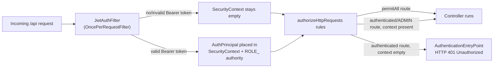

`JwtAuthFilter` (`@Component`, extends `OncePerRequestFilter`) is registered **before** `UsernamePasswordAuthenticationFilter` via `addFilterBefore(...)`. It only acts when an `Authorization: Bearer <token>` header is present and the context is not already populated. On a valid token it creates a `UsernamePasswordAuthenticationToken` whose principal is the `AuthPrincipal` and whose single authority is `"ROLE_" + role.name()`. On a `JwtException`/`IllegalArgumentException` it **clears the context and lets the chain continue** — it does not write the error itself; the request simply arrives unauthenticated and is rejected downstream with 401.

### 10.3 Route authorization (permitAll vs authenticated vs ADMIN)

| Route pattern | Access | Rationale |
|---|---|---|
| `/api/auth/**` | `permitAll` | Login/register must work before a token exists |
| `/api/payments/webhook` | `permitAll` | Server-to-server Stripe callback — trusted by **signature**, not JWT (see 10.4) |
| everything else (`anyRequest()`) | `authenticated()` | Must present a valid bearer token |
| ADMIN-only writes | `@PreAuthorize` (method-level) | `@EnableMethodSecurity`; a denial raises `AccessDeniedException` mapped to **403** |

Other chain settings: **CSRF disabled** (`csrf().disable()` — safe because there is no cookie-based session to forge against), **CORS enabled** via `Customizer.withDefaults()` (so the chain honors the CORS bean), and **session policy `STATELESS`**. Unauthenticated calls hit a custom `AuthenticationEntryPoint` that returns a clean **HTTP 401 "Unauthorized"** via `response.sendError(...)` rather than redirecting to a login page (correct behavior for an API, not a server-rendered site).

### 10.4 The Stripe webhook signature exception

The webhook is the **single unauthenticated endpoint** in the system, and it is deliberately so: Stripe's servers call it directly and cannot present a CineBook JWT. Instead of token auth, it is trusted by **cryptographic signature** — `StripeGateway.parseEvent()` runs `Webhook.constructEvent(payload, sigHeader, whsec_...)`; if the signature does not match the configured webhook secret, the event is rejected. This means whitelisting the path in `SecurityConfig` does **not** make it open: an attacker without the `whsec_` secret cannot forge a valid event. Because card details never pass through CineBook (Stripe Hosted Checkout — see 10.10), this one public endpoint is the only externally reachable Stripe surface.

### 10.5 CORS policy

`com.cinebook.config.CorsConfig` exposes a `CorsConfigurationSource` bean (intentionally, **not** a WebMvc CORS mapping, which the security filter chain would ignore). A single rule is registered:

| Setting | Value |
|---|---|
| Path | `/api/**` |
| Allowed origin | `http://localhost:4200` (Angular dev client only — a fixed origin, not a wildcard pattern) |
| Allowed methods | `GET, POST, PUT, DELETE, PATCH, OPTIONS` |
| Allowed headers | `*` |
| Allow credentials | `true` |

A fixed origin (not `*`) is required for `allowCredentials=true` to be legal. In day-to-day dev the Angular proxy (`proxy.conf.json`: `/api` → `localhost:8181`, `changeOrigin`) makes the browser see one origin, so CORS is only exercised in non-proxied setups. **For production this origin list must be parameterized** to the deployed SPA's domain.

### 10.6 Theater-scoping (multi-tenancy)

Admin operations — manage shows, the all-bookings ledger, analytics — are scoped strictly to the admin's **own theater**. Rather than trusting a client-supplied `theaterId` (which would let one admin mutate another theater's data) or re-querying the owner on every request, the `theaterId` rides inside the **signed** token. Controllers read `principal.theaterId()` (never the request body) and pass it into services; `ShowService`, the admin paths of `BookingService`, and `AnalyticsService` each call `requireTheater(theaterId)` (403 if null) and `requireOwnership(...)` for mutations (403 if a show's theater differs from the caller's). Because the value is signed, it is both **cheap** (no extra DB round-trip) and **tamper-proof**.

### 10.7 Password hashing and input validation

- **Passwords:** stored as **BCrypt** hashes via the `BCryptPasswordEncoder` bean. Login uses `passwordEncoder.matches(raw, hash)` (which re-hashes the candidate) — plaintext is never compared or stored.
- **Input validation:** request DTOs are checked with Jakarta Bean Validation (`@Valid`, `@NotNull`, `@NotBlank`, `@Size`, `@Positive`, `@PositiveOrZero`). A `MethodArgumentNotValidException` is converted by the global handler into a **400** whose message concatenates `"field: message"` details.

### 10.8 Global exception handling / ApiException

`com.cinebook.exception.ApiException` extends `RuntimeException` and carries an `HttpStatus`, with factory helpers `badRequest(400)`, `unauthorized(401)`, `forbidden(403)`, `notFound(404)`, `conflict(409)`. `GlobalExceptionHandler` (`@RestControllerAdvice`) maps every error to a **uniform JSON envelope** `{ timestamp, status, error, message }`:

| Exception | HTTP status |
|---|---|
| `ApiException` | its own `HttpStatus` |
| `MethodArgumentNotValidException` | 400 (with field-level detail) |
| `AccessDeniedException` (from `@PreAuthorize`) | 403 (so denials aren't swallowed as 500) |
| any other `Exception` | 500 |

Because `ApiException` is a `RuntimeException`, throwing it inside a `@Transactional` method also rolls the transaction back (key to refund safety — see 11).

### 10.9 Transactions, soft-delete, scheduling/reaper

- **Transactions:** booking, cancellation, and payment finalization run inside single `@Transactional` service methods so the DB and Stripe never drift (a failed Stripe refund rolls the seat-cancellation back). `spring.jpa.open-in-view=false` keeps lazy loading out of the view layer.
- **Soft-delete:** `Movie` and `Show` carry a boolean `deleted` flag; "delete" flips the flag instead of removing the row, so historical bookings/reviews keep resolving. Every read filters `deleted=false` (e.g. `findByTheaterIdAndDeletedFalse`), with a graceful `"(unavailable)"` fallback for archived references.
- **Scheduling / reaper:** `CineBookApplication` is annotated `@EnableScheduling`. The only scheduled job is `StripePaymentService.reapAbandonedHolds()` (`@Scheduled(fixedDelay = 300000)` — every 5 minutes), which releases `PENDING_PAYMENT` holds older than `app.stripe.hold-ttl-minutes = 30`, returning seats to the pool.

### 10.10 Config and secrets handling

The server listens on **port 8181** (`server.port`). Stripe redirect URLs and the webhook secret are environment-injected (`${STRIPE_WEBHOOK_SECRET:}`, `${STRIPE_SUCCESS_URL:...}`, `${STRIPE_CANCEL_URL:...}`); currency is fixed to `inr`.

**Known risk (must fix before production):** `application.properties` currently commits **real-looking secrets in plaintext** — `app.jwt.secret` (the HMAC signing key), `app.stripe.secret-key` (a full `sk_test_...` key), and the DB `username`/`password` (`root` / plaintext). These three are **hardcoded, not env-injected** (only the Stripe URLs/webhook secret use `${ENV:default}` placeholders). They are **redacted** in any config listing here. The remediation is to move all secrets to environment variables / a secrets manager and **rotate** them, and to move off `spring.jpa.hibernate.ddl-auto=update` (fine for dev, not for prod).

| Concern | How it's handled today | Production recommendation |
|---|---|---|
| JWT signing key | Hardcoded `app.jwt.secret` (redacted) | Env var / secrets manager + rotate |
| Stripe secret key | Hardcoded `sk_test_...` (redacted) | `STRIPE_SECRET_KEY` env var only |
| DB credentials | Hardcoded `root` / plaintext (redacted) | Env-injected, least-privilege user |
| Stripe webhook secret & URLs | Already `${ENV:default}` | Keep; set per-environment |
| Schema management | `ddl-auto=update` | Versioned migrations |

## 11. Development Challenges & Resolutions

This section is a narrative of the genuine problems the team hit and exactly how each was resolved, grouped into five themes: **Payments**, **Build & Environment**, **Backend logic**, **Frontend**, and **Data**. Each carries its root cause, the fix that shipped, and the file/commit evidence so any claim can be re-checked.

### 11.1 Payments

Payments were the hardest area because two independent systems — the CineBook database (MySQL) and Stripe — must agree on money and seats, while Stripe's webhooks arrive **at-least-once** and users can abandon checkout at any moment.

**Reserve-then-pay creates orphaned holds.** To guarantee a seat is available the instant a user starts paying, seats are marked `BOOKED` *before* payment, creating a real `Booking` row in `PENDING_PAYMENT`. The downside: if the user closes the tab and no webhook ever arrives, those seats would be locked forever. The fix is a **three-layer cleanup**: (1) explicit back-out → `/payment/cancel` → `POST /cancel-hold` → `releasePending()`; (2) Stripe's `checkout.session.expired` webhook → `cancelHold()` → `releasePending()`; and (3) a belt-and-suspenders `@Scheduled(fixedDelay = 300_000)` reaper (`reapAbandonedHolds`, every 5 min) that finds `PENDING_PAYMENT` bookings older than `hold-ttl-minutes=30` and releases them. `releasePending()` returns the freed seats to `Show.availableSeats` (clamped to capacity) and is **idempotent**.

**Two finalize sources risk double-confirm/double-refund.** A booking is finalized from both the `/payment/success` return page **and** the `checkout.session.completed` webhook; the same is true of cancel page + expiry webhook + reaper. Both `finalizeBySession()` and `finalizePending()` only act on the `PENDING_PAYMENT → CONFIRMED` transition — whoever arrives second is a no-op — and `releasePending()` returns early if the booking is missing or no longer pending. The webhook handler also swallows benign `ApiException`s and always returns 200 so Stripe stops retrying.

**Refund vs DB drift.** Cancellation must flip seats to `CANCELLED` *and* issue a real Stripe refund. `applyCancellation()` runs in one `@Transactional` method: it marks seats cancelled, computes the refund, and calls `stripeGateway.refund(...)` **before commit**. Because `StripeGateway` maps any `StripeException` to an `ApiException` (a `RuntimeException`), a failed refund **rolls the whole transaction back** — seats are never cancelled without the money actually returning.

**Charged for a reaped hold (rare race).** If the reaper releases a hold a moment before a slow payer's Stripe payment completes, the card is charged for a booking that no longer exists. When `finalizeBySession()` finds **no** matching booking, it re-fetches the session; if `payment_status == 'paid'`, it **auto-refunds the full amount** and returns a clear 400 — the user is never left charged.

**Money units & PCI.** A single helper `BookingService.toMinorUnits()` (`movePointRight(2).setScale(0, HALF_UP)`) converts rupees to paise for every Stripe call, so ₹236.00 charges as `23600`, not `236`. And **Stripe Hosted Checkout** (redirect to `checkout.stripe.com`) was chosen so CineBook never sees a card number — no Stripe.js, no publishable key on the frontend, all secrets backend-only.

### 11.2 Build & Environment

**Stale Stripe class under DevTools (`NoClassDefFoundError`).** After adding/upgrading the Stripe jar, the app threw `NoClassDefFoundError: Could not initialize class com.stripe...` even though the dependency was present. Root cause: Spring Boot **DevTools uses a two-classloader hot-reload that does not cleanly reload newly-added jars**, leaving Stripe classes half-loaded after a hot restart. Fix (documented as a notes-to-future-self gotcha): after adding or upgrading the Stripe jar, do a **full** backend restart (stop and re-run `spring-boot:run`) rather than a hot reload. DevTools is kept only as an optional runtime dependency.

**Corporate PKIX / Maven offline resolution.** In the corporate network, Maven dependency downloads failed on TLS/PKIX certificate-chain validation; the team relied on the **Maven Wrapper** (`mvnw`/`mvnw.cmd`, so no system Maven is needed) and resolving against the already-populated local repository (offline) to get past the broken certificate path.

**Port 8181 single-instance conflicts.** The backend is pinned to port 8181 (`server.port`, echoed in `CineBookApplication.main`). A second instance — or a previous run that didn't exit — produces a port-in-use bind failure, resolved by ensuring only one backend instance runs on 8181 at a time.

**Stripe webhook can't reach localhost.** Stripe's servers cannot POST to a developer's `localhost:8181`. Fix: the **Stripe CLI** (`stripe login`, then `stripe listen --forward-to localhost:8181/api/payments/webhook`) forwards live events locally and prints a `whsec_` to use as `STRIPE_WEBHOOK_SECRET`. Crucially, the happy path works **without** the CLI because the success page confirms server-side; the webhook is the backstop only.

### 11.3 Backend logic

**Seat double-booking under concurrency.** Two users (or a cancel-then-rebook interleaving) could reserve the same seat for the same show at the same instant, because there is **no DB uniqueness on `(show_id, seat_label)`** and the "read BOOKED labels, then insert" sequence is not atomic. `holdSeats()` was made a single `@Transactional` method that re-queries `findByShowIdAndStatus(showId, BOOKED)` immediately before insert, normalizes labels (trim/uppercase, reject blanks/dupes), rejects already-booked labels with a 400, caps the request to `availableSeats`, then persists one `BookingSeat` row per seat and decrements the counter — all atomically (last-validated-wins). The residual narrow-window risk and a hardening ladder (unique index → optimistic `@Version` → pessimistic `SELECT…FOR UPDATE`) are explicitly documented.

**Per-seat, tiered, time-based refunds.** The original CSV-string, all-or-nothing seat model could not cancel/refund a single seat. It was normalized to a `BookingSeat` table (per-seat `seat_label`, captured price, status, `cancelled_at`) with `BookingStatus.PARTIALLY_CANCELLED` added; `Booking.seats` stays as an immutable original snapshot. The refund engine computes a percentage from `Duration.between(now, showTime)` tiers (≥24h→100, 12–24h→80, 2–12h→50, under 2h→0), applies it to `(seat price + 18% GST)` rounded `HALF_UP`, accumulates into `Booking.refundAmount`, and recounts remaining `BOOKED` seats to choose `CANCELLED` vs `PARTIALLY_CANCELLED`.

**N+1 query explosion.** Enriching booking/analytics lists joins each row to movie/show/theater/user/seat. Because entities use plain FK columns (no heavy `@ManyToOne` graphs), each list path collects distinct ids and does **one** batched `findAllById(...)` per type into `Map<id,entity>` lookups, mapping rows with no in-loop queries (codified as NFR-PERF-01).

**Editing capacity must not wipe sold seats.** Naively resetting `availableSeats = totalSeats` on edit would re-open sold seats. Instead availability is shifted by the change: `newAvailable = clamp(oldAvailable + (newTotal - oldTotal), 0, newTotal)`; capacity bounded 1–250; open/closed derived from `showTime` vs now with a 15-minute operational buffer.

### 11.4 Frontend

**Registration 404 — proxy never wired.** `POST localhost:4200/api/auth/register-admin` returned 404 because the relative `/api` call hit the Angular dev server, not Spring Boot — `proxy.conf.json` was correct but `angular.json` never referenced it. Fix: added `"proxyConfig": "proxy.conf.json"` to the serve target (and `ng serve --proxy-config proxy.conf.json` in the `start` script), then restarted `ng serve`.

**Logged-in users could still reach `/login` and `/register`.** Those routes had no guard. A functional `guestGuard` (`CanActivateFn`) now allows access only when `!auth.isLoggedIn()`; logged-in users get a `UrlTree` redirect (admins → `/manage-movies`, users → `/`).

**Tailwind/component CSS over Angular's style budget.** The themed components (carousels, rich filter dropdown, status badges, seat maps) exceeded the default `anyComponentStyle` budget (2kb warn / 4kb error). Raised to `maximumWarning 6kb / maximumError 8kb` in `angular.json`; the shared tomato/ink palette is centralized in `tailwind.config.js` + `styles.css` so styling is reused, not duplicated.

**Null-safe templates via Angular 17 control flow.** Possibly-null signals (current user, selected movie, refund quote, trailer URL, error messages) are bound with the `@if (...; as alias)` syntax — null-check and unwrap in one step (e.g. `@if (auth.currentUser(); as user)`, `@if (cancelQuote(); as quote)`) — pairing with the standalone-component + signals architecture (no NgModules).

### 11.5 Data

**`PENDING_PAYMENT` polluting ledgers and revenue.** Holding seats creates a real `Booking` row before money changes hands; if surfaced it would inflate My-Bookings, the admin All-Bookings ledger, revenue KPIs and the "Most Booked" leaderboard. `PENDING_PAYMENT` is therefore treated as **internal-only**: `listForUser()` and `listForTheater()` both filter it out before enrichment, and all aggregations operate only on confirmed/partially-cancelled rows.

**Audience-interest theater-scoping bug & fix.** All admin analytics are theater-scoped, but the **Audience Interest** panel needs the opposite — it must reveal demand for titles the admin has **not** yet scheduled. Applying the standard theater scope hid exactly the signal the feature exists for. Ratings/occupancy stay derived from `theaterMovieIds()`, but `movieInterest()` is the deliberate exception: it calls `MovieInterestRepository.countAllByMovie()` — a JPQL `GROUP BY` over the **whole** `MovieInterest` table — then drops soft-deleted movies and sorts most-wanted first, while `requireTheater()` still gates the endpoint to admins.

**Timezone drift corrupting refund tiers.** The refund engine pivots on `Duration.between(now, showTime)`; mismatched browser/JVM/MySQL timezones could quote one refund % and charge another near a tier boundary. Fix: pin a single UTC clock — the datasource URL appends `serverTimezone=UTC`, with the SRS prescribing `hibernate.jdbc.time_zone=UTC` and `-Duser.timezone=UTC` ("store and compute in UTC everywhere; localize only at the edge"; the SPA estimate is advisory, the server's UTC computation authoritative).

**Soft deletion to avoid orphaning history.** Hard-deleting a movie/show with bookings would orphan that history. `Movie`/`Show` carry a `deleted` flag; deletes flip it, every read filters `deleted=false`, and enrichment drops soft-deleted rows with a `"(unavailable)"` fallback.

**Local-vs-cloud DB switch & externalized secrets.** The team needed a persistent, free, externally reachable MySQL for the deployed backend (Render) plus local dev — without committing live credentials. A free **Alwaysdata** MySQL/MariaDB (`cinebook_data`) was provisioned with "SSL required" unchecked and Authorized-IP blank (wildcard) so both localhost and Render connect (`useSSL=false&allowPublicKeyRetrieval=true`). The cloud datasource block is kept **commented** alongside the active local one, so switching is a one-line change; `ddl-auto=update` auto-builds the schema. The SRS flags that committed secrets are non-production placeholders that **must** be overridden via env vars in prod.

**Analytics table vertical-scroll cap.** Admin analytics tables grew unbounded as data accumulated, pushing charts off-screen; the table was given a capped height with internal vertical scroll so the dashboard layout stays stable while the full dataset remains reachable.

### Challenge summary table

| # | Theme | Challenge | Root cause | Fix | Evidence |
|---|---|---|---|---|---|
| 1 | Payments | Seat double-booking under concurrency | No DB uniqueness on `(show_id, seat_label)`; check-then-insert not atomic | `@Transactional holdSeats()` re-queries BOOKED, normalizes, caps, persists per-seat rows; hardening ladder documented | `BookingService.holdSeats()` ~247–315; `srs1.md` §5.1 |
| 2 | Payments | Abandoned holds lock inventory forever | Reserve-then-pay creates orphan `PENDING_PAYMENT` rows | 3-layer release: cancel-hold, `expired` webhook, `@Scheduled` reaper (5 min, TTL 30); idempotent `releasePending()` | `StripePaymentService.reapAbandonedHolds()` 141–153; `hold-ttl-minutes=30` |
| 3 | Payments | Refund vs DB drift on cancel | Two systems (MySQL + Stripe) mutated in one op | `@Transactional applyCancellation()` refunds before commit; `StripeException → ApiException` rolls back | `BookingService.applyCancellation()` 401–450; `StripeGateway.refund()` 85–95 |
| 4 | Payments | Double-confirm / double-refund | At-least-once webhooks + server success confirm | Idempotent `finalizeBySession`/`finalizePending`/`releasePending`; webhook returns 200 | `StripePaymentService` 75–130; `stripe-integration.md` §11 |
| 5 | Payments | Charged for a reaped hold | Reaper vs slow payer are independent timelines | `finalizeBySession()` auto-refunds full amount if no booking but `paid`; returns 400 | `StripePaymentService.finalizeBySession()` 77–87 |
| 6 | Payments | Rupees vs paise | App uses rupee `BigDecimal`, Stripe wants minor units | `toMinorUnits()` helper on every Stripe call; currency fixed `inr` | `BookingService.toMinorUnits()` 84–87 |
| 7 | Payments | Card-data / PCI burden | Card UI on own pages widens compliance scope | Stripe Hosted Checkout redirect; no card data, no frontend key | `STRIPE_SETUP.md`; `stripe-integration.md` §2 |
| 8 | Build & Env | `NoClassDefFoundError` after Stripe upgrade | DevTools two-classloader doesn't reload new jars | Full backend restart after adding/upgrading Stripe jar | `stripe-integration.md` §13; `pom.xml` 58–73 |
| 9 | Build & Env | Corporate PKIX / Maven offline | TLS cert-chain validation blocks downloads | Maven Wrapper + offline resolution against local repo | `mvnw`/`mvnw.cmd` |
| 10 | Build & Env | Port 8181 single-instance conflict | Two backends bind the same port | Ensure one instance on 8181 | `server.port`; `CineBookApplication.main` |
| 11 | Build & Env | Webhook can't reach localhost | Webhooks need a public URL | Stripe CLI `stripe listen --forward-to`; success page is primary path | `STRIPE_SETUP.md` §4 |
| 12 | Backend | Per-seat tiered refunds impossible | CSV all-or-nothing seat model | `BookingSeat` table + `PARTIALLY_CANCELLED`; time-tier refund engine | `BookingService` 400–506; `flow.md` §4 |
| 13 | Backend | N+1 query explosion | Plain FK columns fetched per-row | Batched `findAllById` into `Map` lookups (NFR-PERF-01) | `BookingService.enrich()` 509–539 |
| 14 | Backend | Editing capacity wipes sold seats | `availableSeats` reset loses sold delta | `clamp(oldAvailable + (newTotal - oldTotal), 0, newTotal)`; 1–250 bound | `manage-shows.md` §1/§3 |
| 15 | Frontend | Registration 404 | `angular.json` never referenced `proxy.conf.json` | Add `proxyConfig` + `--proxy-config`; restart | `day1.md` §3.1; `package.json` start |
| 16 | Frontend | Auth pages reachable when logged in | No inverse guard on `/login`,`/register` | `guestGuard` redirects logged-in users | `guest.guard.ts`; commit `5be411c` |
| 17 | Frontend | CSS over style budget | Default `anyComponentStyle` 2kb/4kb too small | Raise to 6kb/8kb; centralize palette | `angular.json` budgets; `tailwind.config.js` |
| 18 | Frontend | Null-safe templates | Reading null signals twice is error-prone | Angular 17 `@if (...; as alias)` | navbar/booking/my-bookings templates |
| 19 | Data | `PENDING_PAYMENT` pollutes ledgers | Hold persists a row before payment | Filter `PENDING_PAYMENT` from user/admin lists & KPIs | `BookingService.listForTheater()` 95, `listForUser()` 200–202 |
| 20 | Data | Audience-interest scoping bug | Uniform theater scope hides cross-catalogue demand | `movieInterest()` uses `countAllByMovie()` over whole table; endpoint still admin-gated | `AnalyticsService` 69–97; commit `88c16c2` |
| 21 | Data | Timezone drift in refund tiers | No pinned connection/JVM/Hibernate timezone | Pin UTC everywhere (`serverTimezone=UTC`, `jdbc.time_zone`, `-Duser.timezone`) | `application.properties` line 14; `srs1.md` §5.2 |
| 22 | Data | Hard-delete orphans history | FK columns to catalog rows | Soft-delete `deleted` flag; reads filter `deleted=false` | `manage-shows.md` §1; `BookingService.mostBookedMovies()` 138 |
| 23 | Data | Local-vs-cloud DB + secrets | Free tiers sleep/restrict; one datasource can't serve both | Alwaysdata free MySQL, commented cloud block, env-override mandate | `database.md`; `application.properties` 7–17 |
| 24 | Data | Analytics table unbounded growth | Tables push charts off-screen | Capped height + internal vertical scroll | analytics dashboard component |
