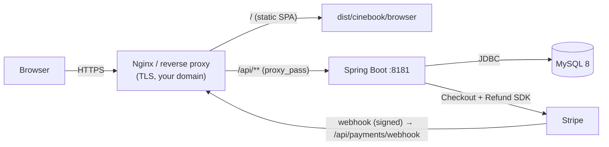
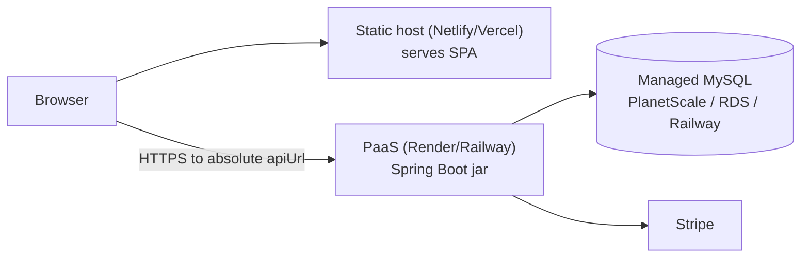

# 🚀 CineBook — Deployment Guide

> A complete, practical guide to deploying CineBook (Angular SPA + Spring Boot API + MySQL + Stripe)
> from a local build to a production server. It covers the **build artifacts**, the **two things that
> *will* break if you skip them** (the SPA's relative `/api` URL and the hardcoded CORS origin),
> **three deployment topologies** (single VM + Nginx, Docker Compose, split PaaS), **secrets**,
> **Stripe production setup**, **TLS**, and a **post-deploy verification checklist**.
>
> Companion docs: [stripe-integration.md](stripe-integration.md) · [STRIPE_SETUP.md](STRIPE_SETUP.md) · [SRS2.md](SRS2.md).

---

## 1. What you're deploying

| Component | Tech | Build output | Runtime |
|---|---|---|---|
| **Backend API** | Spring Boot 3.3.5, Java 21 | `backend/target/cinebook-backend-0.0.1-SNAPSHOT.jar` (executable fat-jar) | `java -jar …` on port **8181** |
| **Frontend SPA** | Angular 17 (standalone + Signals), Tailwind | `frontend/dist/cinebook/browser/` (static `index.html` + JS/CSS) | Served by any static host / Nginx |
| **Database** | MySQL 8 | — | Managed or self-hosted; schema auto-created (`ddl-auto=update`) |
| **Payments** | Stripe Hosted Checkout | — | External SaaS; backend holds the secret key + verifies a webhook |

### Production topology (recommended: same-origin behind one reverse proxy)



Serving the SPA and proxying `/api` to the backend **from the same domain** is the simplest correct setup: the SPA's existing `apiUrl="/api"` "just works," and **CORS becomes irrelevant** (same origin). The alternatives (Docker, split PaaS) are in §6.

---

## 2. Prerequisites

| On the build machine | On the server |
|---|---|
| **JDK 21** (to build the jar) | **JRE/JDK 21** (to run the jar) |
| **Node.js 18 or 20 LTS** + npm (to build the SPA) | **MySQL 8** (managed service or installed) |
| Maven Wrapper (bundled: `backend/mvnw` / `mvnw.cmd` — no separate Maven needed) | **Nginx** (or another static host + reverse proxy) |
| Internet access to download Maven/npm deps | A **domain name + TLS certificate** (Let's Encrypt) — required for Stripe webhooks |
| A **Stripe account** (test or live) | |

> **Build-machine note:** if you're behind a TLS-intercepting corporate proxy, the Maven download can fail with `PKIX path building failed`. Build on a clean network, or import the corporate CA into the JDK truststore. Once dependencies are cached, `./mvnw -o package` builds offline.

---

## 3. ⚠️ Configuration & secrets (read this before anything else)

CineBook currently ships **development placeholders committed in
[`backend/src/main/resources/application.properties`](backend/src/main/resources/application.properties)**:
a local MySQL password, a dev JWT secret, and a **Stripe TEST secret key**. **None of these are safe for
production.** Spring Boot lets OS **environment variables override** any property (env vars have higher
precedence than `application.properties`), so you override every secret at deploy time **without editing the file**.

### 3.1 Environment variables to set on the server

Spring Boot "relaxed binding" maps an env var like `APP_JWT_SECRET` → the property `app.jwt.secret`
(uppercase, dots/dashes → underscores).

| Env var | Overrides property | Required? | Example / note |
|---|---|---|---|
| `SPRING_DATASOURCE_URL` | `spring.datasource.url` | ✅ | `jdbc:mysql://db-host:3306/cinebook?useSSL=true&serverTimezone=UTC` |
| `SPRING_DATASOURCE_USERNAME` | `spring.datasource.username` | ✅ | `cinebook_app` |
| `SPRING_DATASOURCE_PASSWORD` | `spring.datasource.password` | ✅ | *(strong, from a secret store)* |
| `APP_JWT_SECRET` | `app.jwt.secret` | ✅ | **Base64-encoded**, ≥256-bit, freshly generated (see below) |
| `APP_JWT_EXPIRATION_MS` | `app.jwt.expiration-ms` | optional | default `86400000` (24h) |
| `APP_STRIPE_SECRET_KEY` | `app.stripe.secret-key` | ✅ (for payments) | `sk_live_…` or `sk_test_…` |
| `STRIPE_WEBHOOK_SECRET` | `app.stripe.webhook-secret` | ✅ (for webhook) | `whsec_…` from the Stripe Dashboard endpoint |
| `STRIPE_SUCCESS_URL` | `app.stripe.success-url` | ✅ | `https://cinebook.example.com/payment/success` |
| `STRIPE_CANCEL_URL` | `app.stripe.cancel-url` | ✅ | `https://cinebook.example.com/payment/cancel` |
| `SERVER_PORT` | `server.port` | optional | default `8181` |
| `SPRING_JPA_HIBERNATE_DDL_AUTO` | `spring.jpa.hibernate.ddl-auto` | recommended | `validate` in prod (see §7) |

> Generate a strong JWT secret (Base64):
> ```bash
> openssl rand -base64 48
> ```

> **Scrub the repo before going public:** even though env vars override them, the committed test
> Stripe key, JWT secret, and DB password are in git history. Rotate them and replace the values in
> `application.properties` with placeholders (e.g. `app.stripe.secret-key=${STRIPE_SECRET_KEY:}`).

### 3.2 🔴 Gotcha #1 — the frontend's `apiUrl` is relative (`/api`)

[`frontend/src/environments/environment.ts`](frontend/src/environments/environment.ts) sets `apiUrl: "/api"`.
In development this only works because the Angular dev-server **proxy** ([`proxy.conf.json`](frontend/proxy.conf.json))
forwards `/api → http://localhost:8181`. **In production there is no dev server and no proxy.** You have two choices:

- **(Recommended) Same-origin reverse proxy** — serve the SPA and proxy `/api/**` to the backend from the
  same domain (Nginx `proxy_pass`). `apiUrl="/api"` then resolves correctly and you need **no code change** and **no CORS**.
- **Split origin** — if the SPA and API live on different domains, edit `environment.ts` **before building**
  to an absolute URL, e.g. `apiUrl: "https://api.cinebook.example.com/api"`, and then you **must** also fix CORS (below).

### 3.3 🔴 Gotcha #2 — CORS is hardcoded to `localhost:4200`

[`backend/src/main/java/com/cinebook/config/CorsConfig.java`](backend/src/main/java/com/cinebook/config/CorsConfig.java)
allows only `http://localhost:4200`. This **only matters for the split-origin setup**. If you go same-origin
(Nginx), the browser never makes a cross-origin call, so CORS is moot. For split origin, make it
configurable rather than hardcoded — a minimal patch:

```java
// CorsConfig.java — read allowed origins from a property (comma-separated)
@org.springframework.beans.factory.annotation.Value("${app.cors.allowed-origins:http://localhost:4200}")
private java.util.List<String> allowedOrigins;
// …then:
config.setAllowedOrigins(allowedOrigins);
```
…and set `APP_CORS_ALLOWED_ORIGINS=https://cinebook.example.com` on the server. `allowCredentials(true)` is
already set, so the origin list must be explicit (not `*`).

---

## 4. Build the artifacts

### 4.1 Backend → executable jar
```bash
cd backend
./mvnw clean package          # Windows: mvnw.cmd clean package
# (add -DskipTests to skip tests; -o to build offline once deps are cached)
# → backend/target/cinebook-backend-0.0.1-SNAPSHOT.jar
```
The `spring-boot-maven-plugin` produces a self-contained fat-jar with an embedded Tomcat. **Spring Boot
DevTools is automatically excluded** from the repackaged jar, so the hot-reload classpath issues seen in
dev do not occur in production.

Run it:
```bash
java -jar target/cinebook-backend-0.0.1-SNAPSHOT.jar
# with config:  (env vars from §3.1 exported first)
```

### 4.2 Frontend → static bundle
```bash
cd frontend
npm ci                         # clean, reproducible install from package-lock
# If split-origin: edit src/environments/environment.ts apiUrl FIRST (see §3.2)
npm run build                  # = ng build (defaults to the 'production' configuration)
# → frontend/dist/cinebook/browser/   ← this folder (the one containing index.html) is what you deploy
```
> Angular 17's application builder emits browser assets under `dist/cinebook/browser/`. Confirm by locating
> `index.html`. If you deploy under a sub-path instead of the domain root, rebuild with
> `ng build --base-href /cinebook/`.

---

## 5. Option A — Single server + Nginx (recommended)

One VM running the jar (as a service) and Nginx serving the SPA and reverse-proxying `/api`.

### 5.1 MySQL
```sql
CREATE DATABASE cinebook CHARACTER SET utf8mb4 COLLATE utf8mb4_unicode_ci;
CREATE USER 'cinebook_app'@'%' IDENTIFIED BY 'STRONG_PASSWORD_HERE';
GRANT ALL PRIVILEGES ON cinebook.* TO 'cinebook_app'@'%';
FLUSH PRIVILEGES;
```
On first boot Hibernate (`ddl-auto=update`) creates all tables automatically.

### 5.2 Run the backend as a systemd service
Copy the jar to e.g. `/opt/cinebook/app.jar`, put secrets in a root-only env file:

`/opt/cinebook/cinebook.env`
```ini
SPRING_DATASOURCE_URL=jdbc:mysql://localhost:3306/cinebook?useSSL=true&serverTimezone=UTC&allowPublicKeyRetrieval=true
SPRING_DATASOURCE_USERNAME=cinebook_app
SPRING_DATASOURCE_PASSWORD=STRONG_PASSWORD_HERE
APP_JWT_SECRET=BASE64_SECRET_FROM_OPENSSL
APP_STRIPE_SECRET_KEY=sk_live_or_test_xxx
STRIPE_WEBHOOK_SECRET=whsec_xxx
STRIPE_SUCCESS_URL=https://cinebook.example.com/payment/success
STRIPE_CANCEL_URL=https://cinebook.example.com/payment/cancel
SPRING_JPA_HIBERNATE_DDL_AUTO=update
SERVER_PORT=8181
```
`/etc/systemd/system/cinebook.service`
```ini
[Unit]
Description=CineBook API
After=network.target mysql.service

[Service]
User=cinebook
EnvironmentFile=/opt/cinebook/cinebook.env
ExecStart=/usr/bin/java -jar /opt/cinebook/app.jar
SuccessExitStatus=143
Restart=on-failure
RestartSec=5

[Install]
WantedBy=multi-user.target
```
```bash
sudo systemctl daemon-reload
sudo systemctl enable --now cinebook
sudo journalctl -u cinebook -f      # watch logs / confirm "Started CineBookApplication"
```

### 5.3 Nginx — serve SPA + proxy `/api`
Copy `frontend/dist/cinebook/browser/` to `/var/www/cinebook`.

`/etc/nginx/sites-available/cinebook`
```nginx
server {
    listen 80;
    server_name cinebook.example.com;

    root /var/www/cinebook;
    index index.html;

    # SPA client-side routing: fall back to index.html (so /payment/success, /movies/:id deep-links work)
    location / {
        try_files $uri $uri/ /index.html;
    }

    # Reverse-proxy the API → same origin, so apiUrl="/api" works and CORS is unnecessary
    location /api/ {
        proxy_pass http://127.0.0.1:8181;
        proxy_set_header Host              $host;
        proxy_set_header X-Real-IP         $remote_addr;
        proxy_set_header X-Forwarded-For   $proxy_add_x_forwarded_for;
        proxy_set_header X-Forwarded-Proto $scheme;
    }
}
```
```bash
sudo ln -s /etc/nginx/sites-available/cinebook /etc/nginx/sites-enabled/
sudo nginx -t && sudo systemctl reload nginx
```

### 5.4 TLS (required for Stripe webhooks)
```bash
sudo certbot --nginx -d cinebook.example.com    # Let's Encrypt → auto-configures HTTPS + renewal
```

---

## 6. Option B — Docker Compose  ·  Option C — Split PaaS

### 6.1 Docker Compose (single host, three containers)

The repo has **no Docker files yet** — create these.

`backend/Dockerfile` (multi-stage)
```dockerfile
FROM eclipse-temurin:21-jdk AS build
WORKDIR /app
COPY .mvn/ .mvn/
COPY mvnw pom.xml ./
RUN ./mvnw -q -B dependency:go-offline
COPY src/ src/
RUN ./mvnw -q -B clean package -DskipTests

FROM eclipse-temurin:21-jre
WORKDIR /app
COPY --from=build /app/target/cinebook-backend-0.0.1-SNAPSHOT.jar app.jar
EXPOSE 8181
ENTRYPOINT ["java","-jar","/app/app.jar"]
```

`frontend/Dockerfile` (build then serve via Nginx)
```dockerfile
FROM node:20-alpine AS build
WORKDIR /app
COPY package*.json ./
RUN npm ci
COPY . .
RUN npm run build

FROM nginx:alpine
COPY --from=build /app/dist/cinebook/browser /usr/share/nginx/html
COPY nginx.conf /etc/nginx/conf.d/default.conf
EXPOSE 80
```
`frontend/nginx.conf` — same `try_files` + `/api` proxy as §5.3, but `proxy_pass http://backend:8181;`
(the compose service name).

`docker-compose.yml` (repo root)
```yaml
services:
  db:
    image: mysql:8
    environment:
      MYSQL_DATABASE: cinebook
      MYSQL_ROOT_PASSWORD: ${DB_ROOT_PASSWORD}
    volumes: ["dbdata:/var/lib/mysql"]
  backend:
    build: ./backend
    environment:
      SPRING_DATASOURCE_URL: jdbc:mysql://db:3306/cinebook?useSSL=false&allowPublicKeyRetrieval=true&serverTimezone=UTC
      SPRING_DATASOURCE_USERNAME: root
      SPRING_DATASOURCE_PASSWORD: ${DB_ROOT_PASSWORD}
      APP_JWT_SECRET: ${APP_JWT_SECRET}
      APP_STRIPE_SECRET_KEY: ${APP_STRIPE_SECRET_KEY}
      STRIPE_WEBHOOK_SECRET: ${STRIPE_WEBHOOK_SECRET}
      STRIPE_SUCCESS_URL: https://cinebook.example.com/payment/success
      STRIPE_CANCEL_URL: https://cinebook.example.com/payment/cancel
    depends_on: [db]
  web:
    build: ./frontend
    ports: ["80:80"]
    depends_on: [backend]
volumes: { dbdata: {} }
```
```bash
DB_ROOT_PASSWORD=... APP_JWT_SECRET=... APP_STRIPE_SECRET_KEY=... STRIPE_WEBHOOK_SECRET=... docker compose up -d --build
```
Put TLS termination in front (a host Nginx or a platform load balancer) for HTTPS.

### 6.2 Split PaaS (e.g. backend on Render/Railway, SPA on Netlify/Vercel, managed MySQL)


This is the most "cloud-native" but needs the most wiring:

1. **Frontend:** set `apiUrl` to the backend's absolute URL (§3.2) **before** `npm run build`; deploy `dist/cinebook/browser`. Add a SPA rewrite rule so all routes serve `index.html` (Netlify `_redirects`: `/* /index.html 200`; Vercel `rewrites`).
2. **Backend:** deploy the jar (or `backend/Dockerfile`); set all env vars from §3.1; expose port `8181` (or set `SERVER_PORT` to the platform's `$PORT`).
3. **CORS:** apply the §3.3 patch and set `APP_CORS_ALLOWED_ORIGINS` to the SPA's domain — **mandatory** here.
4. **Database:** point `SPRING_DATASOURCE_URL` at the managed MySQL (enable TLS).
5. **Stripe URLs:** `STRIPE_SUCCESS_URL` / `STRIPE_CANCEL_URL` must point to the SPA's domain.

---

## 7. Database in production

- **Schema:** `ddl-auto=update` auto-creates/alters tables on boot — convenient, but it never drops columns or reconciles
  destructively and isn't a migration tool. For stricter control, set `SPRING_JPA_HIBERNATE_DDL_AUTO=validate`
  and introduce migrations (e.g. Flyway/Liquibase — not currently in the project) after the first schema is created.
- **Time zone:** keep `serverTimezone=UTC` in the JDBC URL. Refund tiers (100/80/50/0%) are computed from
  `Duration.between(now, showTime)` in UTC; a mismatched DB/JVM zone will skew refund windows.
- **Charset:** create the DB as `utf8mb4` (movie titles/languages may be non-ASCII).
- **Backups:** schedule regular dumps (`mysqldump`) or use the managed provider's automated backups.

---

## 8. Stripe in production

1. **Keys:** use `sk_live_…` for real money or keep `sk_test_…` for a staging deploy. Set via `APP_STRIPE_SECRET_KEY`.
2. **Register the webhook** (so confirmations survive a closed tab and holds expire cleanly):
   Stripe Dashboard → **Developers → Webhooks → Add endpoint** →
   URL `https://cinebook.example.com/api/payments/webhook`, events **`checkout.session.completed`** and
   **`checkout.session.expired`** → copy the revealed **`whsec_…`** into `STRIPE_WEBHOOK_SECRET`.
   The webhook endpoint is the **only** public (non-JWT) route — it's trusted by Stripe's signature, so it
   **must be reachable over public HTTPS** (hence the TLS requirement).
3. **Return URLs:** `STRIPE_SUCCESS_URL`/`STRIPE_CANCEL_URL` must be your real frontend URLs.
4. **Test card** (test mode): `4242 4242 4242 4242`, any future expiry, any CVC.
5. The full payment/refund mechanics are documented in [stripe-integration.md](stripe-integration.md).

---

## 9. Post-deployment verification checklist

| ✓ | Check | How |
|---|---|---|
| ☐ | Backend is up | `journalctl -u cinebook` shows `Started CineBookApplication`; `curl https://…/api/movies` returns `401` (auth required = security is on) |
| ☐ | SPA loads | Open `https://cinebook.example.com` — the app renders |
| ☐ | Deep links work | Refresh on `/movies` or `/payment/success` → no 404 (confirms SPA `try_files`/rewrite) |
| ☐ | Register + login | Create a user; confirm the JWT is issued and you stay logged in across refresh |
| ☐ | No CORS errors | Browser console clean on API calls (same-origin) — or allowed-origin set (split) |
| ☐ | Booking → payment | Pick seats → Proceed to Payment → pay with `4242…` → land on `/payment/success` → booking **CONFIRMED** |
| ☐ | Webhook delivers | Stripe Dashboard → Webhooks shows `200` for `checkout.session.completed` |
| ☐ | Refund | Cancel a booking ≥24h before showtime → Stripe Dashboard shows a 100% refund on the PaymentIntent |
| ☐ | Admin scope | An admin only sees their own theater's data |
| ☐ | TLS valid | `https://` padlock; certificate auto-renews |

---

## 10. Production hardening & operations

- **Secrets:** all via env vars / a secret manager; rotate the committed dev placeholders and never commit live keys.
- **`ddl-auto`:** move to `validate` + migrations once the schema is stable.
- **CORS:** externalize allowed origins (§3.3); never use `*` with `allowCredentials(true)`.
- **Logging:** raise `logging.level.org.hibernate.SQL` only when debugging; ship logs to a central store.
- **Scaling:** the API is **stateless** (JWT, no server session) → it scales horizontally behind a load balancer with no sticky sessions. **Caveat:** the abandoned-hold reaper (`@Scheduled`, every 5 min) and any scheduled task run **on every instance**; the operations are idempotent so it's safe, but for many instances consider a leader/lock (e.g. ShedLock) to avoid duplicate sweeps.
- **JVM:** set a memory ceiling on small hosts, e.g. `JAVA_TOOL_OPTIONS="-Xmx512m"`.
- **DB connection pool:** the default HikariCP is fine; tune `spring.datasource.hikari.maximum-pool-size` to the DB's limits if you scale out.

---

## 11. Troubleshooting

| Symptom | Likely cause | Fix |
|---|---|---|
| SPA loads but every API call is `404` or hits the SPA HTML | `/api` not proxied to the backend (Gotcha #1) | Add the Nginx `/api` `proxy_pass`, or set absolute `apiUrl` + rebuild |
| Browser console: **CORS** blocked | Split origin without allowed-origin set (Gotcha #2) | Apply §3.3 patch + set `APP_CORS_ALLOWED_ORIGINS`, or go same-origin |
| `401` on everything after login | JWT secret differs between build/run, or clock skew | Set a stable `APP_JWT_SECRET`; ensure server time is correct |
| Refresh on a route → **404** | No SPA fallback | Add `try_files … /index.html` (Nginx) or platform rewrite |
| Payment returns `500` `Stripe is not configured` | `APP_STRIPE_SECRET_KEY` not set | Set the env var; restart |
| Stripe webhook shows `400`/signature error | Wrong/missing `STRIPE_WEBHOOK_SECRET`, or a proxy altered the raw body | Use the exact `whsec_…` for that endpoint; don't rewrite the webhook body |
| Webhook never delivered | Endpoint not public/HTTPS | Expose `https://…/api/payments/webhook`; finish TLS |
| Refund window seems off by hours | DB/JVM time zone mismatch | Keep `serverTimezone=UTC` everywhere |
| Tables missing on first run | DB user lacks DDL rights, or `ddl-auto` not `update`/`create` | Grant privileges; verify `SPRING_JPA_HIBERNATE_DDL_AUTO` |

---

*Last updated: 2026-06-16. Source of truth is the code — verify against
`application.properties`, `CorsConfig.java`, `environment.ts`, `proxy.conf.json`, and `pom.xml` before deploying.*
