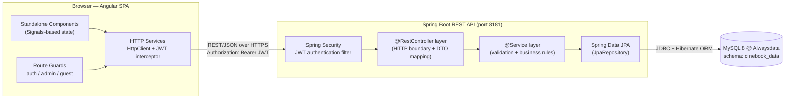
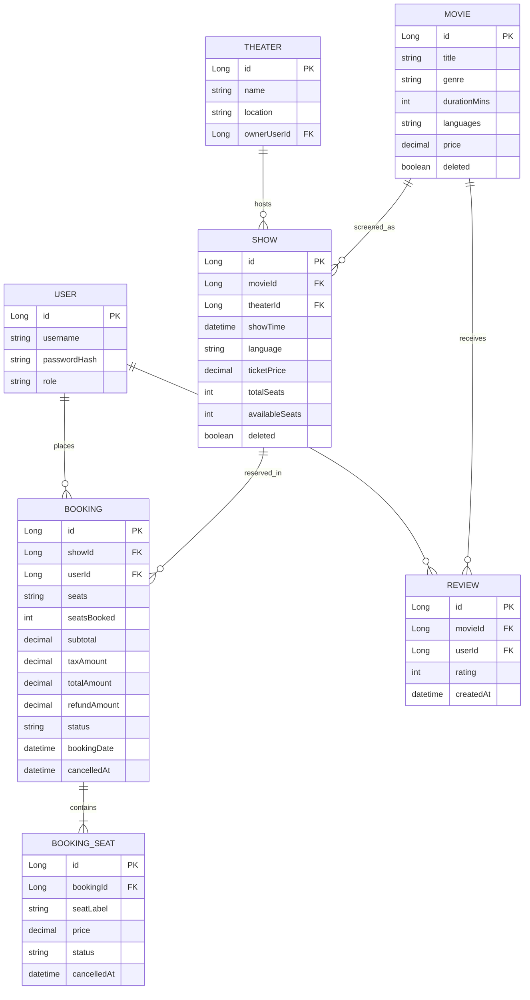
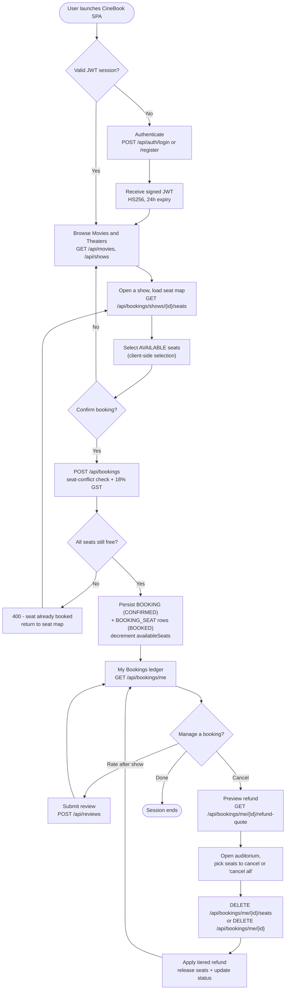
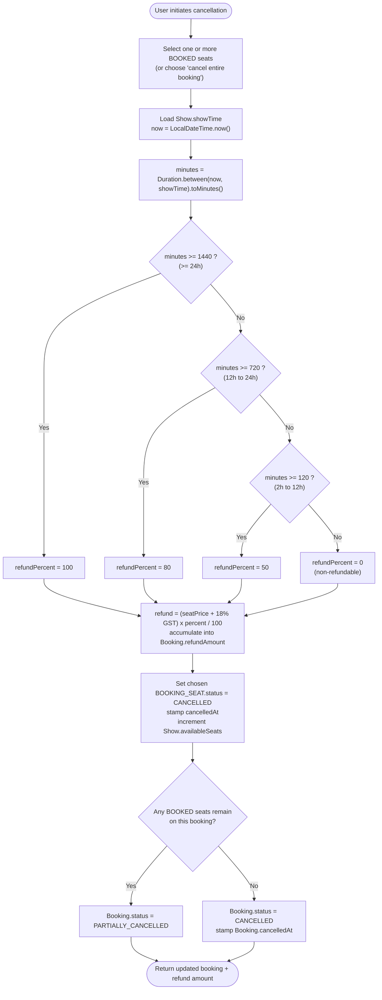

# Software Requirements Specification (SRS)
## CineBook — Full-Stack Movie Ticket Booking Platform

| Field | Value |
|---|---|
| **Document title** | CineBook — Software Requirements Specification |
| **Version** | 1.0 |
| **Status** | Released for review |
| **Date** | 2026-06-15 |
| **Audience** | Project mentors, business stakeholders, end-users, engineering team |
| **System** | CineBook (Angular SPA · Spring Boot REST API · MySQL/MariaDB) |

> **Reading guide.** Sections 1 and 3 are written for business and academic reviewers; Sections 2, 4, and 5 carry the deep technical detail for mentors and engineers. All architecture diagrams are authored in Mermaid.js and render directly in GitHub, VS Code, and most Markdown viewers.

---

## Table of Contents

1. [Executive Summary & Project Overview](#1-executive-summary--project-overview)
2. [System Architecture & Component Breakdown](#2-system-architecture--component-breakdown)
3. [Core System Features & Requirements](#3-core-system-features--requirements)
4. [End-to-End System Workflows](#4-end-to-end-system-workflows)
5. [Critical Edge Cases & Exception Handling](#5-critical-edge-cases--exception-handling)
6. [Appendix A — REST API Reference](#6-appendix-a--rest-api-reference)
7. [Appendix B — Glossary](#7-appendix-b--glossary)

---

## 1. Executive Summary & Project Overview

### 1.1 Business Purpose

**CineBook** is a full-stack, multi-tenant cinema ticketing platform that lets cinema-goers discover movies, browse showtimes across theaters, reserve specific seats from a live auditorium map, pay, and self-manage their reservations — including a flexible, policy-driven cancellation and refund workflow. Theater administrators independently manage their own catalog of movies, schedule shows, and monitor booking performance.

The platform replaces manual, error-prone box-office processes and rigid third-party portals with a responsive single-page experience backed by a transactional, rules-enforcing API.

### 1.2 Problems Solved

> **Core value proposition.** CineBook converts a high-friction, all-or-nothing ticketing experience into a transparent, self-service, seat-accurate workflow with fair, automated refunds.

- **Automated seat allocation.** A real-time auditorium map prevents double-booking and removes the need for manual seat assignment. Seat state (AVAILABLE / BOOKED / CANCELLED) is authoritative on the server.
- **Instant, itemized payment tracking.** Every reservation records an itemized breakdown — per-seat subtotal, 18% GST, grand total, and any accrued refund — so users and administrators always see an accurate financial ledger.
- **Cancellation flexibility (flagship capability).** Unlike portals that only support all-or-nothing cancellation, CineBook lets a user cancel **individual seats** or the **entire booking**, with a **tiered, time-based refund** computed automatically and previewed before the user commits.
- **Operational governance for theaters.** Show scheduling enforces operational buffers and soft-deletion so that historical bookings are never orphaned.
- **Trust through transparency.** A refund-quote endpoint shows the exact refund amount and the governing policy line *before* the user confirms a cancellation.

### 1.3 Scope

| In scope | Out of scope (current release) |
|---|---|
| User registration, login, JWT-secured sessions | Real payment-gateway settlement (amounts are tracked, not charged) |
| Movie & theater catalog browsing | Loyalty / wallet / promo-code engine |
| Show scheduling (admin) | Dynamic / surge pricing |
| Real-time seat selection & booking | Physical turnstile / barcode scanning |
| Full & partial cancellation with tiered refunds | Multi-currency support |
| Post-show ratings & reviews | Email/SMS notification delivery |

### 1.4 Stakeholders

| Stakeholder | Interest |
|---|---|
| **End-user (cinema-goer)** | Fast discovery, accurate seats, fair cancellation |
| **Theater administrator** | Catalog & show management, booking analytics |
| **Business stakeholder** | Revenue tracking, refund-policy governance |
| **Project mentor / reviewer** | Architecture soundness, correctness of business rules |

---

## 2. System Architecture & Component Breakdown

CineBook follows a classic **three-tier architecture**: a stateless Angular SPA (presentation), a stateless Spring Boot REST API (application/business logic), and a managed relational database (persistence). The API is the single source of truth; the SPA holds no authoritative state.

### 2.1 Architectural Overview

> **Runtime topology.** In development the SPA is served by the Angular dev server and proxies all `/api/**` calls to `http://localhost:8181` via `proxy.conf.json`. This keeps the frontend origin-agnostic — the same relative `apiUrl` (`/api`) works in development and production.

---

### 2.2 Frontend Component — Angular SPA

A standalone-component Angular application (no NgModules) using **Signals** for reactive state.

- **State management.** Domain state lives in singleton, `providedIn: "root"` services that expose Angular **signals** (e.g., a booking list signal, a shows signal). Components read signals reactively and mutate state through service methods that pipe HTTP responses back into the signal (`tap(...)`), so the UI updates without manual subscriptions or a heavyweight store.
- **Modular design.** Each feature is a lazy-loaded standalone component organized in its own folder using flat `name.ts / name.html / name.css` files. User-facing features (`movies`, `theaters`, `theater-detail`, `booking`, `my-bookings`) are separated from admin features (`manage-movies`, `manage-shows`, `manage-bookings`, `analytics`). Cross-cutting UI lives in `shared/` (e.g., trailer modal, tomato-rating icon, carousel, footer).
- **Route guards.** Navigation is protected by three functional guards:
  - `authGuard` — requires a valid session for all user/admin routes.
  - `adminGuard` — restricts catalog/show/analytics management to administrators.
  - `guestGuard` — keeps authenticated users away from `login` / `register`.
- **Environment configuration tracking.** A typed `environment.ts` centralizes the API base URL (`apiUrl: "/api"`). No hostnames are hard-coded in components or services; switching environments is a single-file change.
- **API integration.** A central `HttpClient`-based service layer issues typed REST calls. A JWT interceptor attaches the `Authorization: Bearer <token>` header to every outbound request, and TypeScript interfaces mirror the backend DTOs (e.g., `UserBooking`, `RefundQuote`, `PublicShow`) for end-to-end type safety.

> **Design principle.** The SPA never computes authoritative money or seat state. It *previews* (e.g., a client-side refund estimate for responsiveness) but always defers to server-computed values returned by the API.

---

### 2.3 Backend Component — Spring Boot REST API

A layered Spring Boot service with strict separation of concerns.

- **REST Controller layer (`@RestController`).** Thin HTTP boundary. Controllers validate request shape (`@Valid` on request DTOs), read the authenticated principal from the security context (never from the request body), delegate to services, and map domain results to response DTOs. Representative controllers: `AuthController`, `MovieController`, `ShowController`, `TheaterController`, `BookingController`, `AdminBookingController`, `ReviewController`.
- **Service layer (`@Service`).** Owns all business rules and transactional boundaries (`@Transactional`). This is where seat-conflict detection, the 18% GST computation, the tiered refund policy, booking-status transitions, and ownership checks live. The service layer is the authoritative decision-maker.
- **Security mechanism (Spring Security + JWT).** Authentication is stateless and token-based:
  - On `POST /api/auth/login`, credentials are verified and a **JWT signed with HMAC-SHA256 (HS256)** is issued, carrying the user identity and role, with a **24-hour expiry** (`app.jwt.expiration-ms = 86400000`).
  - A servlet filter validates the bearer token on every protected request and populates the security context with an `AuthPrincipal` (user id, role, owning theater id for admins).
  - Method/route authorization uses role checks (e.g., `@PreAuthorize("hasRole('ADMIN')")`) so theater administrators can only mutate their own theater's shows.
  - Passwords are stored as salted one-way hashes; the raw password never leaves the auth service.
- **Data Access layer (Spring Data JPA / Hibernate).** `JpaRepository` interfaces provide CRUD plus derived finder queries (e.g., find shows by movie/theater excluding soft-deleted, find seats by booking and status). Hibernate maps entities to MySQL with `ddl-auto=update`; `open-in-view=false` keeps lazy loading inside the transactional service boundary.

> **Security callout.** The JWT secret and datasource credentials are externalized into `application.properties` and **must be overridden via environment variables / secrets in production**. The values committed for local development are non-production placeholders and are intentionally redacted in this document.

---

### 2.4 Database Component — MySQL / MariaDB (Alwaysdata)

The persistence tier is a managed **MySQL 8** instance hosted on **Alwaysdata** (schema `cinebook_data`), accessed over JDBC with the MySQL Connector/J driver and the `MySQLDialect`.

**Entity-relationship handling.** Entities use surrogate `Long` primary keys (`IDENTITY` generation) and plain foreign-key columns rather than heavy bidirectional JPA associations, which keeps queries explicit and predictable. Soft deletion (`deleted` flags on `Movie` and `Show`) guarantees that historical bookings are never orphaned by catalog changes.

**Table mapping highlights.**

- **Users** (`USER`) — identity, hashed credential, and role (`USER` / `ADMIN`). Administrators are additionally associated with a `THEATER` they own.
- **Shows** (`SHOW`) — a screening of one `MOVIE` at one `THEATER` at a single `showTime` (`LocalDateTime`), carrying `ticketPrice`, `totalSeats`, and a live `availableSeats` counter that is decremented on booking and incremented on cancellation.
- **Bookings** (`BOOKING`) — the financial aggregate: an immutable CSV snapshot of originally booked seats, the itemized money fields (`subtotal`, `taxAmount`, `totalAmount`, `refundAmount`), the lifecycle `status`, and audit timestamps (`bookingDate`, `cancelledAt`).
- **Seats** (`BOOKING_SEAT`) — the **authoritative per-seat record** (one row per seat) that drives partial cancellation. Each row holds its `seatLabel`, captured `price`, `status` (`BOOKED` / `CANCELLED`), and `cancelledAt`. The parent `BOOKING.status` is derived from the aggregate state of its seat rows.

> **Why a separate `BOOKING_SEAT` table?** Partial cancellation and accurate per-seat refunds require seat-level state. The parent booking's `seats` string is only an immutable snapshot; the seat rows are the source of truth for what is still active.

---

## 3. Core System Features & Requirements

Requirements use **"shall"** language and stable identifiers (e.g., `FR-BOOK-03`) for traceability. Business rules are called out in blockquotes.

### 3.1 User Management & Authentication

| ID | Requirement |
|---|---|
| FR-AUTH-01 | The system **shall** allow a guest to register an account (`POST /api/auth/register`) with a unique username and a password. |
| FR-AUTH-02 | The system **shall** authenticate credentials (`POST /api/auth/login`) and return a signed JWT on success. |
| FR-AUTH-03 | The system **shall** store passwords only as salted one-way hashes and never return them in any response. |
| FR-AUTH-04 | The system **shall** authorize every protected endpoint by validating the bearer JWT and deriving the caller identity server-side. |
| FR-AUTH-05 | The system **shall** scope administrative actions to the `ADMIN` role and, where applicable, to the administrator's own theater. |

> **Business rules.**
> - JWTs are HS256-signed and expire after **24 hours**; an expired or absent token yields `401 Unauthorized`.
> - The user id is **always** read from the authenticated principal — never trusted from the request body — to prevent horizontal privilege escalation.
> - Ownership is re-verified inside the service layer for every read/mutate of a user-owned resource (e.g., a booking), returning `403 Forbidden` on mismatch.

### 3.2 Show Scheduling & Management

| ID | Requirement |
|---|---|
| FR-SHOW-01 | An administrator **shall** create, update, and (soft-)delete shows only for the theater they own. |
| FR-SHOW-02 | The system **shall** initialize `availableSeats = totalSeats` on show creation and preserve sold seats when capacity is edited. |
| FR-SHOW-03 | The public catalog **shall** expose only upcoming, non-deleted shows, filterable by `movieId` or `theaterId`. |
| FR-SHOW-04 | The system **shall** reject scheduling a show whose start time is inside the operational buffer window. |

> **Business rule — operational buffer.** The system **shall not** permit creation (or activation) of a show whose `showTime` is **less than 15 minutes** in the future. This guarantees a minimum operational lead time for box-office readiness and prevents bookings against effectively-started screenings. Soft deletion (`deleted = true`) is used instead of physical deletion so that existing bookings and ticket history remain intact.

### 3.3 Seat Selection & Booking Engine

| ID | Requirement |
|---|---|
| FR-BOOK-01 | The system **shall** render a live auditorium map derived from `totalSeats`, marking each seat AVAILABLE, BOOKED, or (the caller's own) CANCELLED. |
| FR-BOOK-02 | The system **shall** allow selecting one or more AVAILABLE seats and submitting them as a single booking (`POST /api/bookings`). |
| FR-BOOK-03 | The system **shall** reject a booking if any requested seat is already BOOKED for that show, returning a descriptive `400`. |
| FR-BOOK-04 | The system **shall** compute money as `subtotal = ticketPrice × seatCount`, `tax = subtotal × 18%`, `total = subtotal + tax`, rounded `HALF_UP` to 2 decimals. |
| FR-BOOK-05 | On a successful booking the system **shall** persist one `BOOKING` (status `CONFIRMED`) and one `BOOKING_SEAT` row per seat (status `BOOKED`), and decrement `Show.availableSeats`. |

> **Seat state model.** A seat's authoritative lifecycle is `AVAILABLE → BOOKED → CANCELLED`. `AVAILABLE` is implicit (no active `BOOKING_SEAT` row); `BOOKED` and `CANCELLED` are explicit `BOOKING_SEAT.status` values. A CANCELLED seat is immediately returned to the show's available pool and may be re-booked by anyone.

### 3.4 Full & Partial Cancellation Engine *(flagship feature)*

This engine is the differentiating capability of CineBook. It supports cancelling **specific seats** or the **whole booking**, recomputes booking status automatically, and applies a **tiered, time-based refund**.

| ID | Requirement |
|---|---|
| FR-CANCEL-01 | The system **shall** allow cancelling a subset of a booking's BOOKED seats (`DELETE /api/bookings/me/{id}/seats`) or all of them (`DELETE /api/bookings/me/{id}`). |
| FR-CANCEL-02 | The system **shall** refund **only the cancelled seats**, computed as their seat price plus 18% GST, scaled by the applicable refund tier. |
| FR-CANCEL-03 | The system **shall** accumulate refunds into `Booking.refundAmount` (supporting repeated partial cancellations) and release each cancelled seat back to `Show.availableSeats`. |
| FR-CANCEL-04 | The system **shall** transition the parent booking status automatically (see rule below). |
| FR-CANCEL-05 | The system **shall** expose a non-mutating refund preview (`GET /api/bookings/me/{id}/refund-quote`) returning the current refund percentage, per-seat refund, hours-until-show, and a human-readable policy message. |
| FR-CANCEL-06 | The user interface **shall** present the refund amount and policy before the user confirms, and **shall** hide the Cancel action once the show has started. |

> **Business rule — automatic status transition.** After applying a cancellation, the system recounts the booking's still-`BOOKED` seats:
> - **0 seats remain** → parent `BOOKING.status = CANCELLED` and `cancelledAt` is stamped.
> - **≥ 1 seat remains** → parent `BOOKING.status = PARTIALLY_CANCELLED`.

> **Business rule — tiered refund policy.** Time remaining is computed at the moment of cancellation as `Duration.between(now, show.showTime)`. The refund percentage applied to each cancelled seat's value (seat price + 18% GST) is:

| Time remaining until showtime | Refund | Classification |
|---|---|---|
| **≥ 24 hours** | **100%** | Full refund |
| **≥ 12 and < 24 hours** | **80%** | High refund |
| **≥ 2 and < 12 hours** | **50%** | Partial refund |
| **< 2 hours** (including past) | **0%** | Non-refundable window |

> Cancellation within the non-refundable window is still permitted (it frees the seats) but yields **₹0**; the UI surfaces an explicit non-refundable warning. Refund math is rounded `HALF_UP` to two decimals.

### 3.5 Supporting Features

- **Ratings & reviews.** After a show has played, a user who booked it **shall** be able to submit a one-time rating (`POST /api/reviews`). Aggregate ratings are surfaced on the catalog as an interactive "tomato" score.
- **Theater discovery.** Users **shall** browse theaters and drill into a theater to view its upcoming shows grouped by movie, and book directly from there.

### 3.6 Non-Functional Requirements

| ID | Category | Requirement |
|---|---|---|
| NFR-SEC-01 | Security | All mutating endpoints require a valid JWT; secrets are externalized and overridable per environment. |
| NFR-PERF-01 | Performance | List/enrichment endpoints **shall** batch lookups to avoid N+1 queries. |
| NFR-REL-01 | Reliability | Booking and cancellation **shall** execute inside a single database transaction (all-or-nothing). |
| NFR-USE-01 | Usability | Monetary values **shall** be server-authoritative; the SPA may preview but never override them. |
| NFR-DATA-01 | Data integrity | Timestamps **shall** be persisted and interpreted under a single, uniform timezone (see §5.2). |

---

## 4. End-to-End System Workflows

### 4.1 Overall System Workflow

The complete user journey, from authentication through booking to cancellation management.

### 4.2 Partial vs. Full Cancellation Flowchart

The decision matrix for refund-tier evaluation (via `java.time.Duration`) and the resulting database state transitions.

> **Note on equivalence.** "Cancel entire booking" is implemented as selecting *all* still-BOOKED seats and routing them through the same engine. When the last active seat is cancelled, the `remaining == 0` branch flips the parent to `CANCELLED` — so full cancellation is a special case of partial cancellation, guaranteeing one consistent code path and refund computation.

---

## 5. Critical Edge Cases & Exception Handling

### 5.1 Concurrency & Race Conditions

**Scenario.** Two users attempt to book — or one cancels while another re-books — the *same* seat for the *same* show within the same instant.

**Current handling.** Booking creation runs inside a single `@Transactional` service method that, immediately before insert, queries the set of currently `BOOKED` seat labels for the show and rejects the request (`400`) if any requested label is already taken. Cancellation likewise runs transactionally and re-reads seat state before mutating. This collapses most interleavings to a safe, last-validated-wins outcome and keeps the `availableSeats` counter consistent within each transaction.

> **Residual risk.** Without a database-level guarantee, a sufficiently narrow interleaving (two transactions that both pass the check before either commits) could double-book a seat. The check-then-insert is **not** atomic on its own.

**Recommended hardening (locking strategy).**

| Strategy | Mechanism | Trade-off |
|---|---|---|
| **DB unique constraint** *(recommended baseline)* | A unique index on `(show_id, seat_label)` over active rows (or a status-aware partial/filtered index) makes a double-book a constraint violation the service catches and maps to `400`. | Strongest guarantee, lowest contention; the database is the final arbiter. |
| **Optimistic locking** | Add `@Version` to `Show`; concurrent `availableSeats` updates throw `OptimisticLockException`, which the service retries or rejects. | Great for low-contention; needs retry/ças handling. |
| **Pessimistic locking** | `SELECT ... FOR UPDATE` (`@Lock(PESSIMISTIC_WRITE)`) on the `Show` row for the booking's duration. | Serializes seat changes per show; simplest to reason about, higher contention under load. |

> **Recommendation.** Adopt the **unique constraint** as the correctness backstop and layer **optimistic locking** on `Show` for the seat-counter; reserve pessimistic locking for hotspots (blockbuster opening nights).

### 5.2 Network & Timezone Synchronization

**Scenario.** The user's browser, the Spring Boot JVM, and the Alwaysdata MySQL server may each run in a different timezone. Because the **entire refund engine pivots on `Duration.between(now, showTime)`**, any timezone drift directly corrupts which refund tier a user receives.

> **Observed risk.** The current datasource URL does **not** pin a connection timezone, and no `hibernate.jdbc.time_zone` is configured. This leaves time interpretation dependent on JVM and server defaults — unacceptable for money-affecting comparisons.

**Required mitigation — force a single uniform timezone target (UTC):**

1. **Database connection.** Pin the JDBC connection timezone, e.g. append `&serverTimezone=UTC` (and/or `&connectionTimeZone=UTC`) to the datasource URL so the driver never guesses.
2. **Hibernate.** Set `spring.jpa.properties.hibernate.jdbc.time_zone=UTC` so timestamps are read/written in UTC regardless of server locale.
3. **JVM.** Run the Spring Boot process under `-Duser.timezone=UTC` so `LocalDateTime.now()` and all server-side comparisons share one clock.
4. **Presentation only.** Persist and compute in **UTC**; convert to the user's local timezone **only** in the Angular layer for display. The SPA's client-side refund estimate is advisory; the server's UTC-based computation is authoritative and is what the user is charged/refunded.

> **Rule.** *Store and compute in UTC everywhere; localize only at the edge.* This eliminates the class of bugs where a user near a tier boundary (e.g., ~24h out) is quoted one refund and charged another.

### 5.3 Stale / Abandoned Bookings

**Scenario.** A user opens the seat map, selects seats, then abandons the flow (closes the tab, loses connectivity) without confirming.

**Current handling.** Seat selection is **stateless on the server** — seats are only persisted (`BOOKING_SEAT`) at commit time via `POST /api/bookings`. An abandoned selection therefore leaves **no stale rows** and locks no inventory; the seats remain AVAILABLE to everyone. The conflict check at commit time resolves any contention. This is simple and self-cleaning.

> **Trade-off.** Because there is no temporary hold, two users can each select the same seat in their browsers; the second to *commit* is rejected. This favors availability over reservation comfort.

**If a "seat-hold" model is introduced later**, the following exception-handling requirements apply:

- Each hold **shall** carry a short TTL (e.g., 5–10 minutes) recorded server-side.
- A scheduled reaper job (`@Scheduled`) **shall** sweep expired holds and return those seats to AVAILABLE, and **shall** correct any provisional `availableSeats` decrement.
- The seat-map endpoint **shall** treat expired holds as AVAILABLE so the UI never shows a phantom lock.

### 5.4 Other Exception Handling

| Condition | Response | Behavior |
|---|---|---|
| Invalid request body | `400 Bad Request` | Bean-validation (`@Valid`) messages returned in a consistent error envelope. |
| Resource not found | `404 Not Found` | e.g., booking/show id does not exist. |
| Ownership violation | `403 Forbidden` | Caller is not the owner of the booking/theater. |
| Cancelling a seat not active on the booking | `400 Bad Request` | Engine validates each requested label is currently BOOKED. |
| Cancelling an already fully-cancelled booking | `400 Bad Request` | No active seats remain to cancel. |
| Expired/invalid JWT | `401 Unauthorized` | Security filter rejects before the controller executes. |

---

## 6. Appendix A — REST API Reference

> All endpoints are JSON over HTTP, rooted at `/api`. Protected routes require `Authorization: Bearer <JWT>`. Admin routes additionally require the `ADMIN` role.

| Method | Path | Auth | Purpose |
|---|---|---|---|
| POST | `/api/auth/register` | Public | Register an end-user account |
| POST | `/api/auth/register-admin` | Public/bootstrap | Register an administrator account |
| POST | `/api/auth/login` | Public | Authenticate; returns a JWT |
| GET | `/api/movies` · `/api/movies/{id}` | User | Browse catalog |
| POST/PUT/DELETE | `/api/movies` · `/api/movies/{id}` | Admin | Manage catalog |
| GET | `/api/shows?movieId={id}` | User | Upcoming shows for a movie |
| GET | `/api/shows?theaterId={id}` | User | Upcoming shows for a theater |
| GET / POST / PUT / DELETE | `/api/shows` · `/api/shows/{id}` | Admin | Manage shows (own theater) |
| GET | `/api/theaters` · `/api/theaters/{id}` | User | Browse theaters |
| GET | `/api/bookings/shows/{showId}/seats` | User | Seat map (capacity + BOOKED labels) |
| POST | `/api/bookings` | User | Create a booking |
| GET | `/api/bookings/me` · `/api/bookings/me/{id}` | User | List / fetch own bookings |
| GET | `/api/bookings/me/{id}/refund-quote` | User | Non-mutating refund preview |
| DELETE | `/api/bookings/me/{id}/seats` | User | Partial cancellation (chosen seats) |
| DELETE | `/api/bookings/me/{id}` | User | Full cancellation |
| GET | `/api/admin/bookings` · `/api/admin/bookings/most-booked` | Admin | Theater booking ledger & analytics |
| POST | `/api/reviews` | User | Submit a post-show rating |

---

## 7. Appendix B — Glossary

| Term | Definition |
|---|---|
| **SPA** | Single-Page Application; the Angular frontend. |
| **JWT** | JSON Web Token; the stateless, signed session credential (HS256, 24h). |
| **DTO** | Data Transfer Object; the request/response shape at the API boundary. |
| **GST** | Goods & Services Tax; applied at a flat **18%** to ticket subtotals. |
| **Seat state** | `AVAILABLE` (no active row) · `BOOKED` · `CANCELLED`. |
| **Booking status** | `CONFIRMED` · `PARTIALLY_CANCELLED` · `CANCELLED`. |
| **Refund tier** | Time-based refund percentage (100 / 80 / 50 / 0) governed by hours-until-showtime. |
| **Soft delete** | Marking a row `deleted = true` instead of physical removal, preserving historical references. |
| **Operational buffer** | The 15-minute pre-showtime window in which new shows may not be scheduled. |

---

> **Document end.** CineBook SRS v1.0 — prepared for mentor and stakeholder review. All business rules (tiered refunds, automatic status transitions, 18% GST, operational buffers) reflect the system's authoritative server-side logic; all timestamps are to be computed under a uniform UTC target as specified in §5.2.
