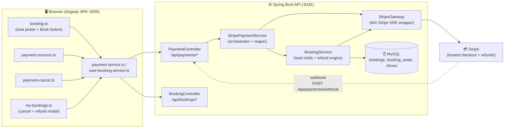
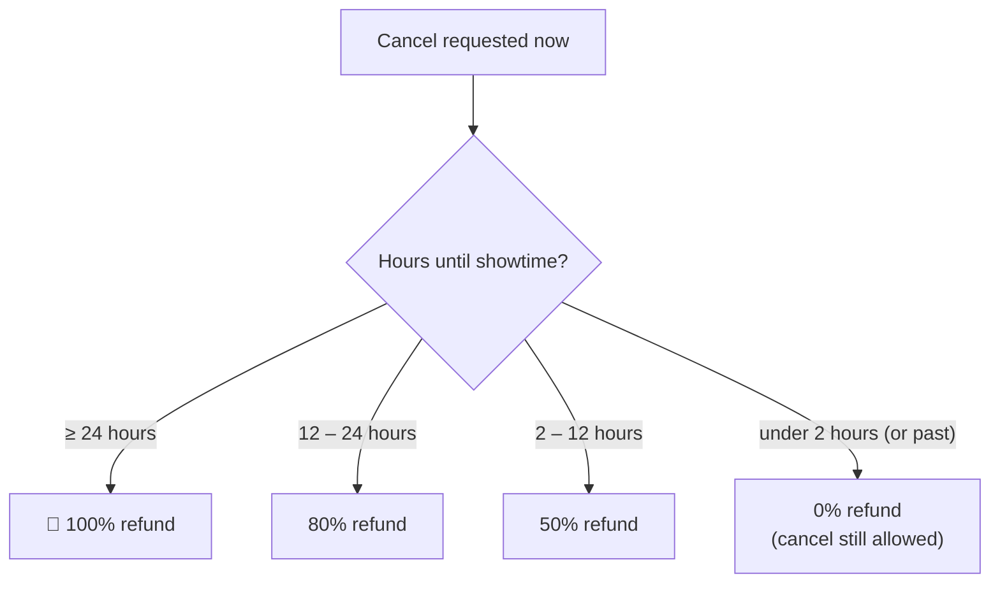
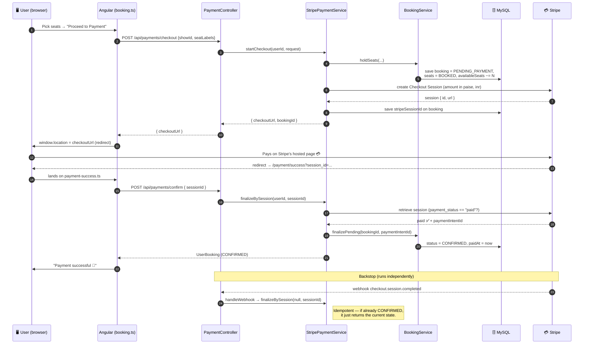
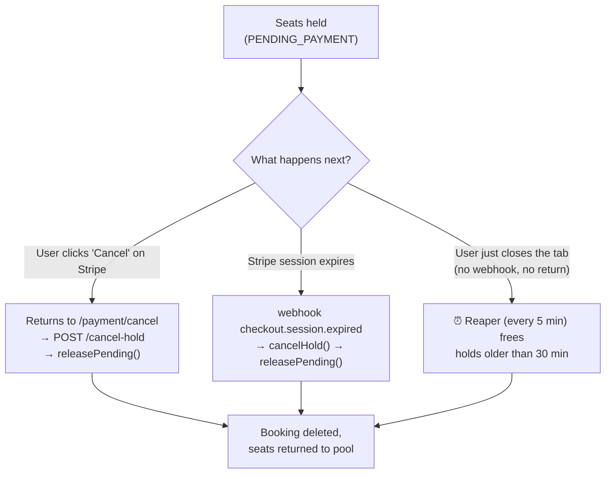
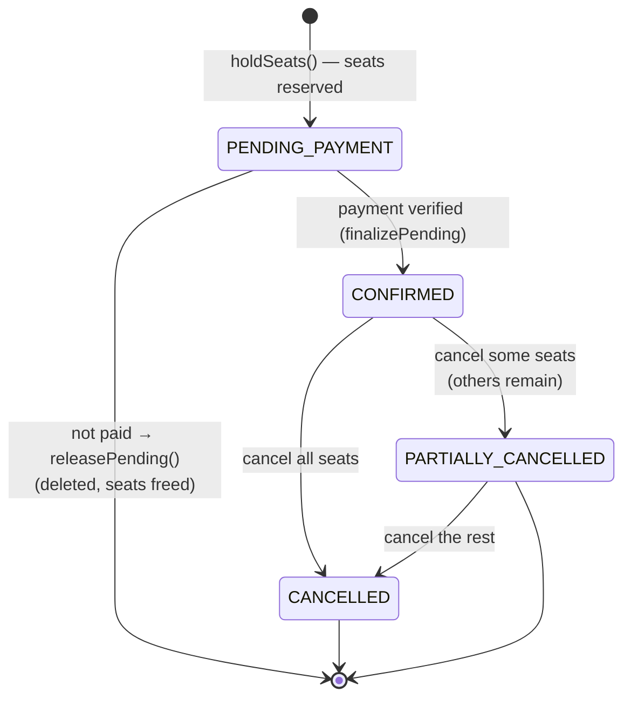
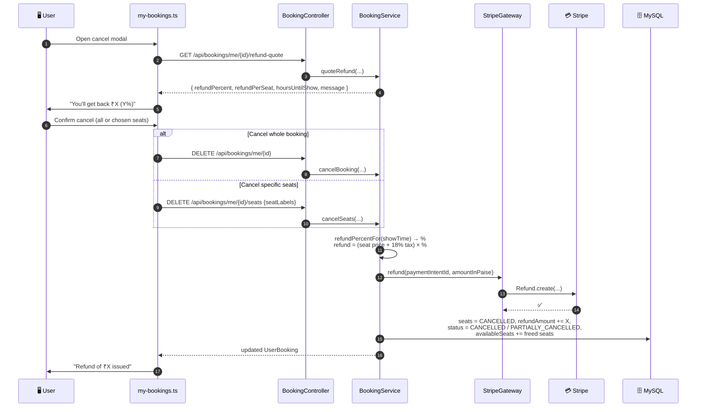

# 💳 Stripe Integration Guide — CineBook

> **Purpose of this file:** a future-proof, plain-English reference for *how money flows
> through CineBook* — from the moment a user clicks **Book** all the way to **payment
> completion** and, later, **refunds**. If you (or anyone) come back months from now having
> forgotten the details, read this top-to-bottom and you'll have the full mental model again.
>
> It explains both the **what** (the steps) and the **why** (the reasoning), with diagrams
> you can read at a glance and prose a non-developer can follow.

---

## 1. The 30-second mental model (read this first)

Think of buying a movie ticket like **booking a hotel room online**:

1. You pick your room (seats) and the hotel **puts a temporary hold** on it so nobody else grabs it.
2. You're sent to a **secure payment counter** to pay.
3. Once you pay, the hold becomes a **confirmed booking**.
4. If you walk away without paying, the hold is **quietly released** and the room goes back on sale.
5. If you later cancel, you get money back according to **how early you cancelled**.

CineBook does exactly this. The "secure payment counter" is **Stripe's own hosted page** —
**CineBook never sees or stores your card number.** We only ever hold a secret *key* that lets
us *ask Stripe* to take payments and issue refunds on our behalf.

We call this pattern **"reserve-then-pay" with Stripe Hosted Checkout.**

---

## 2. Why we built it this way (design decisions)

| Decision | What it means | Why |
|---|---|---|
| **Hosted Checkout** (redirect to Stripe) | The user leaves our site, pays on `checkout.stripe.com`, and comes back. | We never touch card data → far less security/compliance burden. No card UI to build. No `Stripe.js` or publishable key needed. |
| **Reserve-then-pay** | Seats are held *before* payment, confirmed *after*. | Prevents two people paying for the same seat while one is mid-checkout. |
| **Confirm on return AND via webhook** | The booking is finalized both when the user lands back on our success page *and* by a background "webhook" message from Stripe. | If the user closes the tab right after paying, the webhook still confirms the booking. Belt **and** suspenders. |
| **A scheduled "reaper"** | A timer that cleans up holds nobody paid for. | If a user abandons checkout *and* the webhook never arrives, seats still get freed automatically. |
| **Real, tiered refunds** | Refund amount depends on how early you cancel. | Mirrors real cinema policy and actually moves money back via Stripe. |

---

## 3. Who's who — the components involved



**One-line job of each piece:**

- **`booking.ts`** — lets the user pick seats; the **Book / "Proceed to Payment"** button calls the backend and then *redirects the browser to Stripe*.
- **`payment.service.ts`** — the frontend's tiny HTTP client for the 3 payment endpoints (`checkout`, `confirm`, `cancel-hold`).
- **`payment-success.ts` / `payment-cancel.ts`** — the two pages the user lands on *coming back from Stripe*.
- **`PaymentController`** — the public face of the payment API (`/api/payments/*`).
- **`StripePaymentService`** — the **brain** of the flow: holds seats, opens checkout, finalizes, releases, runs the cleanup timer.
- **`BookingService`** — owns the database truth: creates/holds/cancels bookings, computes prices & taxes, and runs the **refund engine**.
- **`StripeGateway`** — the only class that actually *talks to Stripe* (create session, retrieve session, refund, verify webhook). Everything else stays "Stripe-agnostic."
- **`StripeProperties`** — holds the config/keys (`app.stripe.*`).

---

## 4. The money & the rules (constants you must know)

| Thing | Value | Where | Note |
|---|---|---|---|
| **Currency** | `inr` (Indian Rupee) | `app.stripe.currency` | |
| **Amounts to Stripe** | in **paise** (minor units) | `BookingService.toMinorUnits()` | Stripe wants the *smallest* unit. ₹236.00 → **23600** paise. The helper is `amount × 100`, rounded. |
| **Tax** | **18% GST** | `BookingService.TAX_RATE` | Added on top of the ticket subtotal. |
| **Hold lifetime** | **30 minutes** | `app.stripe.hold-ttl-minutes` | After this, an unpaid hold is reaped. |
| **Reaper cadence** | every **5 minutes** | `@Scheduled(fixedDelay = 300_000)` | Background sweep for abandoned holds. |

### The refund ladder (how much you get back)

Refund % is decided by **how long before showtime** you cancel:



| Time before show | Refund | Code |
|---|---|---|
| 24 hours or more | **100%** | `refundPercentFor()` in `BookingService` |
| 12 to 24 hours | **80%** | |
| 2 to 12 hours | **50%** | |
| Less than 2 hours | **0%** | You can still cancel (frees the seat) — you just get nothing back. |

> The refund is calculated on the **ticket price + its 18% tax**, then scaled by this %. The
> amount is derived from **what was actually charged**, so it stays correct even if the show's
> ticket price changes later.

---

## 5. 🎬 The happy path: from "Book" to "Confirmed"

### In plain English

1. User picks seats and clicks **Proceed to Payment**.
2. Backend **holds the seats** (creates a hidden `PENDING_PAYMENT` booking + marks those seats `BOOKED`, and drops the show's available-seat count). It then asks Stripe to open a **Checkout Session** and hands the browser a **Stripe URL**.
3. Browser **redirects to Stripe's hosted page**. User types card details *on Stripe* (e.g. test card `4242 4242 4242 4242`).
4. Stripe takes the payment and **redirects the user back** to `/payment/success?session_id=...`.
5. Our success page asks the backend to **confirm**. The backend **re-checks with Stripe** that the session is truly `paid`, then flips the booking to **`CONFIRMED`**.
6. Separately, Stripe also fires a **webhook** to our server saying "this session completed" — a backstop that confirms the booking even if the user closed the tab.

### Sequence diagram



### Step-by-step, elaborated

- **Step 1–2 — Holding the seats (`holdSeats`):** Before any money is involved, we *reserve* the seats. We validate the seat labels (trim/uppercase, no duplicates), check none are already taken, compute **subtotal → +18% tax → total**, then save a booking with status **`PENDING_PAYMENT`** plus one `BOOKED` row per seat, and **decrement the show's `availableSeats`**. This is what stops a second person from buying the same seat while you pay.
  - 🔐 **Safety:** this whole step plus the Stripe call run inside one database transaction. If Stripe refuses to open a session, **the transaction rolls back** and the hold vanishes automatically — no "ghost" reservations.
- **Step 3 — Creating the Checkout Session (`StripeGateway.createCheckoutSession`):** We tell Stripe: *one line item, this much money (in paise), currency INR, here's where to send the user on success/cancel.* We tag the session with our `bookingId` (as both `client_reference_id` and `metadata`) so we can match Stripe's response back to our booking. Stripe replies with a **unique URL** — that's the page the user pays on.
- **Step 4 — Redirect:** The frontend simply does `window.location.href = checkoutUrl`. No card form on our side.
- **Step 5 — Confirm on return (`finalizeBySession`):** When the user comes back, we **don't trust the URL alone** — we call Stripe and verify `payment_status == "paid"`. Only then do we flip the booking to **`CONFIRMED`**, record the `paymentIntentId` (needed later for refunds) and `paidAt`.
- **Step 6 — The webhook backstop:** Stripe *also* sends a server-to-server message (`checkout.session.completed`). We verify its **signature** (so we know it's really Stripe), then run the **same** `finalizeBySession`. Because that method is **idempotent**, it's perfectly safe whether the success page already ran it or not.

---

## 6. 🌧️ The unhappy paths (what if the user doesn't pay?)

Three things can go wrong, and each is handled:



- **User backs out on Stripe** → lands on `/payment/cancel` → `payment-cancel.ts` calls `POST /api/payments/cancel-hold` → `releasePending()` **deletes the unpaid booking and returns the seats** immediately.
- **Session expires** → Stripe sends `checkout.session.expired` → same release path.
- **User vanishes (tab closed, no webhook)** → the **reaper** (`reapAbandonedHolds`, every 5 min) finds `PENDING_PAYMENT` bookings older than 30 minutes and releases them.

> **Rare edge case handled:** if a hold was *already reaped* but the user *did* manage to pay,
> `finalizeBySession` notices the booking no longer exists, and **automatically refunds the
> charge** so the user is never charged for seats they can't get.

---

## 7. 🔄 The booking's life story (state machine)



| Status | Meaning |
|---|---|
| `PENDING_PAYMENT` | Seats held, waiting for payment. **Hidden** from "My Bookings" and admin reports — it's not a real booking yet. |
| `CONFIRMED` | Paid and locked in. |
| `PARTIALLY_CANCELLED` | Some seats cancelled & refunded; at least one seat still active. |
| `CANCELLED` | All seats cancelled. |

(Each individual seat is either `BOOKED` or `CANCELLED`.)

---

## 8. 💸 The refund flow (cancellation)

Refunds happen from **My Bookings**, where the user can cancel the **whole** booking or **specific seats** (interactive seat picker). Before confirming, a modal shows a **live refund preview**.

### Sequence diagram



### Elaborated

- **Refund preview (`quoteRefund`)** — the modal first asks the backend how much would come back *right now*. The per-seat refund is `(total ÷ seats booked) × policy %`.
- **The actual cancel (`applyCancellation`)** — for each seat being cancelled: mark it `CANCELLED`, sum its price, add 18% tax, scale by the policy %. If the booking was paid (it has a `stripePaymentIntentId`) and the refund is greater than zero, we call **Stripe to issue a real refund**.
  - 🔐 **Safety:** the cancel runs in one transaction. If **Stripe's refund call fails, the whole cancellation rolls back** — so seats are *never* cancelled without the money actually being returned.
- **After refunding** — we bump the booking's running `refundAmount`, set the status to `CANCELLED` (no seats left) or `PARTIALLY_CANCELLED` (some remain), and **return the freed seats to the show's pool** so others can book them.

---

## 9. ⚙️ Configuration & secrets (where the keys live)

All Stripe settings are bound from `app.stripe.*` in
[`backend/src/main/resources/application.properties`](backend/src/main/resources/application.properties)
into [`StripeProperties.java`](backend/src/main/java/com/cinebook/config/StripeProperties.java):

```properties
app.stripe.secret-key=${STRIPE_SECRET_KEY:}          # sk_test_...  (REQUIRED — lets us charge/refund)
app.stripe.webhook-secret=${STRIPE_WEBHOOK_SECRET:}  # whsec_...    (verifies webhook authenticity)
app.stripe.success-url=${STRIPE_SUCCESS_URL:http://localhost:4200/payment/success}
app.stripe.cancel-url=${STRIPE_CANCEL_URL:http://localhost:4200/payment/cancel}
app.stripe.currency=inr
app.stripe.hold-ttl-minutes=30
```

- The **secret key** is the only *required* one — without it, payment endpoints fail fast with *"Stripe is not configured"* and the rest of the app keeps working.
- The **webhook secret** is only needed for the webhook backstop (and is verified on every webhook). The happy path works without it because the success page confirms server-side.
- 🔒 **Never commit real keys to a public repo.** Prefer environment variables. The DB password and JWT secret also live in this file — keep it private.
- Full first-time key setup lives in **[`STRIPE_SETUP.md`](STRIPE_SETUP.md)**.

---

## 10. 🧭 Endpoint cheat-sheet

| Method & path | Auth | Purpose |
|---|---|---|
| `POST /api/payments/checkout` | JWT (user) | Hold seats + open Checkout → returns `{ checkoutUrl, bookingId }` |
| `POST /api/payments/confirm` | JWT (user) | Verify payment & finalize → `CONFIRMED` |
| `POST /api/payments/cancel-hold` | JWT (user) | Release held seats when user backs out |
| `POST /api/payments/webhook` | **Public** (Stripe signature) | Backstop: `completed` → confirm, `expired` → release |
| `GET  /api/bookings/me/{id}/refund-quote` | JWT (user) | Refund preview for the cancel modal |
| `DELETE /api/bookings/me/{id}` | JWT (user) | Cancel **whole** booking (refund) |
| `DELETE /api/bookings/me/{id}/seats` | JWT (user) | Cancel **specific** seats (refund subset) |
| `GET  /api/bookings/shows/{showId}/seats` | JWT (user) | Seat-map availability for the picker |

> The webhook is the **only** unauthenticated endpoint — it's whitelisted in `SecurityConfig`
> and trusted purely by Stripe's cryptographic signature.

---

## 11. 🛡️ Why it can't double-charge or double-refund (idempotency)

- **`finalizeBySession` is idempotent:** it only flips `PENDING_PAYMENT → CONFIRMED`. If the
  booking is already `CONFIRMED`, it just returns the current state. So the **success page and
  the webhook can both run it** with no harm — whoever arrives second is a no-op.
- **`releasePending` is idempotent:** if the booking is gone or no longer pending, it does nothing.
  So cancel-page + expiry-webhook + reaper can't conflict.
- **Transactions guard the money:** opening checkout, confirming, and refunding each run in a
  single DB transaction tied to the Stripe call — a Stripe failure rolls the DB back, never
  leaving the database and Stripe out of sync.

---

## 12. 🧪 Testing locally (quick recap)

1. Set `STRIPE_SECRET_KEY` (a `sk_test_…` key) and start the backend on `:8181` and the SPA on `:4200`.
2. (Optional, for the webhook) install the Stripe CLI and run:
   `stripe listen --forward-to localhost:8181/api/payments/webhook` → it prints a `whsec_…` to use as `STRIPE_WEBHOOK_SECRET`.
3. Book seats → **Proceed to Payment** → pay with test card **`4242 4242 4242 4242`**, any future expiry, any CVC, any postal code.
4. Land on `/payment/success` → booking shows **CONFIRMED** in My Bookings; the seats disappear from availability.
5. Cancel ≥24h before showtime → check the Stripe Dashboard shows a **100% Refund** on that PaymentIntent.

---

## 13. 🧠 Notes-to-future-self (gotchas)

- **Stripe needs amounts in paise** — always go through `BookingService.toMinorUnits()`. ₹100 = `10000`.
- **Adding/upgrading the Stripe jar?** Do a **full backend restart** afterward (not a DevTools hot-reload) — DevTools doesn't reload new jars cleanly and you'll get `NoClassDefFoundError: Could not initialize class com.stripe...`.
- **The happy path doesn't strictly need the webhook** — the success page confirms server-side. The webhook only matters if the user closes the tab right after paying.
- **Refund of 0% still cancels** the booking and frees the seats — you just don't get money back (<2h rule).
- **`PENDING_PAYMENT` bookings are intentionally hidden** from My Bookings and admin revenue — they're not real bookings until paid.
- **We store the `paymentIntentId` at confirm time** — without it we cannot refund later, so it's essential the confirm step records it.

---

*Last updated: 2026-06-16. Source of truth is the code; if they disagree, the code wins —
key files: `StripePaymentService`, `BookingService`, `StripeGateway`, `PaymentController`,
`payment.service.ts`.*
